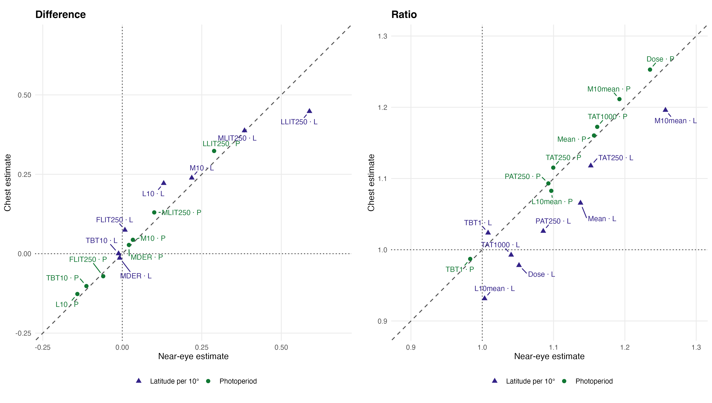
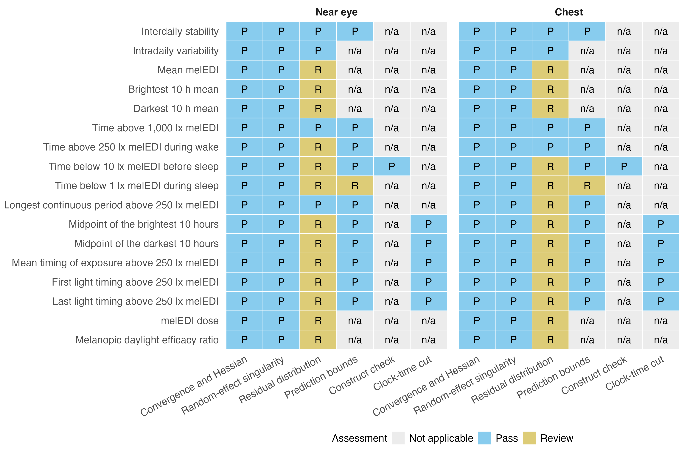
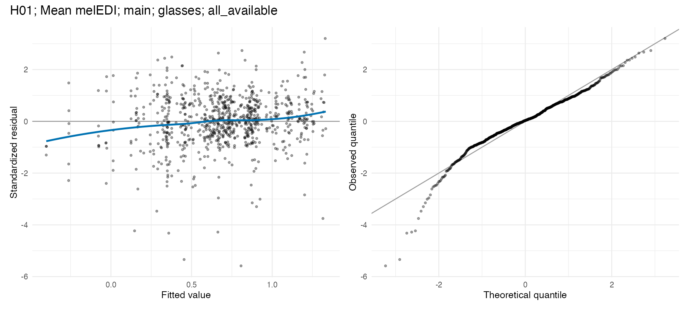
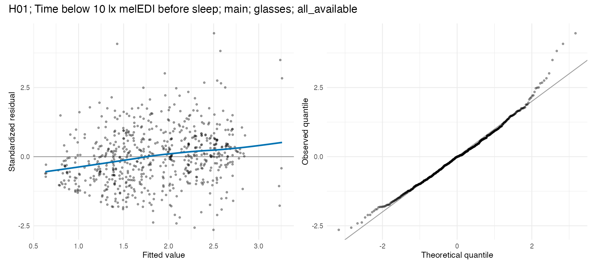
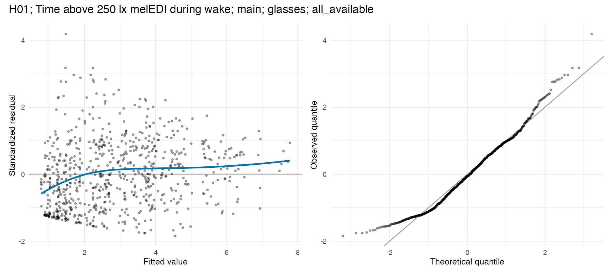
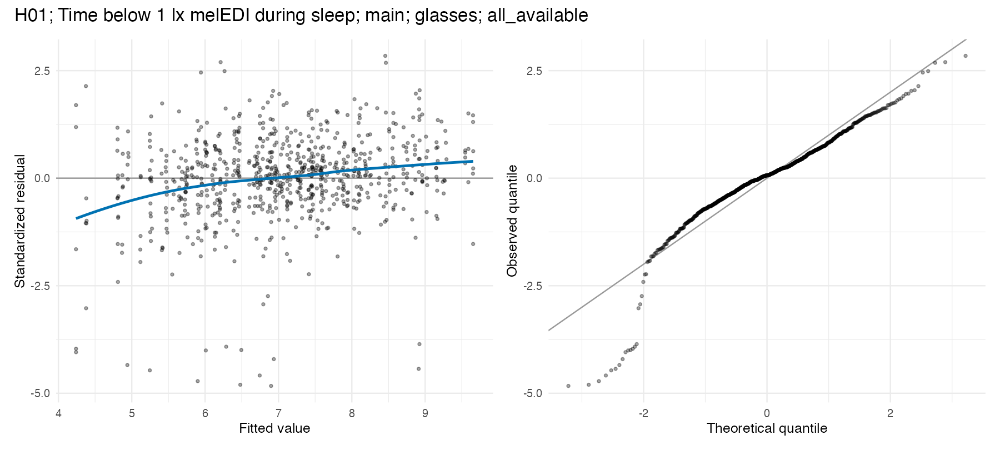

## Question and analysis sequence

This analysis estimates associations of study site, photoperiod, and latitude
with personal light-exposure metrics. Near-eye measurements define the primary
analysis. Chest measurements, placement-matched samples, and the alternative
preprocessing dataset address distinct sensitivity questions.

The notebook reads the datasets derived in the preparation pages, fits the
specified models, checks their assumptions, evaluates sensitivities, and
calculates bootstrap uncertainty. Model objects, exact fitted samples, and
numerical results are saved under `results/` as they are produced.

## Data and model guide {#methods}

The [metric preparation](../preparation/04-light-metrics.qmd) and
[analysis-dataset preparation](../preparation/06-analysis-datasets.qmd) supply
17 outcomes, their units, metric-specific support and participant/site keys.
Interdaily stability and intradaily variability have one outcome per participant;
the other outcomes have one per eligible participant-day. Missing support stays
missing. The primary and alternative preprocessing datasets are fitted separately
at each sensor position, using both all-available and placement-matched samples.

The site model includes study site and centred civil photoperiod. The latitude
model replaces site with centred absolute latitude per 10 degrees on the same
observations. Site and latitude are not independent predictors within one model.
Gaussian participant-level models use ordinary regression; participant-day
Gaussian or Tweedie models include participant random intercepts. Nested comparisons
use maximum likelihood, with final Gaussian mixed-model coefficients obtained
by restricted maximum likelihood. The exact response families, transforms and
formulas are displayed below.

Four complete 17-test FDR families address site, photoperiod, latitude and the
adequacy of latitude relative to site. Site follow-ups require a supported omnibus
test and use equal-site averaging. Conditional R² includes participant variation;
marginal R² describes fixed predictors. Their difference is the participant-associated
share. Term-specific part-R² values can overlap. Joint model-refit bootstraps provide
uncertainty; the central quick profile reduces their count to 50. Residual, influence,
metric-definition and preprocessing checks qualify the findings.

The executable sections below write fitted objects to `results/models/H01/`,
reader tables to `results/tables/H01/`, and the supporting numerical and figure
outputs under `results/`. Start with the calculations below or jump to
[findings and interpretation](#findings).

## Libraries and shared settings

```{r}
#| label: h01-analysis-setup
library(dplyr)
library(tidyr)
library(tibble)
library(readr)
library(gt)
source("scripts/project.R")
analysis_setup()
root <- getOption("nh.root")
source("scripts/pipeline/paths_io.R")
source("scripts/pipeline/assertions.R")
source("scripts/pipeline/multiplicity.R")
source("scripts/hypotheses/H01/h01_contract.R")
source("scripts/hypotheses/H01/h01_modeling.R")
source("scripts/hypotheses/H01/h01_result_helpers.R")
producer <- "analyses/H01-site-differences.qmd"
model_root <- file.path(root, "results/models/H01")
diagnostic_root <- file.path(root, "results/csv/diagnostics/H01")
table_root <- file.path(root, "results/tables/H01")
figure_root <- file.path(root, "results/images/H01")
source_root <- file.path(root, "results/csv/source_data/H01")
for (directory in c(model_root, diagnostic_root, table_root, figure_root, source_root)) {
  dir.create(directory, recursive = TRUE, showWarnings = FALSE)
}
save_plots <- TRUE
bootstrap_refits <- bootstrap_count(1000L)
bootstrap_cores <- analysis_workers()
```

## Prepared data and model specifications

Both preprocessing variants are loaded from the outputs of the preparation
notebooks. The registry specifies each response scale, model family, and
analysis unit. Scenario identifiers are held fixed so that each bootstrap
uses the same numerical seed on repeated runs.

```{r}
#| label: h01-inputs-and-specifications
input_contract <- h01_input_contract(root)
objects <- list(
  main = readRDS(input_contract$main$path),
  alternative_preprocessing = readRDS(input_contract$alternative_preprocessing$path)
)
metric_registry <- h01_metric_registry()
h01_validate_registry(metric_registry)
display_registry <- objects$main$metric_contract |>
  dplyr::select(
    metric_order,
    metric_id,
    manuscript_name,
    abbreviation,
    manuscript_category,
    display_unit,
    variant_label,
    value_definition
  )
metric_registry <- dplyr::left_join(
  metric_registry,
  display_registry,
  by = c("metric_order", "metric_id"),
  relationship = "one-to-one"
)
if (any(!stats::complete.cases(
  metric_registry[c("manuscript_name", "display_unit")]
))) {
  h01_abort("H01 display registry does not cover all 17 metrics")
}


run_registry <- h01_run_registry()
metric_registry |> select(manuscript_name, analysis_unit, response_family, response_transform) |> gt()
```

## Fit the specified models

Fit every declared metric and sample using its specified response model. Each saved model is paired with the exact rows used to fit it.

```{r}
#| label: h01-fit-models
result_lists <- list(
  tests = list(),
  term_effects = list(),
  site_estimates = list(),
  site_deviations = list(),
  marginalization = list(),
  samples = list(),
  samples_by_site = list(),
  diagnostics = list(),
  influence = list(),
  latitude_loo = list(),
  random_site = list(),
  r2_point = list(),
  model_specifications = list(),
  preregistered_scope = list(),
  exactly_identified_period = list(),
  l10_noon_tests = list(),
  l10_noon_term_effects = list(),
  l10_noon_site_estimates = list(),
  l10_noon_site_deviations = list(),
  l10_noon_samples = list(),
  l10_noon_diagnostics = list(),
  l10_noon_r2 = list(),
  l10_noon_model_specifications = list()
)
result_index <- stats::setNames(
  rep(1L, length(result_lists)),
  names(result_lists)
)
add_result <- function(name, value) {
  if (nrow(value) == 0L) {
    return(invisible(NULL))
  }
  result_lists[[name]][[result_index[[name]]]] <<- value
  result_index[[name]] <<- result_index[[name]] + 1L
  invisible(NULL)
}

for (run_index in seq_len(nrow(run_registry))) {
  run <- run_registry[run_index, , drop = FALSE]
  object <- objects[[run$data_scenario_id]]
  message("Fitting H01 run: ", run$run_id)
  for (metric_index in seq_len(nrow(metric_registry))) {
    spec <- metric_registry[metric_index, , drop = FALSE]
    message("  ", spec$metric_order, "/17 ", spec$metric_id)
    frame <- h01_prepare_model_frame(
      object,
      spec,
      placement = run$placement,
      sample_scenario = run$sample_scenario
    )
    run_path <- file.path(
      run$data_scenario_id,
      run$placement,
      run$sample_scenario
    )
    model_directory <- file.path(model_root, run_path)
    diagnostic_directory <- file.path(diagnostic_root, run_path)
    source_directory <- file.path(source_root, run_path)
    invisible(vapply(
      c(model_directory, diagnostic_directory, source_directory),
      dir.create,
      logical(1),
      recursive = TRUE,
      showWarnings = FALSE
    ))
    frame_path <- file.path(
      model_directory,
      paste0(spec$metric_id, "_model_frame.rds")
    )
    bundle_path <- file.path(
      model_directory,
      paste0(spec$metric_id, "_models.rds")
    )
    if (nrow(frame) == 0L) {
      empty <- h01_empty_metric_rows(run, spec)
      add_result("tests", empty$tests)
      add_result("diagnostics", empty$diagnostics)
      add_result("samples", empty$samples)
      h01_write_rds(
        list(
          status = "NON_ESTIMABLE",
          spec = spec,
          run = run,
          reason = "Prepared scenario is unavailable for this metric"
        ),
        bundle_path
      )
      h01_write_rds(frame, frame_path)
      next
    }
    bundle <- h01_fit_metric_models(frame, spec)
    add_result("model_specifications", h01_model_specification_rows(bundle, run, spec))
    h01_write_rds(frame, frame_path)
    h01_write_rds(bundle, bundle_path)
    frame_csv <- frame |>
      dplyr::select(
        .model_row_id,
        site,
        participant_key,
        local_date,
        value,
        response_value,
        photoperiod_hours,
        photoperiod_centered_hours,
        latitude_deg,
        absolute_latitude_10deg_centered,
        metric_support_available,
        metric_support_valid_minutes,
        metric_support_expected_minutes,
        metric_any_censored
      )
    h01_write_csv(
      frame_csv,
      file.path(
        source_directory,
        paste0(spec$metric_id, "_model_frame.csv")
      )
    )


  }
}

bind_rows(result_lists$model_specifications) |> count(estimation_stage, converged, status) |> gt()
```

## Estimate associations and represented variation

Compare the fitted site and latitude specifications, estimate effects, and record model-specific samples and variance components.

```{r}
#| label: h01-model-inference
for (run_index in seq_len(nrow(run_registry))) {
  run <- run_registry[run_index, , drop = FALSE]
  object <- objects[[run$data_scenario_id]]
  for (metric_index in seq_len(nrow(metric_registry))) {
    spec <- metric_registry[metric_index, , drop = FALSE]
    run_path <- file.path(run$data_scenario_id, run$placement, run$sample_scenario)
    model_directory <- file.path(model_root, run_path)
    source_directory <- file.path(source_root, run_path)
    diagnostic_directory <- file.path(figure_root, "diagnostics", run_path)
    dir.create(diagnostic_directory, recursive = TRUE, showWarnings = FALSE)
    frame <- readRDS(file.path(model_directory, paste0(spec$metric_id, "_model_frame.rds")))
    bundle <- readRDS(file.path(model_directory, paste0(spec$metric_id, "_models.rds")))
    if (identical(bundle$status, "NON_ESTIMABLE") || nrow(frame) == 0L) next
    site_model <- h01_unwrap_model(bundle, "final", "site_full")
    seed <- h01_primary_seed(spec$metric_order, run$data_scenario_id,
                             run$placement, run$sample_scenario)
tests <- h01_model_tests(bundle) |>
  dplyr::left_join(
    h01_family_registry(),
    by = c("comparison_id" = "comparison"),
    relationship = "many-to-one"
  )
add_result("tests", h01_add_identity(tests, run, spec))

site_model <- h01_unwrap_model(bundle, "final", "site_full")
latitude_model <- h01_unwrap_model(
  bundle,
  "final",
  "latitude_full"
)
effects <- dplyr::bind_rows(
  h01_extract_term_effect(
    site_model,
    "photoperiod_centered_hours",
    "Photoperiod per hour",
    spec
  ),
  h01_extract_term_effect(
    latitude_model,
    "absolute_latitude_10deg_centered",
    "Absolute latitude per 10 degrees",
    spec
  )
)
add_result(
  "term_effects",
  h01_add_identity(effects, run, spec)
)

site <- h01_site_summaries(site_model, frame, spec)
add_result(
  "site_estimates",
  h01_add_identity(site$estimates, run, spec)
)
add_result(
  "site_deviations",
  h01_add_identity(site$deviations, run, spec)
)
add_result(
  "marginalization",
  h01_add_identity(site$marginalization, run, spec)
)

samples <- h01_sample_summary(frame, spec)
add_result(
  "samples",
  h01_add_identity(
    dplyr::mutate(samples$overall, sample_status = "FITTED"),
    run,
    spec
  )
)
add_result(
  "samples_by_site",
  h01_add_identity(samples$by_site, run, spec)
)

add_result(
  "random_site",
  h01_add_identity(
    h01_fit_random_site_summary(bundle),
    run,
    spec
  )
)
add_result(
  "r2_point",
  h01_add_identity(
    h01_r2_point_summary(bundle),
    run,
    spec
  )
)


  }
}

bind_rows(result_lists$term_effects) |> select(run_id, metric_id, everything()) |> head()
```

## Check model assumptions

Evaluate residual distributions, prediction support, and other diagnostics. Failed model checks remain explicit and prevent unqualified inference.

```{r}
#| label: h01-model-diagnostics
for (run_index in seq_len(nrow(run_registry))) {
  run <- run_registry[run_index, , drop = FALSE]
  object <- objects[[run$data_scenario_id]]
  for (metric_index in seq_len(nrow(metric_registry))) {
    spec <- metric_registry[metric_index, , drop = FALSE]
    run_path <- file.path(run$data_scenario_id, run$placement, run$sample_scenario)
    model_directory <- file.path(model_root, run_path)
    source_directory <- file.path(source_root, run_path)
    diagnostic_directory <- file.path(figure_root, "diagnostics", run_path)
    dir.create(diagnostic_directory, recursive = TRUE, showWarnings = FALSE)
    frame <- readRDS(file.path(model_directory, paste0(spec$metric_id, "_model_frame.rds")))
    bundle <- readRDS(file.path(model_directory, paste0(spec$metric_id, "_models.rds")))
    if (identical(bundle$status, "NON_ESTIMABLE") || nrow(frame) == 0L) next
    site_model <- h01_unwrap_model(bundle, "final", "site_full")
    seed <- h01_primary_seed(spec$metric_order, run$data_scenario_id,
                             run$placement, run$sample_scenario)
seed <- h01_primary_seed(
  spec$metric_order,
  run$data_scenario_id,
  run$placement,
  run$sample_scenario
)
diagnostics <- h01_model_diagnostics(bundle, frame, seed)
add_result(
  "diagnostics",
  h01_add_identity(diagnostics, run, spec)
)
diagnostic_data <- h01_diagnostic_plot_data(site_model, frame)
diagnostic_source_path <- file.path(
  source_directory,
  paste0(spec$metric_id, "_diagnostic_plot_data.csv")
)
h01_write_csv(diagnostic_data, diagnostic_source_path)
if (save_plots) {
  h01_save_diagnostic_plot(
    diagnostic_data,
    file.path(
      diagnostic_directory,
      paste0(spec$metric_id, "_diagnostics.png")
    ),
    paste(
      "H01",
      spec$manuscript_name,
      run$data_scenario_id,
      run$placement,
      run$sample_scenario,
      sep = "; "
    )
  )
}


  }
}

bind_rows(result_lists$diagnostics) |> count(diagnostic_status) |> gt()
```

## Evaluate sensitivity to analytical choices

Repeat the relevant fits after removing influential participants or individual sites, restricting to exactly identified bright periods, changing the midnight conversion, and applying the preregistered scope.

```{r}
#| label: h01-sensitivity-analyses
for (run_index in seq_len(nrow(run_registry))) {
  run <- run_registry[run_index, , drop = FALSE]
  object <- objects[[run$data_scenario_id]]
  for (metric_index in seq_len(nrow(metric_registry))) {
    spec <- metric_registry[metric_index, , drop = FALSE]
    run_path <- file.path(run$data_scenario_id, run$placement, run$sample_scenario)
    model_directory <- file.path(model_root, run_path)
    source_directory <- file.path(source_root, run_path)
    diagnostic_directory <- file.path(figure_root, "diagnostics", run_path)
    dir.create(diagnostic_directory, recursive = TRUE, showWarnings = FALSE)
    frame <- readRDS(file.path(model_directory, paste0(spec$metric_id, "_model_frame.rds")))
    bundle <- readRDS(file.path(model_directory, paste0(spec$metric_id, "_models.rds")))
    if (identical(bundle$status, "NON_ESTIMABLE") || nrow(frame) == 0L) next
    site_model <- h01_unwrap_model(bundle, "final", "site_full")
    seed <- h01_primary_seed(spec$metric_order, run$data_scenario_id,
                             run$placement, run$sample_scenario)
tests <- h01_model_tests(bundle)
      add_result(
        "influence",
        h01_add_identity(
          h01_participant_influence(bundle, frame),
          run,
          spec
        )
      )
      add_result(
        "latitude_loo",
        h01_add_identity(
          h01_latitude_leave_one_site_out(bundle, frame),
          run,
          spec
        )
      )
      if (
        run$data_scenario_id == "main" &&
          run$placement == "glasses" &&
          run$sample_scenario == "all_available"
      ) {
        registered <- h01_fit_registered_scope(frame, spec, tests)
        add_result(
          "preregistered_scope",
          h01_add_identity(registered, run, spec)
        )
      }

      if (spec$metric_id == "longest_bout_above_250") {
        exact_frame <- h01_prepare_model_frame(
          object,
          spec,
          placement = run$placement,
          sample_scenario = run$sample_scenario,
          exactly_identified_only = TRUE
        )
        if (nrow(exact_frame) > 0L) {
          exact_bundle <- h01_fit_metric_models(exact_frame, spec)
          exact_tests <- h01_model_tests(exact_bundle)
          exact_samples <- h01_sample_summary(exact_frame, spec)$overall
          exact_diagnostics <- h01_model_diagnostics(
            exact_bundle,
            exact_frame,
            seed + 500000L
          )
          exact_output <- dplyr::bind_cols(
            exact_tests,
            exact_samples[rep(1L, nrow(exact_tests)), , drop = FALSE],
            exact_diagnostics[
              rep(1L, nrow(exact_tests)),
              ,
              drop = FALSE
            ]
          ) |>
            dplyr::mutate(
              sensitivity_id = "exactly_identified_longest_period",
              excluded_censored_rows = nrow(frame) - nrow(exact_frame)
            )
          add_result(
            "exactly_identified_period",
            h01_add_identity(exact_output, run, spec)
          )
          h01_write_rds(
            exact_bundle,
            file.path(
              model_directory,
              paste0(
                spec$metric_id,
                "_exactly_identified_period_sensitivity_models.rds"
              )
            )
          )
        }
      }

      if (spec$metric_id == "l10_midpoint") {
        noon_spec <- spec
        noon_spec$response_transform <- "clock_hours_midnight_after_12"
        noon_frame <- h01_prepare_model_frame(
          object,
          noon_spec,
          placement = run$placement,
          sample_scenario = run$sample_scenario
        )
        if (!identical(frame$.model_row_id, noon_frame$.model_row_id)) {
          h01_abort(
            "The H01 L10 noon sensitivity changed the primary model rows"
          )
        }
        noon_bundle <- h01_fit_metric_models(noon_frame, noon_spec)
        noon_tests <- h01_model_tests(noon_bundle) |>
          dplyr::mutate(
            sensitivity_id = "l10_midpoint_noon_conversion",
            multiplicity_role = "unadjusted_sensitivity_not_family_member"
          )
        noon_site_model <- h01_unwrap_model(
          noon_bundle,
          "final",
          "site_full"
        )
        noon_latitude_model <- h01_unwrap_model(
          noon_bundle,
          "final",
          "latitude_full"
        )
        noon_effects <- dplyr::bind_rows(
          h01_extract_term_effect(
            noon_site_model,
            "photoperiod_centered_hours",
            "Photoperiod per hour",
            noon_spec
          ),
          h01_extract_term_effect(
            noon_latitude_model,
            "absolute_latitude_10deg_centered",
            "Absolute latitude per 10 degrees",
            noon_spec
          )
        ) |>
          dplyr::mutate(
            sensitivity_id = "l10_midpoint_noon_conversion"
          )
        noon_site <- h01_site_summaries(
          noon_site_model,
          noon_frame,
          noon_spec
        )
        noon_samples <- h01_sample_summary(noon_frame, noon_spec)$overall |>
          dplyr::mutate(
            sensitivity_id = "l10_midpoint_noon_conversion",
            sample_status = "FITTED"
          )
        noon_diagnostics <- h01_model_diagnostics(
          noon_bundle,
          noon_frame,
          seed + 600000L
        ) |>
          dplyr::mutate(
            sensitivity_id = "l10_midpoint_noon_conversion"
          )
        noon_r2 <- h01_r2_point_summary(noon_bundle) |>
          dplyr::mutate(
            sensitivity_id = "l10_midpoint_noon_conversion"
          )
        add_result(
          "l10_noon_tests",
          h01_add_identity(noon_tests, run, noon_spec)
        )
        add_result(
          "l10_noon_term_effects",
          h01_add_identity(noon_effects, run, noon_spec)
        )
        add_result(
          "l10_noon_site_estimates",
          h01_add_identity(
            dplyr::mutate(
              noon_site$estimates,
              sensitivity_id = "l10_midpoint_noon_conversion"
            ),
            run,
            noon_spec
          )
        )
        add_result(
          "l10_noon_site_deviations",
          h01_add_identity(
            dplyr::mutate(
              noon_site$deviations,
              sensitivity_id = "l10_midpoint_noon_conversion"
            ),
            run,
            noon_spec
          )
        )
        add_result(
          "l10_noon_samples",
          h01_add_identity(noon_samples, run, noon_spec)
        )
        add_result(
          "l10_noon_diagnostics",
          h01_add_identity(noon_diagnostics, run, noon_spec)
        )
        add_result(
          "l10_noon_r2",
          h01_add_identity(noon_r2, run, noon_spec)
        )
        add_result(
          "l10_noon_model_specifications",
          h01_model_specification_rows(noon_bundle, run, noon_spec) |>
            dplyr::mutate(
              sensitivity_id = "l10_midpoint_noon_conversion"
            )
        )
        h01_write_rds(
          noon_frame,
          file.path(
            model_directory,
            paste0(
              spec$metric_id,
              "_noon_conversion_sensitivity_model_frame.rds"
            )
          )
        )
        h01_write_rds(
          noon_bundle,
          file.path(
            model_directory,
            paste0(
              spec$metric_id,
              "_noon_conversion_sensitivity_models.rds"
            )
          )
        )
        h01_write_csv(
          noon_frame |>
            dplyr::select(
              .model_row_id,
              site,
              participant_key,
              local_date,
              value,
              response_value,
              photoperiod_hours,
              photoperiod_centered_hours,
              latitude_deg,
              absolute_latitude_10deg_centered
            ),
          file.path(
            source_directory,
            paste0(
              spec$metric_id,
              "_noon_conversion_sensitivity_model_frame.csv"
            )
          )
        )
      }

  }
}

bind_rows(result_lists$preregistered_scope) |> head()
```

## Control multiplicity and export estimates

Apply the specified false-discovery-rate families and save the numerical estimates and diagnostic results. Model specifications and sample counts remain available alongside the estimates.

```{r}
#| label: h01-multiplicity-and-exports
results <- lapply(result_lists, dplyr::bind_rows)
results$tests <- h01_adjust_primary_families(results$tests)
invalid_model_runs <- unique(
  results$diagnostics$run_id[
    results$diagnostics$diagnostic_status == "MODEL_CHECK_FAILED"
  ]
)
results$tests <- results$tests |>
  dplyr::mutate(
    family_status = ifelse(
      .data$run_id %in% invalid_model_runs,
      "INVALID_MODEL_CHECK",
      "COMPLETE"
    ),
    p_adjusted = ifelse(
      .data$run_id %in% invalid_model_runs,
      NA_real_,
      .data$p_adjusted
    )
  )
site_support <- results$tests |>
  dplyr::filter(family_id == "H01-F1-site") |>
  dplyr::select(
    run_id,
    metric_id,
    overall_site_p_adjusted = p_adjusted
  )
results$site_deviations <- results$site_deviations |>
  dplyr::left_join(
    site_support,
    by = c("run_id", "metric_id"),
    relationship = "many-to-one"
  ) |>
  dplyr::mutate(
    inferential_followup_supported =
      !is.na(overall_site_p_adjusted) &
        overall_site_p_adjusted < 0.05
  )

if (nrow(results$preregistered_scope) > 0L) {
  scope_family <- dplyr::case_when(
    results$preregistered_scope$comparison_id ==
      "site_full_vs_no_site" ~ "H01-S1-registered-site",
    results$preregistered_scope$comparison_id ==
      "latitude_full_vs_no_latitude" ~ "H01-S2-registered-latitude",
    results$preregistered_scope$comparison_id ==
      "site_full_vs_latitude_full" ~ "H01-S3-registered-adequacy",
    results$preregistered_scope$comparison_id ==
      "site_full_vs_no_photoperiod" ~
        "H01-S4-registered-photoperiod",
    TRUE ~ NA_character_
  )
  results$preregistered_scope$family_id <- scope_family
  results$preregistered_scope$family_n <- ifelse(
    scope_family == "H01-S4-registered-photoperiod",
    5L,
    17L
  )
  results$preregistered_scope$family_instance_id <- paste(
    results$preregistered_scope$run_id,
    scope_family,
    sep = "::"
  )
  results$preregistered_scope <- results$preregistered_scope |>
    dplyr::filter(!is.na(family_id))
  results$preregistered_scope <- adjust_result_families(
    results$preregistered_scope,
    family_col = "family_instance_id",
    p_col = "p_raw",
    family_n_col = "family_n",
    output_col = "p_adjusted",
    method = "BH"
  ) |>
    dplyr::mutate(
      family_status = ifelse(
        .data$run_id %in% invalid_model_runs,
        "INVALID_MODEL_CHECK",
        "COMPLETE"
      ),
      p_adjusted = ifelse(
        .data$run_id %in% invalid_model_runs,
        NA_real_,
        .data$p_adjusted
      )
    )
}

output_names <- c(
  tests = "H01_model_level_tests.csv",
  term_effects = "H01_term_effects.csv",
  site_estimates = "H01_site_estimates.csv",
  site_deviations = "H01_site_deviations.csv",
  marginalization = "H01_marginalization_comparison.csv",
  samples = "H01_exact_samples.csv",
  samples_by_site = "H01_exact_samples_by_site.csv",
  diagnostics = "H01_model_diagnostics.csv",
  influence = "H01_participant_influence.csv",
  latitude_loo = "H01_latitude_leave_one_site_out.csv",
  random_site = "H01_random_site_descriptions.csv",
  r2_point = "H01_r2_point_summaries.csv",
  model_specifications = "H01_model_specifications.csv",
  preregistered_scope = "H01_preregistered_scope_sensitivity.csv",
  exactly_identified_period =
    "H01_exactly_identified_period_sensitivity.csv",
  l10_noon_tests = "H01_l10_noon_conversion_model_tests.csv",
  l10_noon_term_effects =
    "H01_l10_noon_conversion_term_effects.csv",
  l10_noon_site_estimates =
    "H01_l10_noon_conversion_site_estimates.csv",
  l10_noon_site_deviations =
    "H01_l10_noon_conversion_site_deviations.csv",
  l10_noon_samples = "H01_l10_noon_conversion_samples.csv",
  l10_noon_diagnostics =
    "H01_l10_noon_conversion_diagnostics.csv",
  l10_noon_r2 = "H01_l10_noon_conversion_r2.csv",
  l10_noon_model_specifications =
    "H01_l10_noon_conversion_model_specifications.csv"
)
for (name in names(output_names)) {
  h01_write_csv(
    results[[name]],
    file.path(
      if (name %in% c(
        "diagnostics",
        "influence",
        "latitude_loo",
        "l10_noon_diagnostics"
      )) {
        diagnostic_root
      } else {
        table_root
      },
      output_names[[name]]
    )
  )
}
h01_write_rds(
  results,
  file.path(model_root, "H01_fit_results.rds")
)
results$tests |> count(family_id, family_status) |> gt()
```

## Estimate bootstrap uncertainty

Generate parametric replicates and refit the linked models jointly. Full reproduction uses 1,000 successful refits for each estimable metric and scenario; the quick profile uses the central reduced count. Each attempt has a fixed seed, and refitting stops once the requested number of successful attempts is available.

```{r}
#| label: h01-bootstrap-uncertainty
point_path <- file.path(table_root, "H01_r2_point_summaries.csv")
diagnostic_path <- file.path(
  diagnostic_root,
  "H01_model_diagnostics.csv"
)
if (!file.exists(point_path)) {
  h01_abort("H01 bootstrap requires the completed model-fit R2 summaries")
}
if (!file.exists(diagnostic_path)) {
  h01_abort("H01 bootstrap requires the completed model-fit diagnostics")
}
failed_model_checks <- readr::read_csv(
  diagnostic_path,
  show_col_types = FALSE
) |>
  dplyr::filter(
    .data$run_id %in% run_registry$run_id,
    .data$metric_id %in% metric_registry$metric_id,
    .data$diagnostic_status == "MODEL_CHECK_FAILED"
  )
if (nrow(failed_model_checks) > 0L) {
  failed_model_labels <- unique(paste(
    failed_model_checks$run_id,
    failed_model_checks$metric_id,
    sep = "::"
  ))
  h01_abort(
    paste0(
      "H01 bootstrap cannot proceed after a failed model check: %s. ",
      "Inspect the model diagnostics before interpreting its uncertainty."
    ),
    paste(failed_model_labels, collapse = ", ")
  )
}
point_results <- readr::read_csv(point_path, show_col_types = FALSE)
bootstrap_summaries <- list()
bootstrap_audits <- list()
bootstrap_failures <- list()
summary_index <- 1L
audit_index <- 1L
failure_index <- 1L
for (run_index in seq_len(nrow(run_registry))) {
  run <- run_registry[run_index, , drop = FALSE]
  message("Bootstrapping H01 run: ", run$run_id)
  for (metric_index in seq_len(nrow(metric_registry))) {
    spec <- metric_registry[metric_index, , drop = FALSE]
    run_path <- file.path(
      run$data_scenario_id,
      run$placement,
      run$sample_scenario
    )
    model_directory <- file.path(model_root, run_path)
    bundle_path <- file.path(
      model_directory,
      paste0(spec$metric_id, "_models.rds")
    )
    frame_path <- file.path(
      model_directory,
      paste0(spec$metric_id, "_model_frame.rds")
    )
    if (!file.exists(bundle_path) || !file.exists(frame_path)) {
      h01_abort(
        "H01 bootstrap input is missing for `%s` in `%s`",
        spec$metric_id,
        run$run_id
      )
    }
    bundle <- readRDS(bundle_path)
    frame <- readRDS(frame_path)
    if (
      identical(bundle$status, "NON_ESTIMABLE") ||
        nrow(frame) == 0L
    ) {
      next
    }
    message("  ", spec$metric_order, "/17 ", spec$metric_id)
    seed <- h01_primary_seed(
      spec$metric_order,
      run$data_scenario_id,
      run$placement,
      run$sample_scenario
    )
    bootstrap <- h01_bootstrap_r2(
      bundle,
      frame,
      seed = seed,
      successful_refits = bootstrap_refits,
      cores = bootstrap_cores
    )
    draws_path <- file.path(
      model_directory,
      paste0(spec$metric_id, "_r2_bootstrap_draws.rds")
    )
    h01_write_rds(bootstrap$draws, draws_path)
    point <- point_results |>
      dplyr::filter(
        run_id == run$run_id,
        metric_id == spec$metric_id
      )
    summary <- h01_summarize_bootstrap(point, bootstrap$draws)
    bootstrap_summaries[[summary_index]] <- h01_add_identity(
      summary,
      run,
      spec
    )
    summary_index <- summary_index + 1L
    bootstrap_audits[[audit_index]] <- h01_add_identity(
      bootstrap$audit,
      run,
      spec
    )
    audit_index <- audit_index + 1L
    if (nrow(bootstrap$failures) > 0L) {
      bootstrap_failures[[failure_index]] <- h01_add_identity(
        bootstrap$failures,
        run,
        spec
      )
      failure_index <- failure_index + 1L
    }
  }
}
h01_write_csv(
  dplyr::bind_rows(bootstrap_summaries),
  file.path(table_root, "H01_r2_bootstrap_summaries.csv")
)
h01_write_csv(
  dplyr::bind_rows(bootstrap_audits),
  file.path(diagnostic_root, "H01_r2_bootstrap_audit.csv")
)
h01_write_csv(
  dplyr::bind_rows(bootstrap_failures),
  file.path(diagnostic_root, "H01_r2_bootstrap_failures.csv")
)
bind_rows(bootstrap_audits) |> count(used_refits, status) |> gt()
```

## Assemble the reader summaries

Load the estimates produced above and confirm that the intended model and multiplicity families are complete.

```{r}
#| label: h01-reader-calculations-1
library(ggplot2)
library(ggridges)
library(stringr)
source("scripts/hypotheses/H01/h01_reporting_helpers.R")
primary_run <- "main__glasses__all_available"

chest_run <- "main__chest__all_available"

selected_runs <- c(primary_run, chest_run)

run_registry <- tibble::tribble(
  ~run_id, ~run_order, ~run_label, ~data_label, ~placement_label, ~sample_label,
  "main__glasses__all_available", 1L,
  "Main near-eye", "Main", "Near eye", "All available",
  "main__chest__all_available", 2L,
  "Main chest", "Main", "Chest", "All available",
  "main__glasses__paired_common_sample", 3L,
  "Main near-eye, paired/common sample", "Main", "Near eye", "Paired/common",
  "main__chest__paired_common_sample", 4L,
  "Main chest, paired/common sample", "Main", "Chest", "Paired/common",
  "alternative_preprocessing__glasses__all_available", 5L,
  "Alternative preprocessing near-eye", "Alternative preprocessing", "Near eye", "All available",
  "alternative_preprocessing__chest__all_available", 6L,
  "Alternative preprocessing chest", "Alternative preprocessing", "Chest", "All available",
  "alternative_preprocessing__glasses__paired_common_sample", 7L,
  "Alternative preprocessing near-eye, paired/common sample",
  "Alternative preprocessing", "Near eye", "Paired/common",
  "alternative_preprocessing__chest__paired_common_sample", 8L,
  "Alternative preprocessing chest, paired/common sample",
  "Alternative preprocessing", "Chest", "Paired/common"
)

question_registry <- tibble::tribble(
  ~family_id, ~question_order, ~question_id, ~question_label,
  "H01-F1-site", 1L, "site", "Overall site",
  "H01-F2-photoperiod", 2L, "photoperiod", "Photoperiod",
  "H01-F3-latitude", 3L, "latitude", "Latitude",
  "H01-F4-site-latitude-adequacy", 4L, "adequacy",
  "Site versus linear latitude"
)

site_registry <- read_required("config/site_display_registry.csv") |>
  arrange(.data$display_order)

metric_contract <- read_required(
  "results/intermediate/model_data/H01/metric_contract.csv"
) |>
  select(
    "metric_order", "metric_id", "manuscript_name", "abbreviation",
    "manuscript_category", "display_unit", "variant_label"
  )

metric_registry <- h01_metric_registry() |>
  left_join(
    metric_contract,
    by = c("metric_order", "metric_id"),
    relationship = "one-to-one"
  ) |>
  mutate(
    family_label = format_family(
      .data$response_family,
      .data$response_transform
    ),
    analysis_unit_label = if_else(
      .data$analysis_unit == "participant",
      "Participant",
      "Participant-day"
    )
  )

if (nrow(metric_registry) != 17L || anyNA(metric_registry$manuscript_name)) {
  stop("The H01 reporting metric registry is incomplete", call. = FALSE)
}

tests <- read_required("results/tables/H01/H01_model_level_tests.csv")

term_effects <- read_required("results/tables/H01/H01_term_effects.csv")

site_deviations <- read_required("results/tables/H01/H01_site_deviations.csv")

samples <- read_required("results/tables/H01/H01_exact_samples.csv")

samples_by_site <- read_required(
  "results/tables/H01/H01_exact_samples_by_site.csv"
)

r2 <- read_required("results/tables/H01/H01_r2_bootstrap_summaries.csv")

diagnostics <- read_required(
  "results/csv/diagnostics/H01/H01_model_diagnostics.csv"
)

bootstrap_audit <- read_required(
  "results/csv/diagnostics/H01/H01_r2_bootstrap_audit.csv"
)

model_specifications <- read_required(
  "results/tables/H01/H01_model_specifications.csv"
)

noon_tests <- read_required(
  "results/tables/H01/H01_l10_noon_conversion_model_tests.csv"
)

noon_effects <- read_required(
  "results/tables/H01/H01_l10_noon_conversion_term_effects.csv"
)

noon_samples <- read_required(
  "results/tables/H01/H01_l10_noon_conversion_samples.csv"
)

period_sensitivity <- read_required(
  "results/tables/H01/H01_exactly_identified_period_sensitivity.csv"
)

scope_sensitivity <- read_required(
  "results/tables/H01/H01_preregistered_scope_sensitivity.csv"
)

participant_influence <- read_required(
  "results/csv/diagnostics/H01/H01_participant_influence.csv"
)

latitude_loo <- read_required(
  "results/csv/diagnostics/H01/H01_latitude_leave_one_site_out.csv"
)

marginalization <- read_required(
  "results/tables/H01/H01_marginalization_comparison.csv"
)

descriptive_metric_summary <- read_required(
  "results/tables/descriptives/metric_descriptive_summary_display.csv"
)

descriptive_metric_values <- read_required(
  "results/csv/source_data/descriptives/metric_plot_values.csv"
)

expected_bootstrap_keys <- read_required(
  "results/tables/H01/H01_r2_point_summaries.csv"
) |>
  filter(.data$status == "PASS") |>
  distinct(.data$run_id, .data$metric_id)
bootstrap_keys <- bootstrap_audit |>
  distinct(.data$run_id, .data$metric_id)
if (nrow(anti_join(expected_bootstrap_keys, bootstrap_keys,
                  by = c("run_id", "metric_id"))) > 0L) {
  stop("Bootstrap summaries are missing for estimable fitted models", call. = FALSE)
}

if (
  nrow(bootstrap_audit) != nrow(expected_bootstrap_keys) ||
    any(bootstrap_audit$status != "PASS") ||
    any(bootstrap_audit$used_refits < bootstrap_count(1000L))
) {
  stop(
    "Stored H01 bootstrap outputs do not pass the reporting completeness check",
    call. = FALSE
  )
}

if (
  any(tests$family_n != 17L) ||
    any(tests$family_status != "COMPLETE") ||
    nrow(tests) != 8L * 17L * 4L
) {
  stop("The stored H01 multiplicity families are incomplete", call. = FALSE)
}


metric_registry |> select(metric_id, family_label, analysis_unit_label) |> gt()
```

## Combine estimates and model diagnostics

Join estimates, exact samples, and diagnostic assessments for the primary and complementary models.

```{r}
#| label: h01-reader-calculations-2
test_wide <- tests |>
  filter(.data$run_id %in% selected_runs) |>
  left_join(question_registry, by = "family_id", relationship = "many-to-one") |>
  select(
    "run_id", "metric_id", "question_id", "statistic", "df", "p_raw",
    "p_adjusted", "comparison_status", "family_status"
  ) |>
  pivot_wider(
    names_from = "question_id",
    values_from = c(
      "statistic", "df", "p_raw", "p_adjusted",
      "comparison_status", "family_status"
    ),
    names_glue = "{question_id}_{.value}"
  )

effect_wide <- term_effects |>
  filter(
    .data$run_id %in% selected_runs,
    .data$term %in% c(
      "photoperiod_centered_hours",
      "absolute_latitude_10deg_centered"
    )
  ) |>
  mutate(
    effect_id = if_else(
      .data$term == "photoperiod_centered_hours",
      "photoperiod",
      "latitude"
    )
  ) |>
  select(
    "run_id", "metric_id", "effect_id", "effect_type",
    "estimate_practical", "conf_low_practical", "conf_high_practical",
    "p_raw", "interval_method", "status"
  ) |>
  pivot_wider(
    names_from = "effect_id",
    values_from = c(
      "effect_type", "estimate_practical", "conf_low_practical",
      "conf_high_practical", "p_raw", "interval_method", "status"
    ),
    names_glue = "{effect_id}_{.value}"
  )

diagnostic_assessment <- diagnostics |>
  filter(.data$run_id %in% selected_runs) |>
  left_join(metric_registry, by = c("metric_order", "metric_id")) |>
  left_join(run_registry, by = "run_id", relationship = "many-to-one") |>
  mutate(
    assessment = case_when(
      .data$diagnostic_status == "PASS" ~ "Acceptable",
      .data$diagnostic_status == "WARN_REVIEW" ~
        "Acceptable with limitations",
      .data$diagnostic_status == "NON_ESTIMABLE" ~ "Not fitted",
      TRUE ~ "Not acceptable"
    ),
    residual_assessment = case_when(
      .data$residual_status == "PASS" ~ "No flagged residual issue",
      .data$residual_status == "WARN_GAUSSIAN_DIAGNOSTIC" ~
        "Gaussian residual-shape warning",
      .data$residual_status == "WARN_STRONG_GAUSSIAN_MISFIT" ~
        "Strong Gaussian residual-shape warning",
      .data$residual_status == "WARN_TWEEDIE_DIAGNOSTIC" ~
        "Tweedie simulation-diagnostic warning",
      .data$residual_status == "WARN_STRONG_TWEEDIE_MISFIT" ~
        "Strong Tweedie simulation-diagnostic warning",
      TRUE ~ "Not available"
    ),
    bound_assessment = case_when(
      .data$prediction_bound_status == "PASS" ~ "Prediction bounds passed",
      .data$prediction_bound_status == "WARN_PREDICTED_BOUND" ~
        "Predicted values crossed a physical bound",
      .data$prediction_bound_status == "UPPER_BOUND_UNAVAILABLE" ~
        "No verified upper bound available",
      TRUE ~ "Not available"
    )
  ) |>
  arrange(.data$run_order, .data$metric_order)

diagnostic_details <- diagnostic_assessment |>
  transmute(
    .data$run_id,
    .data$run_order,
    .data$run_label,
    .data$placement_label,
    .data$metric_order,
    .data$metric_id,
    .data$manuscript_category,
    .data$manuscript_name,
    response_family = .data$response_family.x,
    response_transform = .data$response_transform.x,
    .data$assessment,
    .data$residual_assessment,
    .data$bound_assessment,
    .data$residual_status,
    .data$diagnostic_status,
    .data$shapiro_p,
    .data$residual_variance_ratio,
    .data$standardized_residual_over_3_fraction,
    .data$standardized_residual_over_4_fraction,
    .data$dharma_uniformity_p,
    .data$dharma_dispersion_p,
    .data$dharma_zero_inflation_p,
    .data$dharma_outlier_p,
    .data$observed_zero_fraction,
    .data$simulated_zero_fraction,
    .data$zero_fraction_ratio,
    .data$prediction_bound_status,
    .data$predicted_below_bound_n,
    .data$predicted_above_bound_n
  ) |>
  arrange(.data$run_order, .data$metric_order)

model_results <- samples |>
  filter(.data$run_id %in% selected_runs) |>
  left_join(metric_registry, by = c("metric_order", "metric_id")) |>
  left_join(run_registry, by = "run_id", relationship = "many-to-one") |>
  left_join(test_wide, by = c("run_id", "metric_id"), relationship = "one-to-one") |>
  left_join(effect_wide, by = c("run_id", "metric_id"), relationship = "one-to-one") |>
  left_join(
    diagnostic_assessment |>
      select("run_id", "metric_id", "assessment", "residual_assessment", "bound_assessment"),
    by = c("run_id", "metric_id"),
    relationship = "one-to-one"
  ) |>
  arrange(.data$run_order, .data$metric_order)

if (nrow(model_results) != 34L) {
  stop("H01 reporting requires 17 main near-eye and 17 main chest rows", call. = FALSE)
}

primary_publication_summary <- model_results |>
  filter(.data$run_id == primary_run) |>
  transmute(
    .data$metric_order,
    .data$metric_id,
    .data$manuscript_category,
    .data$manuscript_name,
    .data$display_unit,
    .data$site_p_adjusted,
    .data$photoperiod_effect_type,
    .data$photoperiod_estimate_practical,
    .data$photoperiod_conf_low_practical,
    .data$photoperiod_conf_high_practical,
    .data$photoperiod_p_adjusted,
    .data$latitude_effect_type,
    .data$latitude_estimate_practical,
    .data$latitude_conf_low_practical,
    .data$latitude_conf_high_practical,
    .data$latitude_p_adjusted,
    .data$adequacy_p_adjusted,
    .data$participants,
    .data$participant_days,
    .data$observations,
    .data$sites
  ) |>
  arrange(.data$metric_order)


primary_publication_summary |> head()
```

## Summarise site contrasts and represented variation

Report hierarchical site contrasts and bootstrap intervals for the model components. The tables keep unestimable quantities explicit.

```{r}
#| label: h01-reader-calculations-3
site_sample_support <- samples_by_site |>
  filter(.data$run_id %in% selected_runs) |>
  transmute(
    .data$run_id,
    .data$metric_order,
    .data$metric_id,
    .data$site,
    site_participants = as.integer(.data$participants),
    site_participant_days = as.integer(.data$participant_days),
    site_observations = as.integer(.data$observations)
  )

if (
  anyDuplicated(
    site_sample_support[c("run_id", "metric_order", "metric_id", "site")]
  ) ||
    any(site_sample_support$site_observations <= 0L)
) {
  stop("The stored H01 per-site fitted samples are invalid", call. = FALSE)
}

site_contrasts <- site_deviations |>
  filter(
    .data$run_id %in% selected_runs,
    .data$inferential_followup_supported
  ) |>
  left_join(metric_registry, by = c("metric_order", "metric_id")) |>
  left_join(run_registry, by = "run_id", relationship = "many-to-one") |>
  left_join(site_registry, by = "site", relationship = "many-to-one") |>
  left_join(
    site_sample_support,
    by = c("run_id", "metric_order", "metric_id", "site"),
    relationship = "one-to-one"
  ) |>
  mutate(
    null_value = if_else(.data$effect_type == "ratio", 1, 0),
    supported_within_metric = .data$p_adjusted_within_metric < 0.05,
    support_display = if_else(
      .data$supported_within_metric,
      "Adjusted p < 0.050",
      "Adjusted p ≥ 0.050"
    ),
    scale_group = if_else(.data$effect_type == "ratio", "Ratios", "Differences"),
    figure_panel_tag = if_else(.data$scale_group == "Ratios", "A", "B"),
    figure_panel_label = paste0(.data$figure_panel_tag, ". ", .data$scale_group),
    metric_facet_label = .data$manuscript_name,
    site_panel_key = paste(.data$metric_id, .data$site, sep = "__"),
    site_axis_label = paste0(
      sub("\\)$", "", .data$display_name),
      ", n=", .data$site_observations, ")"
    )
  ) |>
  group_by(.data$run_id, .data$metric_id) |>
  mutate(
    display_half_range = 1.08 * max(
      abs(c(
        .data$conf_low_practical - first(.data$null_value),
        .data$conf_high_practical - first(.data$null_value)
      )),
      na.rm = TRUE
    ),
    display_half_range = pmax(
      .data$display_half_range,
      if_else(first(.data$null_value) == 1, 0.05, 0.10)
    ),
    display_x_min = .data$null_value - .data$display_half_range,
    display_x_max = .data$null_value + .data$display_half_range
  ) |>
  ungroup() |>
  arrange(.data$run_order, .data$metric_order, .data$display_order)

if (
  anyNA(site_contrasts[c(
    "site_participants", "site_participant_days", "site_observations",
    "scale_group", "figure_panel_tag", "figure_panel_label",
    "metric_facet_label", "display_x_min", "display_x_max"
  )]) ||
    any(site_contrasts$display_half_range <= 0)
) {
  stop("The H01 site-contrast display metadata are incomplete", call. = FALSE)
}

question_support <- tests |>
  select("run_id", "metric_id", "family_id", "p_adjusted") |>
  left_join(question_registry, by = "family_id", relationship = "many-to-one") |>
  mutate(supported = !is.na(.data$p_adjusted) & .data$p_adjusted < 0.05) |>
  select("run_id", "metric_id", "question_id", "supported") |>
  pivot_wider(
    names_from = "question_id",
    values_from = "supported",
    names_glue = "{question_id}_supported"
  )

r2_reporting <- r2 |>
  filter(
    .data$run_id %in% selected_runs,
    .data$approximation == "lognormal"
  ) |>
  left_join(metric_registry, by = c("metric_order", "metric_id")) |>
  left_join(run_registry, by = "run_id", relationship = "many-to-one") |>
  left_join(
    question_support,
    by = c("run_id", "metric_id"),
    relationship = "many-to-one"
  ) |>
  mutate(
    term_supported = case_when(
      .data$measure == "site_part_r2" ~ .data$site_supported,
      .data$measure == "photoperiod_part_r2" ~ .data$photoperiod_supported,
      .data$measure == "latitude_part_r2" ~ .data$latitude_supported,
      TRUE ~ NA
    )
  ) |>
  arrange(.data$run_order, .data$metric_order, .data$measure)

r2_table_measures <- c(
  "conditional_r2", "marginal_r2", "participant_associated_share",
  "unrepresented_share", "site_part_r2", "photoperiod_part_r2",
  "latitude_part_r2"
)

r2_term_measures <- c(
  "site_part_r2", "photoperiod_part_r2", "latitude_part_r2"
)

r2_table_metrics <- r2_reporting |>
  filter(.data$measure %in% r2_table_measures) |>
  transmute(
    .data$run_id,
    .data$run_order,
    .data$run_label,
    .data$placement_label,
    row_type = "Metric",
    .data$metric_order,
    .data$metric_id,
    .data$manuscript_category,
    .data$manuscript_name,
    .data$measure,
    .data$estimate,
    .data$conf_low,
    .data$conf_high,
    .data$bootstrap_successful_used,
    .data$term_supported,
    supported_n = if_else(
      .data$measure %in% r2_term_measures & .data$term_supported %in% TRUE,
      1L,
      if_else(.data$measure %in% r2_term_measures, 0L, NA_integer_)
    ),
    unsupported_n = if_else(
      .data$measure %in% r2_term_measures & .data$term_supported %in% FALSE,
      1L,
      if_else(.data$measure %in% r2_term_measures, 0L, NA_integer_)
    )
  )

r2_table_grand <- r2_table_metrics |>
  mutate(is_term_measure = .data$measure %in% r2_term_measures) |>
  group_by(
    .data$run_id, .data$run_order, .data$run_label, .data$placement_label,
    .data$measure, .data$is_term_measure
  ) |>
  summarise(
    row_type = "Grand average",
    metric_order = 0L,
    metric_id = "grand_average",
    manuscript_category = "Grand average",
    manuscript_name = "Grand average",
    estimate = if_else(
      dplyr::first(.data$is_term_measure),
      mean(.data$estimate[.data$term_supported %in% TRUE], na.rm = TRUE),
      mean(.data$estimate, na.rm = TRUE)
    ),
    conf_low = NA_real_,
    conf_high = NA_real_,
    bootstrap_successful_used = NA_integer_,
    supported_n = if_else(
      dplyr::first(.data$is_term_measure),
      sum(.data$term_supported %in% TRUE),
      NA_integer_
    ),
    unsupported_n = if_else(
      dplyr::first(.data$is_term_measure),
      sum(.data$term_supported %in% FALSE),
      NA_integer_
    ),
    term_supported = NA,
    .groups = "drop"
  ) |>
  select(-"is_term_measure")

r2_table <- bind_rows(r2_table_grand, r2_table_metrics) |>
  arrange(.data$run_order, .data$metric_order, .data$measure)


r2_table |> filter(row_type == "Grand average") |> gt()
```

## Combine descriptive and model summaries

Pair each metric’s observed distribution with its model estimates and exact inferential sample.

```{r}
#| label: h01-reader-calculations-4
synthesis_r2_measures <- c(
  "marginal_r2", "conditional_r2", "participant_associated_share",
  "site_part_r2", "photoperiod_part_r2", "latitude_part_r2"
)

synthesis_r2 <- r2_reporting |>
  filter(
    .data$run_id == primary_run,
    .data$measure %in% synthesis_r2_measures
  ) |>
  select(
    "metric_id", "measure", "estimate", "conf_low", "conf_high",
    "bootstrap_successful_used", "term_supported"
  ) |>
  pivot_wider(
    names_from = "measure",
    values_from = c(
      "estimate", "conf_low", "conf_high", "bootstrap_successful_used",
      "term_supported"
    ),
    names_glue = "{.value}_{measure}"
  )

descriptive_overall <- descriptive_metric_summary |>
  filter(.data$placement == "near_eye", .data$site == "Overall") |>
  transmute(
    .data$metric_id,
    descriptive_metric_order = as.integer(.data$metric_order),
    descriptive_name = .data$manuscript_name,
    metric_description = .data$meaning_and_relevance,
    descriptive_analysis_unit = .data$analysis_unit,
    descriptive_unit = .data$unit,
    descriptive_scaling = .data$scaling,
    descriptive_median = .data$median,
    descriptive_q1 = .data$q1,
    descriptive_q3 = .data$q3,
    descriptive_median_display = .data$median_formatted,
    descriptive_q1_display = .data$q1_formatted,
    descriptive_q3_display = .data$q3_formatted,
    descriptive_participants = as.integer(.data$n_participants),
    descriptive_participant_days = as.integer(.data$n_participant_days),
    descriptive_observations = as.integer(.data$n_observations)
  )

primary_metric_synthesis <- primary_publication_summary |>
  left_join(
    descriptive_overall,
    by = "metric_id",
    relationship = "one-to-one"
  ) |>
  left_join(synthesis_r2, by = "metric_id", relationship = "one-to-one") |>
  mutate(
    density_artifact_path = paste0(
      "results/images/H01/reporting/metric_density/",
      "H01_metric_density_", .data$metric_id, ".png"
    ),
    site_supported = !is.na(.data$site_p_adjusted) &
      .data$site_p_adjusted < 0.05,
    photoperiod_supported = !is.na(.data$photoperiod_p_adjusted) &
      .data$photoperiod_p_adjusted < 0.05,
    latitude_supported = !is.na(.data$latitude_p_adjusted) &
      .data$latitude_p_adjusted < 0.05
  ) |>
  arrange(.data$metric_order)

if (
  nrow(descriptive_overall) != 17L ||
    nrow(primary_metric_synthesis) != 17L ||
    anyDuplicated(primary_metric_synthesis$metric_id) ||
    !setequal(primary_metric_synthesis$metric_id, metric_registry$metric_id) ||
    anyNA(primary_metric_synthesis[c(
      "metric_description", "descriptive_analysis_unit", "descriptive_unit",
      "descriptive_scaling",
      "descriptive_median", "descriptive_q1", "descriptive_q3",
      "descriptive_median_display", "descriptive_q1_display",
      "descriptive_q3_display", "descriptive_participants",
      "descriptive_participant_days", "descriptive_observations"
    )]) ||
    any(primary_metric_synthesis$sites != 9L) ||
    any(
      primary_metric_synthesis$bootstrap_successful_used_marginal_r2 < bootstrap_count(1000L) |
        primary_metric_synthesis$bootstrap_successful_used_conditional_r2 < bootstrap_count(1000L) |
        primary_metric_synthesis$bootstrap_successful_used_site_part_r2 < bootstrap_count(1000L) |
        primary_metric_synthesis$bootstrap_successful_used_photoperiod_part_r2 < bootstrap_count(1000L) |
        primary_metric_synthesis$bootstrap_successful_used_latitude_part_r2 < bootstrap_count(1000L)
    ) ||
    any(
      primary_metric_synthesis$site_supported !=
        primary_metric_synthesis$term_supported_site_part_r2 |
        primary_metric_synthesis$photoperiod_supported !=
          primary_metric_synthesis$term_supported_photoperiod_part_r2 |
        primary_metric_synthesis$latitude_supported !=
          primary_metric_synthesis$term_supported_latitude_part_r2
    )
) {
  stop("The H01 primary metric synthesis failed its source contract", call. = FALSE)
}


primary_metric_synthesis |> select(metric_id, participants, participant_days) |> head()
```

## Summarise sensitivity and influence analyses

Compare the preprocessing and sample variants, influential participants, latitude leverage, period identification, and clock-time conversions.

```{r}
#| label: h01-reader-calculations-5
exact_samples <- samples |>
  left_join(metric_registry, by = c("metric_order", "metric_id")) |>
  left_join(run_registry, by = "run_id", relationship = "many-to-one") |>
  arrange(.data$run_order, .data$metric_order)

exact_samples_by_site <- samples_by_site |>
  left_join(metric_registry, by = c("metric_order", "metric_id")) |>
  left_join(run_registry, by = "run_id", relationship = "many-to-one") |>
  left_join(site_registry, by = "site", relationship = "many-to-one") |>
  arrange(.data$run_order, .data$metric_order, .data$display_order)

formula_specification <- model_specifications |>
  distinct(
    .data$analysis_unit,
    .data$model_name,
    .data$estimation_stage,
    .data$formula,
    .data$engine,
    .data$estimation_method,
    .data$family,
    .data$link
  ) |>
  arrange(.data$analysis_unit, .data$model_name, .data$estimation_stage, .data$engine)

support_summary <- tests |>
  left_join(question_registry, by = "family_id", relationship = "many-to-one") |>
  left_join(run_registry, by = "run_id", relationship = "many-to-one") |>
  group_by(
    .data$run_id, .data$run_order, .data$run_label, .data$data_label,
    .data$placement_label, .data$sample_label, .data$question_order,
    .data$family_id, .data$question_label
  ) |>
  summarise(
    planned_tests = dplyr::n(),
    supported_metrics = sum(.data$p_adjusted < 0.05, na.rm = TRUE),
    nonestimable_metrics = sum(is.na(.data$p_adjusted)),
    family_status = paste(unique(.data$family_status), collapse = "; "),
    .groups = "drop"
  ) |>
  arrange(.data$run_order, .data$question_order)

primary_support_reference <- tests |>
  filter(.data$run_id == primary_run) |>
  transmute(
    .data$metric_id,
    .data$family_id,
    primary_supported = !is.na(.data$p_adjusted) & .data$p_adjusted < 0.05
  )

sensitivity_classification <- tests |>
  filter(.data$run_id != primary_run) |>
  left_join(
    primary_support_reference,
    by = c("metric_id", "family_id"),
    relationship = "many-to-one"
  ) |>
  left_join(run_registry, by = "run_id", relationship = "many-to-one") |>
  mutate(
    target_supported = case_when(
      is.na(.data$p_adjusted) ~ NA,
      .data$p_adjusted < 0.05 ~ TRUE,
      TRUE ~ FALSE
    )
  ) |>
  group_by(
    .data$run_id, .data$run_order, .data$run_label, .data$data_label,
    .data$placement_label, .data$sample_label
  ) |>
  summarise(
    evaluated_cells = dplyr::n(),
    nonestimable_cells = sum(is.na(.data$target_supported)),
    support_switches = sum(
      !is.na(.data$target_supported) &
        .data$target_supported != .data$primary_supported
    ),
    classification = case_when(
      .data$support_switches == 0L & .data$nonestimable_cells == 0L ~ "Stable",
      .data$support_switches == 0L ~ "Inconclusive",
      TRUE ~ "Qualitatively sensitive"
    ),
    .groups = "drop"
  ) |>
  arrange(.data$run_order)

support_matrix <- tests |>
  filter(.data$run_id %in% selected_runs) |>
  left_join(metric_registry, by = c("metric_order", "metric_id")) |>
  left_join(run_registry, by = "run_id", relationship = "many-to-one") |>
  left_join(question_registry, by = "family_id", relationship = "many-to-one") |>
  mutate(
    support_status = case_when(
      is.na(.data$p_adjusted) ~ "Not estimable",
      .data$p_adjusted < 0.05 ~ "Supported",
      TRUE ~ "Not supported"
    ),
    support_symbol = case_when(
      .data$support_status == "Supported" ~ "✓",
      .data$support_status == "Not estimable" ~ "?",
      TRUE ~ "–"
    )
  ) |>
  arrange(.data$run_order, .data$metric_order, .data$question_order)

diagnostic_matrix <- diagnostic_assessment |>
  transmute(
    .data$run_id,
    .data$run_order,
    .data$placement_label,
    .data$metric_order,
    .data$manuscript_name,
    `Convergence and Hessian` = case_when(
      coalesce(.data$converged, FALSE) &
        coalesce(.data$positive_definite_hessian, FALSE) ~ "Pass",
      TRUE ~ "Fail"
    ),
    `Random-effect singularity` = case_when(
      is.na(.data$singular) ~ "Not applicable",
      !.data$singular ~ "Pass",
      TRUE ~ "Review"
    ),
    `Residual distribution` = case_when(
      .data$residual_status == "PASS" ~ "Pass",
      is.na(.data$residual_status) ~ "Not applicable",
      TRUE ~ "Review"
    ),
    `Prediction bounds` = case_when(
      .data$prediction_bound_status == "PASS" ~ "Pass",
      .data$prediction_bound_status == "UPPER_BOUND_UNAVAILABLE" ~
        "Not applicable",
      is.na(.data$prediction_bound_status) ~ "Not applicable",
      TRUE ~ "Review"
    ),
    `Construct check` = case_when(
      .data$audit_threshold_status == "PASS" ~ "Pass",
      .data$audit_threshold_status == "NOT_APPLICABLE" ~ "Not applicable",
      is.na(.data$audit_threshold_status) ~ "Not applicable",
      TRUE ~ "Review"
    ),
    `Clock-time cut` = case_when(
      .data$timing_status == "PASS" ~ "Pass",
      .data$timing_status == "NOT_APPLICABLE" ~ "Not applicable",
      is.na(.data$timing_status) ~ "Not applicable",
      TRUE ~ "Review"
    )
  ) |>
  pivot_longer(
    cols = c(
      "Convergence and Hessian", "Random-effect singularity",
      "Residual distribution", "Prediction bounds", "Construct check",
      "Clock-time cut"
    ),
    names_to = "diagnostic_check",
    values_to = "check_status"
  ) |>
  mutate(
    check_order = match(
      .data$diagnostic_check,
      c(
        "Convergence and Hessian", "Random-effect singularity",
        "Residual distribution", "Prediction bounds", "Construct check",
        "Clock-time cut"
      )
    ),
    check_symbol = recode(
      .data$check_status,
      Pass = "P",
      Review = "R",
      Fail = "F",
      `Not applicable` = "n/a"
    )
  )

influence_summary <- participant_influence |>
  filter(.data$run_id %in% selected_runs) |>
  group_by(.data$run_id, .data$metric_order, .data$metric_id) |>
  arrange(desc(.data$maximum_absolute_dfbeta), .by_group = TRUE) |>
  summarise(
    refits = dplyr::n(),
    successful_refits = sum(.data$refit_status == "PASS"),
    maximum_absolute_dfbeta = dplyr::first(.data$maximum_absolute_dfbeta),
    most_influential_participant = dplyr::first(.data$omitted_participant),
    maximum_dfbeta_term = dplyr::first(.data$maximum_dfbeta_term),
    .groups = "drop"
  ) |>
  left_join(metric_registry, by = c("metric_order", "metric_id")) |>
  left_join(run_registry, by = "run_id", relationship = "many-to-one") |>
  arrange(.data$run_order, .data$metric_order)

latitude_loo_summary <- latitude_loo |>
  filter(.data$run_id %in% selected_runs) |>
  group_by(
    .data$run_id, .data$metric_order, .data$metric_id, .data$effect_type
  ) |>
  summarise(
    omitted_site_refits = dplyr::n(),
    successful_refits = sum(.data$status == "PASS" & is.na(.data$refit_error)),
    minimum_estimate = min(.data$estimate_practical, na.rm = TRUE),
    maximum_estimate = max(.data$estimate_practical, na.rm = TRUE),
    .groups = "drop"
  ) |>
  mutate(
    null_value = if_else(.data$effect_type == "ratio", 1, 0),
    range_crosses_null =
      .data$minimum_estimate <= .data$null_value &
      .data$maximum_estimate >= .data$null_value
  ) |>
  left_join(metric_registry, by = c("metric_order", "metric_id")) |>
  left_join(run_registry, by = "run_id", relationship = "many-to-one") |>
  arrange(.data$run_order, .data$metric_order)

primary_l10_tests <- tests |>
  filter(
    .data$run_id %in% selected_runs,
    .data$metric_id == "l10_midpoint"
  ) |>
  left_join(question_registry, by = "family_id", relationship = "many-to-one") |>
  transmute(
    .data$run_id,
    variant = "Primary strict-after-16:00 conversion",
    .data$question_order,
    .data$question_label,
    .data$p_raw,
    adjusted_p = .data$p_adjusted,
    multiplicity = "Primary 17-test BH family"
  )

noon_l10_tests <- noon_tests |>
  filter(.data$run_id %in% selected_runs) |>
  mutate(
    question_id = recode(
      .data$comparison_id,
      site_full_vs_no_site = "site",
      site_full_vs_no_photoperiod = "photoperiod",
      latitude_full_vs_no_latitude = "latitude",
      site_full_vs_latitude_full = "adequacy"
    )
  ) |>
  left_join(question_registry, by = "question_id", relationship = "many-to-one") |>
  transmute(
    .data$run_id,
    variant = "Noon-cut sensitivity",
    .data$question_order,
    .data$question_label,
    .data$p_raw,
    adjusted_p = NA_real_,
    multiplicity = "Outside primary multiplicity families"
  )

l10_sensitivity <- bind_rows(primary_l10_tests, noon_l10_tests) |>
  left_join(run_registry, by = "run_id", relationship = "many-to-one") |>
  arrange(.data$run_order, .data$variant, .data$question_order)

period_sensitivity_reporting <- period_sensitivity |>
  filter(.data$run_id %in% selected_runs) |>
  mutate(
    question_id = recode(
      .data$comparison_id,
      site_full_vs_no_site = "site",
      site_full_vs_no_photoperiod = "photoperiod",
      latitude_full_vs_no_latitude = "latitude",
      site_full_vs_latitude_full = "adequacy"
    )
  ) |>
  left_join(question_registry, by = "question_id", relationship = "many-to-one") |>
  left_join(run_registry, by = "run_id", relationship = "many-to-one") |>
  arrange(.data$run_order, .data$question_order)

scope_sensitivity_reporting <- scope_sensitivity |>
  left_join(metric_registry, by = c("metric_order", "metric_id")) |>
  left_join(question_registry, by = "family_id", relationship = "many-to-one") |>
  left_join(run_registry, by = "run_id", relationship = "many-to-one") |>
  arrange(.data$run_order, .data$metric_order, .data$question_order)

marginalization_reporting <- marginalization |>
  filter(.data$run_id %in% selected_runs) |>
  left_join(metric_registry, by = c("metric_order", "metric_id")) |>
  left_join(run_registry, by = "run_id", relationship = "many-to-one") |>
  arrange(.data$run_order, .data$metric_order)


sensitivity_classification |> gt()
```

## Describe departures from preregistration

Record the scientific differences between the preregistered or expected approach and the analysis performed here.

```{r}
#| label: h01-reader-calculations-6
deviations <- tibble::tribble(
  ~topic, ~registered_or_expected, ~analysis_used,
  "Placement",
  "Chest measurements were primary and near-eye measurements a robustness repeat.",
  "Near-eye measurements are primary; chest measurements are complementary and placements are not pooled.",
  "Inclusion and support",
  "Protocol eligibility and fixed daily/hourly coverage exclusions defined the sample.",
  "Verified participant-day coverage is followed by metric-specific support; every fitted model reports its exact rows and support hours.",
  "Sleep and non-wear",
  "Logged non-wear and sleep exclusions were applied without a fully specified state hierarchy.",
  "Diary sleep has precedence, invalid non-wear is masked consistently, and sleep measurements are described as the bedside environment rather than ocular exposure.",
  "Upper light boundary",
  "Values above 120,000 lx were to be removed.",
  "The verified analytical melEDI signal retains values strictly below 100,000 lx.",
  "Darkest-window level",
  "The level metric used the five darkest hours.",
  "The specified metric is the mean melEDI during the darkest 10 hours.",
  "Threshold timing",
  "The timing outcome was the midpoint of the longest period above 250 lx.",
  "The registered midpoint of the longest qualifying period is retained. Mean timing above 250 lx melEDI is a distinct circular duration-weighted metric and is labelled as an adapted sensitivity; period construction follows verified continuity and support rules.",
  "Site and latitude",
  "One model included both site and latitude.",
  "Because each site has one latitude, fixed-site and linear-latitude models are fitted separately on identical rows and compared for adequacy.",
  "Photoperiod scope",
  "Photoperiod adjustment was specified for duration metrics.",
  "Photoperiod is included in the common model implementation for all 17 metrics.",
  "Response models",
  "Linear mixed models were specified generically.",
  "Each metric uses its specified Gaussian transformation or Tweedie log-link response model.",
  "Multiplicity",
  "False-discovery-rate control was required within H1 but the exact vectors were not specified.",
  "Four separate complete 17-test Benjamini–Hochberg families are used for site, photoperiod, latitude, and site-versus-latitude adequacy.",
  "Site follow-ups",
  "Site coefficients were reported without a fixed hierarchical follow-up rule.",
  "Only after a supported overall site test, each site is compared with the equally weighted overall site mean and the site contrasts are adjusted within metric.",
  "Variation, uncertainty, and exact samples",
  "Conditional R² and significance-dependent component summaries were used without joint interval estimation or exact model-specific sample reporting.",
  "Marginal and conditional R², participant-associated share, and non-overlapping term part-R² summaries use 1,000 successful joint bootstrap refits in the full run and 95% intervals; exact model-specific samples are reported.",
  "Model comparison",
  "Fixed-effect structures had been compared using REML-derived criteria.",
  "Gaussian fixed-effect comparisons use maximum likelihood; final Gaussian estimation uses REML where applicable.",
  "Full-day construct",
  "The intended relation between worn exposure and sleep-period environmental measurement was implicit.",
  "The 24-hour record retains both constructs but keeps their interpretations distinct.",
  "Melanopic daylight efficacy ratio",
  "MDER summarizes momentary melEDI-to-photopic-illuminance ratios; the preregistration did not specify a ratio-of-integrals definition.",
  "MDER is the arithmetic mean of viable one-minute melEDI-to-photopic-illuminance ratios. Both channels must be finite and strictly positive, and at least 720 viable minutes are required on the complete 1,440-minute local wall-clock grid.",
  "Interdaily stability and intradaily variability",
  "Incomplete repeated-day support could enter the dynamics metrics.",
  "Dynamics metrics use verified temporal support and report participant-level model rows plus contributing participant-days.",
  "Windows, periods, and timing",
  "Missing intervals could be bridged or incomplete windows summarized.",
  "Windows and continuous periods use support, continuity, gap, wrapping, and tie rules fixed before modelling.",
  "melEDI dose",
  "Dose could be a partial sum without a defined support denominator.",
  "Dose is time-sensitive and retained only with the specified interval support.",
  "Time axes and source epochs",
  "A single local time axis and one assumed source epoch were used.",
  "Absolute time governs ordering and duration, local wall time governs clock metrics, repeated fall-back bins are handled explicitly, and each source epoch is respected.",
  "Participant-day plausibility",
  "The preregistration uses coverage and signal-validity rules but does not specify exclusion of an otherwise eligible complete exact-zero melEDI day.",
  "An otherwise eligible participant-day is excluded only when every finite one-minute melEDI value is exactly 0 lx; individual zeros remain valid and retaining these days is a sensitivity analysis.",
  "Pre-sleep duration",
  "The label implied a single three-hour window before sleep.",
  "The outcome is calendar-day cumulative time below 10 lx melEDI across every diary-defined pre-sleep interval; values strictly above six hours trigger a diagnostic warning but are not capped.",
  "Darkest-10-hour midpoint",
  "The clock response was linearized around noon.",
  "The primary conversion subtracts 24 hours only for values strictly after 16:00; the noon cut is a registered same-row sensitivity."
)


deviations |> select(topic, analysis_used) |> head()
```

## Compare matched sensor positions

Use the same participant-days to compare near-eye and chest effects, with observed photoperiod and latitude as context.

```{r}
#| label: h01-reader-calculations-7
near_photoperiod <- read_required(
  "results/csv/source_data/descriptives/latitude_photoperiod.csv"
) |>
  transmute(
    placement = "glasses",
    .data$site,
    participant_key = .data$Id,
    .data$local_date,
    .data$photoperiod_hours,
    .data$absolute_latitude_deg,
    .data$deterministic_plot_offset_deg,
    .data$plot_latitude_deg
  )

h01_data <- readRDS(file.path(root, "results/intermediate/model_data/H01.rds"))

chest_photoperiod <- h01_data$model_rows |>
  filter(
    .data$placement == "chest",
    .data$scenario == "all_available",
    .data$metric_id == "daily_geometric_mean_medi",
    .data$scenario_estimable,
    .data$site_photoperiod_included,
    .data$latitude_photoperiod_included
  ) |>
  arrange(.data$site, .data$participant_key, .data$local_date) |>
  group_by(.data$site) |>
  mutate(
    deterministic_plot_offset_deg =
      seq(-0.2, 0.2, length.out = 17)[(dplyr::row_number() - 1L) %% 17L + 1L],
    absolute_latitude_deg = abs(.data$latitude_deg),
    plot_latitude_deg =
      .data$absolute_latitude_deg + .data$deterministic_plot_offset_deg
  ) |>
  ungroup() |>
  transmute(
    placement = "chest",
    .data$site,
    .data$participant_key,
    .data$local_date,
    .data$photoperiod_hours,
    .data$absolute_latitude_deg,
    .data$deterministic_plot_offset_deg,
    .data$plot_latitude_deg
  )

photoperiod_source <- bind_rows(near_photoperiod, chest_photoperiod) |>
  left_join(site_registry, by = "site", relationship = "many-to-one") |>
  arrange(.data$placement, .data$display_order, .data$participant_key, .data$local_date)

photoperiod_expected <- samples |>
  filter(
    .data$run_id %in% selected_runs,
    .data$metric_id == "daily_geometric_mean_medi"
  ) |>
  transmute(
    placement = .data$placement,
    expected_observations = as.integer(.data$observations)
  )

photoperiod_observed <- photoperiod_source |>
  count(.data$placement, name = "observed_observations") |>
  left_join(
    photoperiod_expected,
    by = "placement",
    relationship = "one-to-one"
  )

if (
  nrow(photoperiod_observed) != length(selected_runs) ||
    anyNA(photoperiod_observed$expected_observations) ||
    any(
      photoperiod_observed$observed_observations !=
        photoperiod_observed$expected_observations
    )
) {
  stop("The reporting photoperiod source does not match exact fitted samples", call. = FALSE)
}

photoperiod_bounds <- read_required(
  paste0(
    "results/csv/source_data/descriptives/",
    "photoperiod_latitude_bounds.csv"
  )
)

paired_near_run <- "main__glasses__paired_common_sample"

paired_chest_run <- "main__chest__paired_common_sample"

paired_terms <- c(
  "photoperiod_centered_hours",
  "absolute_latitude_10deg_centered"
)

paired_effect_base <- term_effects |>
  filter(
    .data$run_id %in% c(paired_near_run, paired_chest_run),
    .data$term %in% paired_terms,
    is.finite(.data$estimate_practical),
    is.finite(.data$conf_low_practical),
    is.finite(.data$conf_high_practical)
  ) |>
  transmute(
    .data$run_id,
    .data$metric_order,
    .data$metric_id,
    .data$analysis_unit,
    .data$response_family,
    .data$response_transform,
    .data$term,
    .data$effect_type,
    .data$estimate_practical,
    .data$conf_low_practical,
    .data$conf_high_practical,
    .data$p_raw,
    .data$status
  )

paired_test_base <- tests |>
  filter(
    .data$run_id %in% c(paired_near_run, paired_chest_run),
    .data$family_id %in% c("H01-F2-photoperiod", "H01-F3-latitude")
  ) |>
  transmute(
    .data$run_id,
    .data$metric_id,
    term = if_else(
      .data$family_id == "H01-F2-photoperiod",
      "photoperiod_centered_hours",
      "absolute_latitude_10deg_centered"
    ),
    model_level_p_raw = .data$p_raw,
    model_level_bh_adjusted_p = .data$p_adjusted
  )

paired_effect_base <- paired_effect_base |>
  left_join(
    paired_test_base,
    by = c("run_id", "metric_id", "term"),
    relationship = "one-to-one"
  )

paired_near_effect <- paired_effect_base |>
  filter(.data$run_id == paired_near_run) |>
  select(-"run_id") |>
  rename_with(
    ~ paste0("near_", .x),
    -c("metric_order", "metric_id", "term")
  )

paired_chest_effect <- paired_effect_base |>
  filter(.data$run_id == paired_chest_run) |>
  select(-"run_id") |>
  rename_with(
    ~ paste0("chest_", .x),
    -c("metric_order", "metric_id", "term")
  )

paired_near_sample <- samples |>
  filter(.data$run_id == paired_near_run) |>
  transmute(
    .data$metric_id,
    near_participants = as.integer(.data$participants),
    near_participant_days = as.integer(.data$participant_days),
    near_observations = as.integer(.data$observations),
    near_sites = as.integer(.data$sites)
  )

paired_chest_sample <- samples |>
  filter(.data$run_id == paired_chest_run) |>
  transmute(
    .data$metric_id,
    chest_participants = as.integer(.data$participants),
    chest_participant_days = as.integer(.data$participant_days),
    chest_observations = as.integer(.data$observations),
    chest_sites = as.integer(.data$sites)
  )

paired_placement <- paired_near_effect |>
  inner_join(
    paired_chest_effect,
    by = c("metric_order", "metric_id", "term"),
    relationship = "one-to-one"
  ) |>
  left_join(paired_near_sample, by = "metric_id", relationship = "many-to-one") |>
  left_join(paired_chest_sample, by = "metric_id", relationship = "many-to-one") |>
  left_join(metric_registry, by = c("metric_order", "metric_id")) |>
  mutate(
    predictor = recode(
      .data$term,
      photoperiod_centered_hours = "Photoperiod",
      absolute_latitude_10deg_centered = "Latitude per 10°"
    ),
    predictor_order = if_else(.data$term == "photoperiod_centered_hours", 1L, 2L),
    effect_scale = if_else(.data$near_effect_type == "ratio", "Ratio", "Difference"),
    null_value = if_else(.data$near_effect_type == "ratio", 1, 0),
    point_label = paste0(
      .data$abbreviation,
      if_else(.data$term == "photoperiod_centered_hours", " · P", " · L")
    ),
    sample_exactly_matched =
      .data$near_participants == .data$chest_participants &
      .data$near_participant_days == .data$chest_participant_days &
      .data$near_observations == .data$chest_observations &
      .data$near_sites == .data$chest_sites
  ) |>
  arrange(.data$effect_scale, .data$metric_order, .data$predictor_order)

if (
  nrow(paired_placement) != 30L ||
    any(!paired_placement$sample_exactly_matched) ||
    any(paired_placement$near_response_family != paired_placement$chest_response_family) ||
    any(paired_placement$near_response_transform != paired_placement$chest_response_transform) ||
    any(paired_placement$near_effect_type != paired_placement$chest_effect_type) ||
    any(paired_placement$near_analysis_unit != paired_placement$chest_analysis_unit)
) {
  stop(
    "Stored H01 paired-placement estimands do not meet the matched-display rule",
    call. = FALSE
  )
}


paired_placement |> head()
```

## Save the reader tables and figure data

Save the assembled summaries and the source data used for the following figures. Styling functions preserve scales, labels, and units.

```{r}
#| label: h01-reader-calculations-8
table_root <- file.path(root, "results/tables/H01/reporting")

figure_root <- file.path(root, "results/images/H01/reporting")

density_root <- file.path(figure_root, "metric_density")

source_root <- file.path(root, "results/csv/source_data/H01/reporting")

diagnostic_root <- file.path(root, "results/csv/diagnostics/H01/reporting")

dir.create(table_root, recursive = TRUE, showWarnings = FALSE)

dir.create(figure_root, recursive = TRUE, showWarnings = FALSE)

dir.create(density_root, recursive = TRUE, showWarnings = FALSE)

dir.create(source_root, recursive = TRUE, showWarnings = FALSE)

dir.create(diagnostic_root, recursive = TRUE, showWarnings = FALSE)

density_figure_paths <- vapply(
  seq_len(nrow(primary_metric_synthesis)),
  function(index) {
    row <- primary_metric_synthesis[index, , drop = FALSE]
    path <- file.path(
      density_root,
      paste0("H01_metric_density_", row$metric_id[[1]], ".png")
    )
    ggsave(
      path,
      make_metric_density_plot(
        row$metric_id[[1]],
        row$descriptive_scaling[[1]]
      ),
      width = 2.7,
      height = 1.5,
      units = "in",
      dpi = 320,
      bg = "white"
    )
    path
  },
  character(1)
)

if (
  length(density_figure_paths) != 17L ||
    any(!file.exists(density_figure_paths)) ||
    any(file.info(density_figure_paths)$size <= 0L) ||
    !identical(
      substring(density_figure_paths, nchar(root) + 2L),
      primary_metric_synthesis$density_artifact_path
    )
) {
  stop("The H01 metric-density thumbnails are incomplete", call. = FALSE)
}

representative_diagnostic_relative_paths <- c(
  "results/images/H01/diagnostics/main/glasses/all_available/daily_geometric_mean_medi_diagnostics.png",
  "results/images/H01/diagnostics/main/glasses/all_available/duration_below_10_pre_sleep_diagnostics.png",
  "results/images/H01/diagnostics/main/glasses/all_available/duration_above_250_wake_diagnostics.png",
  "results/images/H01/diagnostics/main/glasses/all_available/duration_below_1_sleep_environment_diagnostics.png"
)

representative_diagnostic_source_relative_paths <- c(
  "results/csv/source_data/H01/main/glasses/all_available/daily_geometric_mean_medi_diagnostic_plot_data.csv",
  "results/csv/source_data/H01/main/glasses/all_available/duration_below_10_pre_sleep_diagnostic_plot_data.csv",
  "results/csv/source_data/H01/main/glasses/all_available/duration_above_250_wake_diagnostic_plot_data.csv",
  "results/csv/source_data/H01/main/glasses/all_available/duration_below_1_sleep_environment_diagnostic_plot_data.csv"
)

representative_diagnostic_paths <- file.path(
  root,
  representative_diagnostic_relative_paths
)

representative_diagnostic_source_paths <- file.path(
  root,
  representative_diagnostic_source_relative_paths
)

if (
  !all(file.exists(representative_diagnostic_paths)) ||
    !all(file.exists(representative_diagnostic_source_paths))
) {
  stop("A preserved representative diagnostic plot or source file is missing", call. = FALSE)
}

figure_display_registry <- tibble::tribble(
  ~figure_id, ~artifact_path, ~reader_display_status, ~reason,
  "model_support", "results/images/H01/reporting/H01_model_support.png", "displayed", "Compact overview of the four corrected inferential families.",
  "site_contrasts_near_eye", "results/images/H01/reporting/H01_site_contrasts_near_eye.png", "displayed", "Primary hierarchical site contrasts.",
  "site_contrasts_chest", "results/images/H01/reporting/H01_site_contrasts_chest.png", "displayed", "Complementary hierarchical site contrasts.",
  "r2_intervals", "results/images/H01/reporting/H01_r2_intervals.png", "displayed", "Variation represented by the fitted models.",
  "diagnostic_assessment", "results/images/H01/reporting/H01_diagnostic_assessment.png", "displayed", "Overview of diagnostic review status.",
  "paired_placement", "results/images/H01/reporting/H01_paired_placement.png", "displayed", "Matched near-eye-versus-chest placement comparison.",
  "photoperiod_latitude_near_eye", "results/images/H01/reporting/H01_photoperiod_latitude_near_eye.png", "retained_not_displayed", "The descriptive report displays the observed latitude and photoperiod coverage.",
  "photoperiod_latitude_chest", "results/images/H01/reporting/H01_photoperiod_latitude_chest.png", "retained_not_displayed", "The descriptive report displays the observed latitude and photoperiod coverage.",
  "diagnostic_daily_geometric_mean_medi", representative_diagnostic_relative_paths[[1]], "displayed", "Representative Gaussian review example.",
  "diagnostic_duration_below_10_pre_sleep", representative_diagnostic_relative_paths[[2]], "displayed", "Representative Gaussian review example.",
  "diagnostic_duration_above_250_wake", representative_diagnostic_relative_paths[[3]], "displayed", "Representative Tweedie review example.",
  "diagnostic_duration_below_1_sleep_environment", representative_diagnostic_relative_paths[[4]], "displayed", "Representative strong Tweedie and prediction-bound review example."
)

tables <- list(
  H01_metric_registry = metric_registry,
  H01_model_results = model_results,
  H01_primary_publication_summary = primary_publication_summary,
  H01_primary_metric_synthesis = primary_metric_synthesis,
  H01_site_contrasts = site_contrasts,
  H01_r2 = r2_reporting,
  H01_r2_table = r2_table,
  H01_diagnostic_details = diagnostic_details,
  H01_figure_display_registry = figure_display_registry,
  H01_exact_samples = exact_samples,
  H01_exact_samples_by_site = exact_samples_by_site,
  H01_formula_specification = formula_specification,
  H01_sensitivity_support = support_summary,
  H01_sensitivity_classification = sensitivity_classification,
  H01_paired_placement = paired_placement,
  H01_l10_noon_sensitivity = l10_sensitivity,
  H01_exact_period_sensitivity = period_sensitivity_reporting,
  H01_scope_sensitivity = scope_sensitivity_reporting,
  H01_influence_summary = influence_summary,
  H01_latitude_loo_summary = latitude_loo_summary,
  H01_marginalization = marginalization_reporting,
  H01_deviations = deviations
)

table_paths <- vapply(names(tables), function(name) {
  path <- file.path(table_root, paste0(name, ".csv"))
  write_csv_artifact(tables[[name]], path, producer = producer)
  path
}, character(1))

source_objects <- list(
  H01_model_support_figure_source = support_matrix,
  H01_site_contrast_figure_source = site_contrasts,
  H01_r2_figure_source = r2_reporting |>
    filter(.data$measure %in% c(
      "marginal_r2", "conditional_r2", "participant_associated_share",
      "unrepresented_share"
    )),
  H01_diagnostic_figure_source = diagnostic_matrix,
  H01_photoperiod_latitude_source = photoperiod_source,
  H01_photoperiod_latitude_bounds = photoperiod_bounds,
  H01_l10_noon_effect_source = noon_effects |>
    filter(.data$run_id %in% selected_runs),
  H01_l10_noon_sample_source = noon_samples |>
    filter(.data$run_id %in% selected_runs),
  H01_latitude_leave_one_site_out_source = latitude_loo |>
    filter(.data$run_id %in% selected_runs),
  H01_participant_influence_source = participant_influence |>
    filter(.data$run_id %in% selected_runs),
  H01_paired_placement_figure_source = paired_placement
)

source_paths <- vapply(names(source_objects), function(name) {
  path <- file.path(source_root, paste0(name, ".csv"))
  write_csv_artifact(source_objects[[name]], path, producer = producer)
  path
}, character(1))


```

## Draw the model and sensitivity figures

Generate the support matrix, site contrasts, R-squared intervals, diagnostic display, and matched-placement comparison from the regenerated results.

```{r}
#| label: h01-reader-calculations-9
metric_levels <- rev(metric_registry$manuscript_name)

support_plot <- support_matrix |>
  mutate(
    manuscript_name = factor(.data$manuscript_name, levels = metric_levels),
    question_label = factor(
      .data$question_label,
      levels = question_registry$question_label
    ),
    placement_label = factor(
      .data$placement_label,
      levels = c("Near eye", "Chest")
    )
  ) |>
  ggplot(aes(x = .data$question_label, y = .data$manuscript_name)) +
  geom_tile(aes(fill = .data$support_status), colour = "white", linewidth = 0.35) +
  geom_text(aes(label = .data$support_symbol), size = 4.0, colour = "#111111") +
  facet_wrap(vars(.data$placement_label), ncol = 2) +
  scale_fill_manual(
    values = c(
      Supported = "#88CCEE",
      `Not supported` = "#ECECEC",
      `Not estimable` = "#CC6677"
    ),
    drop = FALSE
  ) +
  labs(x = NULL, y = NULL, fill = "FDR-adjusted result") +
  theme_minimal(base_size = 9) +
  theme(
    panel.grid = element_blank(),
    axis.text.x = element_text(size = 11.2, angle = 28, hjust = 1),
    axis.text.y = element_text(size = 11.2),
    strip.text = element_text(size = 11.2, face = "bold"),
    legend.text = element_text(size = 11.2),
    legend.title = element_text(size = 11.2),
    legend.position = "bottom"
  )

site_colors <- stats::setNames(site_registry$color_hex, site_registry$display_name)

contrast_near_plot <- make_contrast_plot(site_contrasts, "Near eye")

contrast_chest_plot <- make_contrast_plot(site_contrasts, "Chest")

r2_measure_labels <- c(
  marginal_r2 = "Marginal R²",
  conditional_r2 = "Conditional R²",
  participant_associated_share = "Participant-associated share",
  unrepresented_share = "Not represented"
)

r2_plot_data <- source_objects$H01_r2_figure_source |>
  filter(.data$status == "PASS") |>
  mutate(
    manuscript_name = factor(.data$manuscript_name, levels = metric_levels),
    measure_label = factor(
      unname(r2_measure_labels[.data$measure]),
      levels = unname(r2_measure_labels)
    ),
    placement_label = factor(
      .data$placement_label,
      levels = c("Near eye", "Chest")
    )
  )

r2_plot <- ggplot(
  r2_plot_data,
  aes(
    x = .data$estimate,
    y = .data$manuscript_name,
    colour = .data$measure_label,
    shape = .data$measure_label
  )
) +
  geom_errorbar(
    aes(xmin = .data$conf_low, xmax = .data$conf_high),
    width = 0,
    orientation = "y",
    position = position_dodge(width = 0.62),
    linewidth = 0.4
  ) +
  geom_point(position = position_dodge(width = 0.62), size = 1.55) +
  facet_wrap(vars(.data$placement_label), ncol = 2) +
  scale_colour_manual(values = c("#117733", "#332288", "#CC6677", "#777777")) +
  scale_shape_manual(values = c(16, 17, 15, 18)) +
  coord_cartesian(xlim = c(0, 1)) +
  labs(x = "Share of outcome variance (95% bootstrap interval)", y = NULL) +
  theme_minimal(base_size = 9.5) +
  theme(
    panel.grid.minor = element_blank(),
    strip.text = element_text(face = "bold"),
    legend.position = "bottom",
    legend.title = element_blank()
  )

diagnostic_plot <- diagnostic_matrix |>
  mutate(
    manuscript_name = factor(.data$manuscript_name, levels = metric_levels),
    diagnostic_check = factor(
      .data$diagnostic_check,
      levels = unique(diagnostic_matrix$diagnostic_check[order(diagnostic_matrix$check_order)])
    ),
    placement_label = factor(
      .data$placement_label,
      levels = c("Near eye", "Chest")
    )
  ) |>
  ggplot(aes(x = .data$diagnostic_check, y = .data$manuscript_name)) +
  geom_tile(aes(fill = .data$check_status), colour = "white", linewidth = 0.35) +
  geom_text(aes(label = .data$check_symbol), size = 4.3) +
  facet_wrap(vars(.data$placement_label), ncol = 2) +
  scale_fill_manual(
    values = c(
      Pass = "#88CCEE",
      Review = "#DDCC77",
      Fail = "#CC6677",
      `Not applicable` = "#ECECEC"
    ),
    drop = FALSE
  ) +
  labs(x = NULL, y = NULL, fill = "Assessment") +
  theme_minimal(base_size = 9.5) +
  theme(
    panel.grid = element_blank(),
    axis.text.x = element_text(size = 12.2, angle = 28, hjust = 1),
    axis.text.y = element_text(size = 12.2),
    strip.text = element_text(size = 12.2, face = "bold"),
    legend.text = element_text(size = 12.2),
    legend.title = element_text(size = 12.2),
    legend.position = "bottom"
  )

photoperiod_near_plot <- make_photoperiod_plot(photoperiod_source, "glasses")

photoperiod_chest_plot <- make_photoperiod_plot(photoperiod_source, "chest")

paired_difference_plot <- make_paired_placement_panel(paired_placement, "Difference")

paired_ratio_plot <- make_paired_placement_panel(paired_placement, "Ratio")

paired_placement_plot <- cowplot::plot_grid(
  paired_difference_plot,
  paired_ratio_plot,
  nrow = 1,
  align = "hv",
  axis = "tblr",
  rel_widths = c(1, 1)
)

figure_specs <- list(
  H01_model_support = list(plot = support_plot, width = 10.5, height = 7.4, bg = "white"),
  H01_site_contrasts_near_eye = list(plot = contrast_near_plot, width = 11.5, height = 14.5, bg = "white"),
  H01_site_contrasts_chest = list(plot = contrast_chest_plot, width = 11.5, height = 21.0, bg = "white"),
  H01_r2_intervals = list(plot = r2_plot, width = 10.5, height = 8.0, bg = "white"),
  H01_diagnostic_assessment = list(plot = diagnostic_plot, width = 11.5, height = 7.6, bg = "white"),
  H01_paired_placement = list(plot = paired_placement_plot, width = 12, height = 6.8, bg = "white"),
  H01_photoperiod_latitude_near_eye = list(plot = photoperiod_near_plot, width = 6, height = 6, bg = "black"),
  H01_photoperiod_latitude_chest = list(plot = photoperiod_chest_plot, width = 6, height = 6, bg = "black")
)

figure_paths <- density_figure_paths

for (name in names(figure_specs)) {
  spec <- figure_specs[[name]]
  png_path <- file.path(figure_root, paste0(name, ".png"))
  svg_path <- file.path(figure_root, paste0(name, ".svg"))
  ggsave(
    png_path,
    spec$plot,
    width = spec$width,
    height = spec$height,
    units = "in",
    dpi = 320,
    bg = spec$bg
  )
  ggsave(
    svg_path,
    spec$plot,
    width = spec$width,
    height = spec$height,
    units = "in",
    bg = spec$bg
  )
  figure_paths <- c(figure_paths, png_path, svg_path)
}


support_plot
```

## Prepare the displayed estimates

The following extracts bind the displayed tables and prose to the calculated results.

```{r}
#| label: h01-reader-bindings
source("scripts/hypotheses/H01/h01_reader_helpers.R")
library(dplyr)

library(gt)

library(readr)

library(stringr)

library(tidyr)

root <- normalizePath(
  Sys.getenv(
    "NATHEALTH_PROJECT_ROOT",
    unset = Sys.getenv("QUARTO_PROJECT_DIR", unset = getwd())
  ),
  winslash = "/",
  mustWork = TRUE
)

if (!file.exists(file.path(root, "renv.lock"))) {
  stop("H01.qmd must execute from the project root", call. = FALSE)
}

if (!identical(as.character(getRversion()), "4.6.1")) {
  stop("H01.qmd requires R 4.6.1", call. = FALSE)
}

source(file.path(root, "scripts/hypotheses/H01/h01_contract.R"))

source(file.path(root, "scripts/pipeline/p_value_display.R"))

table_root <- file.path(root, "results/tables/H01/reporting")

source_root <- file.path(root, "results/csv/source_data/H01/reporting")

metric_registry <- read_reporting("H01_metric_registry")

model_results <- read_reporting("H01_model_results")

primary_publication_summary <- read_reporting(
  "H01_primary_publication_summary"
)

primary_metric_synthesis <- read_reporting(
  "H01_primary_metric_synthesis"
)

site_contrasts <- read_reporting("H01_site_contrasts")

r2_table <- read_reporting("H01_r2_table")

diagnostic_details <- read_reporting("H01_diagnostic_details")

figure_display_registry <- read_reporting("H01_figure_display_registry")

exact_samples <- read_reporting("H01_exact_samples")

formula_specification <- read_reporting("H01_formula_specification")

sensitivity_support <- read_reporting("H01_sensitivity_support")

sensitivity_classification <- read_reporting(
  "H01_sensitivity_classification"
)

paired_placement <- read_reporting("H01_paired_placement")

l10_noon <- read_reporting("H01_l10_noon_sensitivity")

period_sensitivity <- read_reporting("H01_exact_period_sensitivity")

scope_sensitivity <- read_reporting("H01_scope_sensitivity")

influence_summary <- read_reporting("H01_influence_summary")

latitude_loo_summary <- read_reporting("H01_latitude_loo_summary")

marginalization <- read_reporting("H01_marginalization")

deviations <- read_reporting("H01_deviations")

l10_noon_effects <- read_source("H01_l10_noon_effect_source")

l10_noon_samples <- read_source("H01_l10_noon_sample_source")

primary_run <- "main__glasses__all_available"

chest_run <- "main__chest__all_available"

category_order <- c(
  "duration-based",
  "dynamics-based",
  "exposure-history-based",
  "level-based",
  "spectrum-based",
  "timing-based",
  "Grand average"
)

category_labels <- c(
  `duration-based` = "Duration",
  `dynamics-based` = "Dynamics",
  `exposure-history-based` = "Exposure history",
  `level-based` = "Level",
  `spectrum-based` = "Spectrum",
  `timing-based` = "Timing",
  `Grand average` = "Grand average"
)

primary_support <- sensitivity_support |>
  filter(.data$run_id == primary_run) |>
  arrange(.data$question_order)

chest_support <- sensitivity_support |>
  filter(.data$run_id == chest_run) |>
  arrange(.data$question_order)

diagnostic_counts <- model_results |>
  count(.data$placement_label, .data$assessment)

primary_mean_medi <- primary_publication_summary |>
  filter(.data$metric_id == "daily_geometric_mean_medi")

primary_pre_sleep <- primary_publication_summary |>
  filter(.data$metric_id == "duration_below_10_pre_sleep")

primary_last_light <- primary_publication_summary |>
  filter(.data$metric_id == "last_timing_above_250")

primary_mder <- primary_publication_summary |>
  filter(.data$metric_id == "mder_mean_of_viable_ratios")

primary_r2_metrics <- r2_table |>
  filter(.data$run_id == primary_run, .data$row_type == "Metric")

primary_r2_grand <- r2_table |>
  filter(.data$run_id == primary_run, .data$row_type == "Grand average")

fixed_r2_range <- range(
  primary_r2_metrics$estimate[
    primary_r2_metrics$measure == "marginal_r2"
  ],
  na.rm = TRUE
)

model_r2_range <- range(
  primary_r2_metrics$estimate[
    primary_r2_metrics$measure == "conditional_r2"
  ],
  na.rm = TRUE
)

supported_part_r2 <- primary_r2_grand |>
  filter(.data$measure %in% c(
    "site_part_r2", "photoperiod_part_r2", "latitude_part_r2"
  )) |>
  select(.data$measure, .data$estimate, .data$supported_n, .data$unsupported_n)

paired_summary <- paired_placement |>
  mutate(
    same_side_of_null = sign(.data$near_estimate_practical - .data$null_value) ==
      sign(.data$chest_estimate_practical - .data$null_value),
    support_differs =
      (.data$near_model_level_bh_adjusted_p < 0.05) !=
      (.data$chest_model_level_bh_adjusted_p < 0.05)
  ) |>
  summarise(
    estimands = dplyr::n(),
    same_side = sum(.data$same_side_of_null, na.rm = TRUE),
    support_switches = sum(.data$support_differs, na.rm = TRUE),
    participant_min = min(.data$near_participants, na.rm = TRUE),
    participant_max = max(.data$near_participants, na.rm = TRUE),
    day_min = min(.data$near_participant_days, na.rm = TRUE),
    day_max = max(.data$near_participant_days, na.rm = TRUE),
    observation_min = min(.data$near_observations, na.rm = TRUE),
    observation_max = max(.data$near_observations, na.rm = TRUE),
    sites = unique(.data$near_sites)
  )

gap_primary_summary <- sensitivity_classification |>
  filter(
    .data$run_id ==
      "alternative_preprocessing__glasses__all_available"
  )

primary_category_support <- primary_publication_summary |>
  group_by(.data$manuscript_category) |>
  summarise(
    metrics = dplyr::n(),
    site = sum(.data$site_p_adjusted < 0.05, na.rm = TRUE),
    photoperiod = sum(.data$photoperiod_p_adjusted < 0.05, na.rm = TRUE),
    latitude = sum(.data$latitude_p_adjusted < 0.05, na.rm = TRUE),
    adequacy = sum(.data$adequacy_p_adjusted < 0.05, na.rm = TRUE),
    .groups = "drop"
  )

photoperiod_supported_ratio_range <- primary_publication_summary |>
  filter(
    .data$photoperiod_p_adjusted < 0.05,
    .data$photoperiod_effect_type == "ratio"
  ) |>
  summarise(
    minimum = min(.data$photoperiod_estimate_practical, na.rm = TRUE),
    maximum = max(.data$photoperiod_estimate_practical, na.rm = TRUE)
  )

participant_share_range <- range(
  primary_r2_metrics$estimate[
    primary_r2_metrics$measure == "participant_associated_share"
  ],
  na.rm = TRUE
)

h01_support_orientation <- exact_samples |>
  filter(.data$run_id %in% c(primary_run, chest_run)) |>
  summarise(
    primary_participant_min = min(
      .data$participants[.data$run_id == primary_run],
      na.rm = TRUE
    ),
    primary_participant_max = max(
      .data$participants[.data$run_id == primary_run],
      na.rm = TRUE
    ),
    primary_day_min = min(
      .data$participant_days[.data$run_id == primary_run],
      na.rm = TRUE
    ),
    primary_day_max = max(
      .data$participant_days[.data$run_id == primary_run],
      na.rm = TRUE
    ),
    primary_sites = max(
      .data$sites[.data$run_id == primary_run],
      na.rm = TRUE
    ),
    chest_participant_min = min(
      .data$participants[.data$run_id == chest_run],
      na.rm = TRUE
    ),
    chest_participant_max = max(
      .data$participants[.data$run_id == chest_run],
      na.rm = TRUE
    ),
    chest_day_min = min(
      .data$participant_days[.data$run_id == chest_run],
      na.rm = TRUE
    ),
    chest_day_max = max(
      .data$participant_days[.data$run_id == chest_run],
      na.rm = TRUE
    ),
    chest_sites = max(
      .data$sites[.data$run_id == chest_run],
      na.rm = TRUE
    )
  )


primary_support |> gt()
```
## Hypothesis and analytical question {#findings}

The preregistered H1 hypothesis was:

> “Personal light-exposure metrics differ across sites after accounting for latitude and photoperiod.”

The scientific question is whether the 17 personal-light-exposure metrics show
site, photoperiod, or latitude associations across the international study
sites. Melanopic equivalent daylight illuminance (melEDI) is an illuminance
weighted for melanopsin-related sensitivity. The near-eye sensor position is
primary because it samples light closer to the eyes during wear, but it does
not directly measure retinal exposure. The chest sensor position provides
complementary evidence about light measured at the chest, not ocular exposure,
and is not pooled with near-eye measurements.

The analysis treats site and latitude as separate explanations. Each site has
one latitude, so a fixed-site model and a linear-latitude model cannot be
interpreted as independent covariates in one ordinary fixed-effects model.
Instead, both models use the same observations and photoperiod adjustment, and
their adequacy is compared on that common frame.

::: {.callout-note title="Answer in brief"}
After false-discovery-rate (FDR) adjustment in four separate complete 17-test
families, the primary near-eye analysis supported
`r primary_support$supported_metrics[primary_support$question_order == 1]`
metrics for overall site,
`r primary_support$supported_metrics[primary_support$question_order == 2]` for
photoperiod, and
`r primary_support$supported_metrics[primary_support$question_order == 3]` for
latitude.

Per additional hour of photoperiod, consequential examples were a
`r format_effect_ci(primary_mean_medi$photoperiod_estimate_practical, primary_mean_medi$photoperiod_conf_low_practical, primary_mean_medi$photoperiod_conf_high_practical, primary_mean_medi$photoperiod_effect_type, primary_mean_medi$display_unit)`
ratio in mean melEDI, and
`r format_effect_ci(primary_pre_sleep$photoperiod_estimate_practical, primary_pre_sleep$photoperiod_conf_low_practical, primary_pre_sleep$photoperiod_conf_high_practical, primary_pre_sleep$photoperiod_effect_type, primary_pre_sleep$display_unit)`
less calendar-day cumulative time below 10 lx melEDI before sleep; last light
above 250 lx melEDI occurred
`r format_effect_ci(primary_last_light$photoperiod_estimate_practical, primary_last_light$photoperiod_conf_low_practical, primary_last_light$photoperiod_conf_high_practical, primary_last_light$photoperiod_effect_type, primary_last_light$display_unit)`
later, and each bracketed range is a 95% confidence interval (95% CI).

Fixed effects represented
`r formatC(100 * fixed_r2_range[[1]], format = "f", digits = 1)`--`r formatC(100 * fixed_r2_range[[2]], format = "f", digits = 1)`%
of outcome variation across metrics, while complete models represented
`r formatC(100 * model_r2_range[[1]], format = "f", digits = 1)`--`r formatC(100 * model_r2_range[[2]], format = "f", digits = 1)`%.

MDER was supported for overall site (FDR-adjusted p
`r ifelse(primary_mder$site_p_adjusted < 0.001, "<0.001", paste0("= ", format_p(primary_mder$site_p_adjusted)))`),
photoperiod (FDR-adjusted p
`r ifelse(primary_mder$photoperiod_p_adjusted < 0.001, "<0.001", paste0("= ", format_p(primary_mder$photoperiod_p_adjusted)))`),
latitude (FDR-adjusted p = `r format_p(primary_mder$latitude_p_adjusted)`),
and site-versus-linear-latitude adequacy (FDR-adjusted p =
`r format_p(primary_mder$adequacy_p_adjusted)`). MDER increased by
`r formatC(primary_mder$photoperiod_estimate_practical, format = "f", digits = 3)`
per additional hour of photoperiod (95% CI
`r formatC(primary_mder$photoperiod_conf_low_practical, format = "f", digits = 3)` to
`r formatC(primary_mder$photoperiod_conf_high_practical, format = "f", digits = 3)`)
and decreased by
`r formatC(primary_mder$latitude_estimate_practical, format = "f", digits = 3)`
per 10° absolute latitude (95% CI
`r formatC(primary_mder$latitude_conf_low_practical, format = "f", digits = 3)` to
`r formatC(primary_mder$latitude_conf_high_practical, format = "f", digits = 3)`).

Complementary chest evidence retained the broad geographic pattern; among the
same participants and participant-days at both sensor positions,
`r paired_summary$same_side` of
`r paired_summary$estimands` matched photoperiod or latitude estimates lay on
the same side of the null, although `r paired_summary$support_switches`
FDR-adjusted support decisions differed; relative to the primary dataset,
which for this contrast can be interpreted as a time-sensitive primary metric
dataset, the gap-timing-unaware near-eye sensitivity still passed the general
50%-per-hour and 80%-per-day coverage rules but did not use the timing of
remaining missing observations for metric-specific adjustment; it changed
`r gap_primary_summary$support_switches` of `r gap_primary_summary$evaluated_cells`
metric-question decisions.
:::

## What was analysed

The response package contains 17 metrics spanning temporal dynamics, level,
duration, exposure history, spectrum, and timing. A **participant-day** is one
participant contributing one retained daily record on one local calendar day
under the H01 day definition. Participant-day outcomes use a participant
random intercept: this random effect represents remaining between-participant
variation after the reported predictors are considered. Participant-level
dynamics outcomes use ordinary Gaussian models because each participant
contributes one analytical observation. Each response uses its declared
Gaussian transformation or Tweedie log-link family; the same implementation is
used for both data scenarios.

MDER is calculated as the arithmetic mean of viable one-minute
melEDI-to-illuminance ratios. A minute is viable when both channels are finite
and strictly positive, and a day contributes MDER when at least 720 viable
minute ratios are available.

The **all-available sample** uses all retained metric-specific observations at
one sensor position. Across these outcomes, the primary near-eye samples used
`r h01_support_orientation$primary_participant_min`--`r h01_support_orientation$primary_participant_max`
participants and `r h01_support_orientation$primary_day_min`--`r h01_support_orientation$primary_day_max`
participant-days across `r h01_support_orientation$primary_sites` sites. The
complementary chest samples used
`r h01_support_orientation$chest_participant_min`--`r h01_support_orientation$chest_participant_max`
participants and `r h01_support_orientation$chest_day_min`--`r h01_support_orientation$chest_day_max`
participant-days across `r h01_support_orientation$chest_sites` sites. A
**matched sample** restricts each metric to the same participants and
participant-days at the near-eye and chest positions; the positions are still
fitted separately. Exact metric-specific samples are retained in the
[detailed analysis record](#exact-fitted-samples).

After the first explanation above, the time-sensitive dataset is called the
primary dataset and the alternative sensitivity is called the
**gap-timing-unaware dataset**. The complete
[preregistration deviations](#h01-preregistration-deviations)
are retained later in this report.

Metric derivation is documented in [Preparation 04](../preparation/04-light-metrics.qmd),
and the model-ready rows and sample construction are documented in
[Preparation 06](../preparation/06-analysis-datasets.qmd).

## Statistical models

Site, photoperiod, latitude, and site-versus-linear-latitude adequacy are four
separate model-level questions. Their raw p-values are adjusted as four
separate complete 17-test FDR families. A site-specific
follow-up is made only when the corresponding overall site test has a
FDR-adjusted p < 0.050. That follow-up compares each site with the
**site-average estimate**, an average across sites that gives each site equal
weight, reports a difference or ratio with a 95% CI, and applies a
within-metric FDR adjustment.

Gaussian fixed-effect comparisons use maximum likelihood; final Gaussian
participant-day fits use restricted maximum likelihood. Tweedie models use a
log link and maximum likelihood throughout. Gaussian responses use their
declared identity, log10(value + 0.1), logit, or shifted linear-clock
transformation. A **back-transformed** estimate returns a model-scale estimate
to its displayed original or practical unit. Exact evaluated formula objects,
engines, and estimation methods are retained in the technical reproducibility
section.

## Results overview

In the primary near-eye analysis, the four complete correction families
supported `r primary_support$supported_metrics[primary_support$question_order == 1]`
metrics for overall site,
`r primary_support$supported_metrics[primary_support$question_order == 2]` for
photoperiod,
`r primary_support$supported_metrics[primary_support$question_order == 3]` for
latitude, and
`r primary_support$supported_metrics[primary_support$question_order == 4]` for
site-versus-linear-latitude adequacy. The complementary chest analysis
supported `r chest_support$supported_metrics[chest_support$question_order == 1]`,
`r chest_support$supported_metrics[chest_support$question_order == 2]`,
`r chest_support$supported_metrics[chest_support$question_order == 3]`, and
`r chest_support$supported_metrics[chest_support$question_order == 4]` metrics,
respectively. This overview uses each placement's all-available sample, so it
describes where each analysis retained support but does not by itself isolate
a placement difference.

{#fig-h01-model-support fig-alt="Two-panel matrix for near-eye and chest results. Rows are the 17 personal-light-exposure metrics and columns are overall site, photoperiod, latitude, and site-versus-linear-latitude adequacy. FDR adjustment was applied separately across each complete 17-test family. Blue cells with check marks indicate FDR-adjusted p below 0.050; grey cells with dashes indicate FDR-adjusted p at least 0.050, so colour is not the only cue." width="100%"}

[Source data for @fig-h01-model-support](../results/csv/source_data/H01/reporting/H01_model_support_figure_source.csv)

### Primary near-eye summary

```{r}
#| label: tbl-h01-primary-metric-synthesis
#| tbl-cap: "Primary near-eye metric synthesis: definitions, overall distributions, site, photoperiod and latitude associations, variation represented, and exact fitted samples."

primary_metric_synthesis_gt(primary_metric_synthesis_display())
```

[Source data for @tbl-h01-primary-metric-synthesis](../results/tables/H01/reporting/H01_primary_metric_synthesis.csv) and [metric-level distribution source](../results/csv/source_data/descriptives/metric_plot_values.csv)

The compact synthesis above is followed by a wider inferential summary that
retains the four complete 17-test family decisions and their exact fitted
samples without the descriptive context.

```{r}
#| label: tbl-h01-primary-publication-summary
#| tbl-cap: "Primary near-eye site, photoperiod, latitude, and site-versus-latitude results."

primary_publication_gt(primary_publication_display())
```

## Primary near-eye results

### Model-level tests

```{r}
#| label: tbl-h01-primary-tests
#| tbl-cap: "Primary near-eye model-level tests with raw and FDR-adjusted p-values."

model_test_gt(model_test_display(primary_run))
```

### Photoperiod and latitude effects

```{r}
#| label: tbl-h01-primary-effects
#| tbl-cap: "Primary near-eye photoperiod and latitude effects, 95% CIs, raw and FDR-adjusted p-values, and exact fitted samples."

effect_gt(effect_display(primary_run))
```

### Hierarchical site contrasts

![Primary near-eye site differences or ratios relative to the site-average estimate, which gives each site equal weight. Only metrics with a supported overall site test are shown. Panel A contains ratios and panel B contains differences. Every metric facet uses a symmetric scale around its null, placing 1 for ratios and 0 for differences at the same horizontal position. Filled circles with thicker 95% CIs denote within-metric FDR-adjusted p below 0.050; open circles with thinner intervals denote FDR-adjusted p at least 0.050. Site labels give exact fitted observations as n.](../results/images/H01/reporting/H01_site_contrasts_near_eye.png){#fig-h01-site-contrasts-near-eye fig-alt="Two-panel near-eye forest plot. Panel A groups four ratio metrics and panel B groups six difference metrics. Within every metric facet, the dashed null line is horizontally centred: one for ratios and zero for differences. Each facet displays the nine study sites in registered north-to-south order, with the exact metric-and-site fitted observation count appended to each site label as n. Coloured filled circles with thicker horizontal 95% CIs indicate within-metric FDR-adjusted p below 0.050; coloured open circles with thinner intervals indicate FDR-adjusted p at least 0.050." width="100%"}

[Source data for @fig-h01-site-contrasts-near-eye](../results/csv/source_data/H01/reporting/H01_site_contrast_figure_source.csv)

```{r}
#| label: tbl-h01-primary-site-deviation-matrix
#| tbl-cap: "Primary near-eye site-specific deviations for metrics with a supported overall site test."

site_deviation_matrix_gt(site_deviation_matrix_display(primary_run))
```

```{r}
#| label: tbl-h01-primary-site-contrasts
#| tbl-cap: "Primary near-eye site contrasts after a supported overall site test."

site_contrast_gt(site_contrast_display(primary_run))
```

### Variation represented

Marginal R² is the share of variation represented by the complete set of fixed
predictors. Conditional R² adds the participant random effect, and the
participant-associated share is conditional minus marginal R² for
participant-day models. A term-specific part-R² records the reduction in R²
when that term is removed from its model. Site and photoperiod part-R² values
can contain overlapping information and must not be summed; latitude part-R²
belongs to the separate latitude model.

```{r}
#| label: tbl-h01-primary-r2
#| tbl-cap: "Primary near-eye R² and part-R² summaries with 95% joint-bootstrap intervals."

r2_gt(r2_display(primary_run))
```

## Complementary chest results

The chest analysis repeats the same 17-response package and model
implementation. It is complementary evidence about light measured at the
chest and is not interpreted as ocular exposure.

### Model-level tests

```{r}
#| label: tbl-h01-chest-tests
#| tbl-cap: "Complementary chest model-level tests with raw and FDR-adjusted p-values."

model_test_gt(model_test_display(chest_run))
```

### Photoperiod and latitude effects

```{r}
#| label: tbl-h01-chest-effects
#| tbl-cap: "Complementary chest photoperiod and latitude effects, 95% CIs, raw and FDR-adjusted p-values, and exact fitted samples."

effect_gt(effect_display(chest_run))
```

### Hierarchical site contrasts

![Complementary chest site differences or ratios relative to the site-average estimate, which gives each site equal weight. Only metrics with a supported overall site test are shown. Panel A contains ratios and panel B contains differences. Every metric facet uses a symmetric scale around its null, placing 1 for ratios and 0 for differences at the same horizontal position. Filled circles with thicker 95% CIs denote within-metric FDR-adjusted p below 0.050; open circles with thinner intervals denote FDR-adjusted p at least 0.050. Site labels give exact fitted observations as n.](../results/images/H01/reporting/H01_site_contrasts_chest.png){#fig-h01-site-contrasts-chest fig-alt="Two-panel complementary chest forest plot. Panel A groups seven ratio metrics and panel B groups six difference metrics. Within every metric facet, the dashed null line is horizontally centred: one for ratios and zero for differences. Each facet displays the available study sites in registered north-to-south order, with the exact metric-and-site fitted observation count appended to each site label as n. Coloured filled circles with thicker horizontal 95% CIs indicate within-metric FDR-adjusted p below 0.050; coloured open circles with thinner intervals indicate FDR-adjusted p at least 0.050." width="100%"}

[Source data for @fig-h01-site-contrasts-chest](../results/csv/source_data/H01/reporting/H01_site_contrast_figure_source.csv)

```{r}
#| label: tbl-h01-chest-site-contrasts
#| tbl-cap: "Complementary chest site contrasts after a supported overall site test."

site_contrast_gt(site_contrast_display(chest_run))
```

### Variation represented

```{r}
#| label: tbl-h01-chest-r2
#| tbl-cap: "Complementary chest R² and part-R² summaries with 95% joint-bootstrap intervals."

r2_gt(r2_display(chest_run))
```

{#fig-h01-r2-intervals fig-alt="Two-panel forest plot for near-eye and chest models. Rows are the 17 metrics; coloured symbols and horizontal intervals show marginal R squared, conditional R squared, participant-associated share, and unrepresented share. Intervals are based on `r format(bootstrap_count(1000L), big.mark = ",")` successful joint bootstrap refits per target." width="100%"}

[Source data for @fig-h01-r2-intervals](../results/csv/source_data/H01/reporting/H01_r2_figure_source.csv)

## Matched near-eye and chest evidence

This comparison uses the same participants and participant-days at both sensor
positions for each metric. Across the 30 comparable photoperiod and latitude
estimands, `r paired_summary$same_side` point estimates lay on the same side of
the null and `r paired_summary$support_switches` FDR-adjusted support decisions
differed between positions. The matched samples contained
`r paired_summary$participant_min`--`r paired_summary$participant_max`
participants, `r paired_summary$day_min`--`r paired_summary$day_max`
participant-days and observations, and `r paired_summary$sites` sites,
depending on metric. Proximity to the identity line describes agreement of
point estimates; it is not an equivalence test and does not establish a causal
sensor-position effect.

{#fig-h01-paired-placement fig-alt="Two-panel matched-sample sensor-position scatterplot. The same participants and participant-days contribute at near-eye and chest positions for each metric. The difference panel has null lines at zero and the ratio panel has null lines at one. Near-eye estimates are on the horizontal axes and chest estimates on the vertical axes, with equal axis geometry within each panel. A grey dashed 45-degree line shows identity. Green circles mark photoperiod estimands and purple triangles mark latitude-per-10-degree estimands. Each point is labelled by metric abbreviation and predictor. Component 95% CIs and exact matched samples are reported in the adjacent table." width="100%"}

[Source data for @fig-h01-paired-placement](../results/csv/source_data/H01/reporting/H01_paired_placement_figure_source.csv)

The study-wide photoperiod and latitude distributions are shown once in the
[descriptive results](descriptives.qmd). The corresponding data are available with the descriptive figure outputs.

## Model checks

All 34 primary and complementary point fits converged with positive-definite
Hessians. A model is **acceptable** when no reviewed diagnostic is flagged,
**acceptable with limitations** when optimization is valid but a residual,
prediction-bound, construct, or clock-scale signal requires disclosure, and
**not acceptable** when a required fit or hard diagnostic fails. None of the
34 models is classified as not acceptable. A review signal is therefore not a
convergence failure and does not by itself justify changing a response family.

The model-check matrix (model diagnostics) evaluates:

- convergence and Hessian validity, which indicate whether the numerical
  optimum was obtained and locally identified;
- random-effect singularity, which checks whether an estimated variance
  component collapsed to its boundary;
- residual distribution, which detects residual-shape, dispersion, zero-mass,
  or outlier discrepancies;
- prediction bounds, which check verified physical lower and upper limits;
- the calendar-day cumulative construct check for pre-sleep time; and
- the strict-after-16:00 linearization check for clock outcomes.

{#fig-h01-diagnostic-assessment fig-alt="Two-panel model-check matrix for near-eye and chest models. Rows are the 17 metrics and columns are convergence and Hessian, random-effect singularity, residual distribution, prediction bounds, construct check, and clock-time cut. Blue P cells pass, yellow R cells require review, and grey n/a cells mark non-applicable checks. Convergence and Hessian checks pass throughout; review signals are concentrated in residual distribution and a small number of prediction-bound checks." width="100%"}

[Source data for @fig-h01-diagnostic-assessment](../results/csv/source_data/H01/reporting/H01_diagnostic_figure_source.csv)

```{r}
#| label: tbl-h01-diagnostic-assessment
#| tbl-cap: "Overall model-check assessment for each primary near-eye and complementary chest model."

model_results |>
  arrange(.data$run_order, .data$metric_order) |>
  transmute(
    Placement = .data$placement_label,
    Metric = .data$manuscript_name,
    Assessment = .data$assessment,
    `Residual check` = .data$residual_assessment,
    `Prediction-bound check` = .data$bound_assessment
  ) |>
  h01_gt(groupname_col = "Placement", rowname_col = "Metric") |>
  cols_width(
    Metric ~ px(300),
    Assessment ~ px(190),
    `Residual check` ~ px(300),
    `Prediction-bound check` ~ px(250)
  ) |>
  tab_style(
    style = list(
      cell_fill(color = "#FFF2CC"),
      cell_text(color = "#6B5700")
    ),
    locations = cells_body(rows = Assessment == "Acceptable with limitations")
  ) |>
  tab_source_note(
    md(
      "Yellow rows require interpretation with the stated limitation but passed the required optimization and inferential-fit checks."
    )
  )
```

<details>
<summary>Show representative model-check details</summary>

### Representative review examples

The overview table identifies every model requiring review; the four examples
below make the main warning types inspectable at ordinary report size. The
Gaussian panels show residual structure and tail behaviour directly. For the
Tweedie models, the plots are descriptive views of Pearson residuals; the
formal review signal comes from the stored simulation-based values in the
table, not from expecting Tweedie residuals to be normally distributed.

```{r}
#| label: tbl-h01-representative-diagnostics
#| tbl-cap: "Stored model-check values for four representative primary near-eye review signals."

diagnostic_example_gt(diagnostic_example_display())
```

::: {.panel-tabset}

#### Mean melEDI

{#fig-h01-diagnostic-mean-mel-edi fig-alt="Two diagnostic panels for the primary near-eye mean melEDI Gaussian model. The residual-versus-fitted panel shows a curved smooth and increasing residual spread at higher fitted values. The normal Q–Q panel shows departures in both tails, especially the upper tail." width="88%"}

[Source data for @fig-h01-diagnostic-mean-mel-edi](../results/csv/source_data/H01/main/glasses/all_available/daily_geometric_mean_medi_diagnostic_plot_data.csv)

#### Time below 10 lx melEDI before sleep

{#fig-h01-diagnostic-pre-sleep fig-alt="Two diagnostic panels for the primary near-eye Gaussian model of calendar-day cumulative time below 10 lx melEDI before sleep. The residual-versus-fitted panel shows mild curvature and changing spread. The normal Q–Q panel shows modest departures in the tails." width="88%"}

[Source data for @fig-h01-diagnostic-pre-sleep](../results/csv/source_data/H01/main/glasses/all_available/duration_below_10_pre_sleep_diagnostic_plot_data.csv)

#### Time above 250 lx melEDI during wake

{#fig-h01-diagnostic-wake-250 fig-alt="Two descriptive Pearson-residual panels for the primary near-eye Tweedie model of time above 250 lx melEDI during wake. The residual-versus-fitted panel shows residual structure across the fitted range. The Q–Q panel shows tail departures; the formal review decision uses the stored simulation diagnostics in the adjacent table." width="88%"}

[Source data for @fig-h01-diagnostic-wake-250](../results/csv/source_data/H01/main/glasses/all_available/duration_above_250_wake_diagnostic_plot_data.csv)

#### Time below 1 lx melEDI during sleep

{#fig-h01-diagnostic-sleep-below-1 fig-alt="Two descriptive Pearson-residual panels for the primary near-eye Tweedie model of time below 1 lx melEDI during sleep. Residual structure and upper-tail departures are visible. The stored simulation diagnostics show the strong review signal, and some fitted predictions crossed the verified physical upper bound." width="88%"}

[Source data for @fig-h01-diagnostic-sleep-below-1](../results/csv/source_data/H01/main/glasses/all_available/duration_below_1_sleep_environment_diagnostic_plot_data.csv)

:::

</details>

## Sensitivity analyses

At the individual metric-by-family support level, the battery is
**qualitatively sensitive**, although the broad geographic pattern remains.
Relative to the primary near-eye analysis, support switches occur in both the
gap-timing-unaware dataset and matched-sample analyses and are most
frequent for the complementary chest placement. Photoperiod support is
comparatively stable; site and latitude support vary more with placement and
sample definition.

```{r}
#| label: tbl-h01-sensitivity-classification
#| tbl-cap: "Support-level sensitivity classification relative to the primary near-eye analysis."

sensitivity_classification |>
  transmute(
    Scenario = display_run(.data$run_id),
    `Metric-family cells` = as.integer(.data$evaluated_cells),
    `Non-estimable cells` = as.integer(.data$nonestimable_cells),
    `Support switches` = as.integer(.data$support_switches),
    Classification = .data$classification
  ) |>
  h01_gt() |>
  cols_align("center", columns = -Scenario) |>
  tab_source_note(
    md(
      "A support switch means that FDR-adjusted p < 0.050 in exactly one of the two compared analyses. Non-estimable cells are reported separately."
    )
  )
```

### Alternative dataset and matched-sample results

```{r}
#| label: tbl-h01-sensitivity-support
#| tbl-cap: "Supported metrics in each complete 17-test family across sensor position, dataset, and matched-sample analyses."

sensitivity_support |>
  arrange(.data$run_order, .data$question_order) |>
  transmute(
    Scenario = display_run(.data$run_id),
    Question = .data$question_label,
    `Planned tests` = as.integer(.data$planned_tests),
    `Supported metrics` = as.integer(.data$supported_metrics),
    `Not estimable` = as.integer(.data$nonestimable_metrics),
    Status = str_to_sentence(str_to_lower(.data$family_status))
  ) |>
  h01_gt(groupname_col = "Scenario") |>
  cols_align("center", columns = -Question) |>
  cols_width(Question ~ px(260), everything() ~ px(140))
```

### Matched near-eye and chest estimands

The matched visual and its interpretation are shown in
@fig-h01-paired-placement in the results overview. The table below retains the
component 95% CIs and exact matched sample for every plotted
estimand. The two participant-level dynamics metrics are not estimable in the
paired sample and are omitted.

```{r}
#| label: tbl-h01-paired-placement
#| tbl-cap: "Matched-sample near-eye and chest estimands with component 95% CIs and exact samples."

paired_placement |>
  arrange(.data$effect_scale, .data$metric_order, .data$predictor_order) |>
  transmute(
    Scale = .data$effect_scale,
    Metric = .data$manuscript_name,
    Predictor = .data$predictor,
    `Near-eye estimate (95% CI)` = format_effect_ci(
      .data$near_estimate_practical,
      .data$near_conf_low_practical,
      .data$near_conf_high_practical,
      .data$near_effect_type,
      .data$display_unit
    ),
    `Chest estimate (95% CI)` = format_effect_ci(
      .data$chest_estimate_practical,
      .data$chest_conf_low_practical,
      .data$chest_conf_high_practical,
      .data$chest_effect_type,
      .data$display_unit
    ),
    Participants = as.integer(.data$near_participants),
    `Participant-days` = as.integer(.data$near_participant_days),
    Observations = as.integer(.data$near_observations),
    Sites = as.integer(.data$near_sites)
  ) |>
  h01_gt(groupname_col = "Scale") |>
  cols_align("center", columns = -c(Metric, Predictor)) |>
  cols_width(
    Metric ~ px(280),
    Predictor ~ px(150),
    `Near-eye estimate (95% CI)` ~ px(210),
    `Chest estimate (95% CI)` ~ px(210),
    everything() ~ px(110)
  ) |>
  tab_source_note(
    md(
      "The figure omits intervals for legibility; this table reports both sensor-position-specific 95% CIs. The display compares separately fitted matched estimands and does not pool sensor positions."
    )
  )
```

### Darkest-10-hour midpoint clock cut

The primary midpoint conversion subtracts 24 hours only for clock values
strictly after 16:00. The registered same-row sensitivity uses a noon cut. Both
use the same Gaussian linear model implementation and identical fitted rows.

```{r}
#| label: tbl-h01-l10-noon-support
#| tbl-cap: "Primary strict-after-16:00 and noon-cut sensitivity for the darkest-10-hour midpoint."

l10_noon |>
  arrange(.data$run_order, .data$variant, .data$question_order) |>
  transmute(
    Scenario = display_run(.data$run_id),
    Conversion = recode(
      .data$variant,
      `Primary strict-after-16:00 conversion` = "Strictly after 16:00",
      `Noon-cut sensitivity` = "Strictly after 12:00"
    ),
    Question = .data$question_label,
    `Raw p` = format_p(.data$p_raw),
    `FDR-adjusted p` = format_p(.data$adjusted_p),
    adjusted_bold = !is.na(.data$adjusted_p) & .data$adjusted_p < 0.05,
    Multiplicity = dplyr::recode(
      .data$multiplicity,
      `Primary 17-test BH family` = "Primary 17-test FDR family"
    )
  ) |>
  h01_gt(groupname_col = "Scenario") |>
  cols_hide(columns = "adjusted_bold") |>
  cols_width(
    Conversion ~ px(180),
    Question ~ px(240),
    everything() ~ px(150)
  ) |>
  tab_style(
    style = cell_text(weight = "bold"),
    locations = cells_body(columns = `FDR-adjusted p`, rows = adjusted_bold)
  ) |>
  tab_source_note(
    md(
      "Bold FDR-adjusted p-values meet the declared FDR-adjusted p < 0.050 rule. Raw p-values have no separate decision rule here and are not bold."
    )
  )
```

```{r}
#| label: tbl-h01-l10-noon-effects
#| tbl-cap: "Photoperiod and latitude effects under the darkest-10-hour midpoint clock-cut sensitivity."

l10_noon_effects |>
  left_join(
    metric_registry |>
      select("metric_id", "display_unit"),
    by = "metric_id",
    relationship = "many-to-one"
  ) |>
  arrange(.data$run_id, .data$term) |>
  transmute(
    Scenario = display_run(.data$run_id),
    Conversion = "Strictly after 12:00",
    Term = recode(
      .data$term,
      photoperiod_centered_hours = "Photoperiod",
      absolute_latitude_10deg_centered = "Latitude per 10°"
    ),
    `Effect (95% CI)` = format_effect_ci(
      .data$estimate_practical,
      .data$conf_low_practical,
      .data$conf_high_practical,
      .data$effect_type,
      .data$display_unit
    ),
    `Raw p` = format_p(.data$p_raw)
  ) |>
  h01_gt(groupname_col = "Scenario") |>
  cols_width(Conversion ~ px(180), Term ~ px(160), everything() ~ px(200)) |>
  tab_source_note(
    md("Raw p-values are reported descriptively and have no separate bolding rule in this table.")
  )
```

### Exactly identified continuous periods

The continuous-period sensitivity excludes censored periods and retains only
exactly identified periods. It uses the same response-family implementation
as the corresponding main model.

```{r}
#| label: tbl-h01-period-sensitivity
#| tbl-cap: "Exactly identified continuous-period sensitivity for the longest period above 250 lx melEDI."

period_sensitivity |>
  arrange(.data$run_order) |>
  transmute(
    Scenario = display_run(.data$run_id),
    `Excluded censored rows` = as.integer(.data$excluded_censored_rows),
    Participants = as.integer(.data$participants),
    `Participant-days` = as.integer(.data$participant_days),
    Observations = as.integer(.data$observations),
    Sites = as.integer(.data$sites),
    `Overall site raw p` = format_p(.data$p_raw),
    `Fit status` = str_to_sentence(str_replace_all(.data$comparison_status, "_", " ")),
    `Model-check assessment` = case_when(
      .data$diagnostic_status == "PASS" ~ "Acceptable",
      .data$diagnostic_status == "WARN_REVIEW" ~
        "Acceptable with limitations",
      TRUE ~ "Not acceptable"
    )
  ) |>
  h01_gt() |>
  cols_align("center", columns = -Scenario) |>
  cols_width(Scenario ~ px(260), everything() ~ px(145)) |>
  tab_source_note(
    md("The raw p-value is reported descriptively and has no separate bolding rule in this sensitivity table.")
  )
```

### Preregistered photoperiod scope

The main implementation adjusts all 17 metrics for photoperiod. The
preregistered-scope sensitivity restricts photoperiod adjustment to the
duration metrics declared for that purpose.

```{r}
#| label: tbl-h01-scope-sensitivity
#| tbl-cap: "Preregistered-scope sensitivity with raw and FDR-adjusted p-values."

scope_sensitivity |>
  arrange(.data$run_order, .data$metric_order, .data$question_order) |>
  transmute(
    Scenario = display_run(.data$run_id),
    Metric = .data$manuscript_name,
    Question = .data$question_label,
    `Raw p` = format_p(.data$p_raw),
    `FDR-adjusted p` = format_p(.data$p_adjusted),
    adjusted_bold = !is.na(.data$p_adjusted) & .data$p_adjusted < 0.05,
    Status = str_to_sentence(str_replace_all(.data$comparison_status, "_", " "))
  ) |>
  h01_gt(groupname_col = "Scenario") |>
  cols_hide(columns = "adjusted_bold") |>
  cols_width(
    Metric ~ px(280),
    Question ~ px(230),
    everything() ~ px(145)
  ) |>
  tab_style(
    style = cell_text(weight = "bold"),
    locations = cells_body(columns = `FDR-adjusted p`, rows = adjusted_bold)
  ) |>
  tab_source_note(
    md(
      "Bold FDR-adjusted p-values meet the declared FDR-adjusted p < 0.050 rule. Raw p-values have no separate decision rule here and are not bold."
    )
  )
```

### Marginalization, participant influence, and latitude leverage

Site-average marginalization gives every site equal weight; observed-sample
marginalization weights sites by their fitted analytical sample. Participant
deletion assesses whether one participant dominates a coefficient, while
leave-one-site-out latitude refits assess the structural leverage of individual
sites on the latitude estimate.

```{r}
#| label: tbl-h01-marginalization
#| tbl-cap: "Site-average and observed-sample marginalization for primary and complementary models."

marginalization |>
  arrange(.data$run_order, .data$metric_order) |>
  transmute(
    Placement = .data$placement_label,
    Metric = .data$manuscript_name,
    `Site-average estimate` = format_number(.data$equal_site_estimate_practical),
    `Observed-sample estimate` = format_number(
      .data$observed_sample_estimate_practical
    ),
    Difference = format_number(.data$practical_difference)
  ) |>
  h01_gt(groupname_col = "Placement", rowname_col = "Metric") |>
  cols_align("center", columns = -Metric) |>
  cols_width(Metric ~ px(300), everything() ~ px(190))
```

```{r}
#| label: tbl-h01-influence
#| tbl-cap: "Participant-deletion influence summary for primary and complementary models."

influence_summary |>
  arrange(.data$run_order, .data$metric_order) |>
  transmute(
    Placement = .data$placement_label,
    Metric = .data$manuscript_name,
    Refits = as.integer(.data$refits),
    `Successful refits` = as.integer(.data$successful_refits),
    `Maximum |DFBETA|` = format_number(.data$maximum_absolute_dfbeta, 3),
    `Most influential participant` = .data$most_influential_participant,
    Term = .data$maximum_dfbeta_term
  ) |>
  h01_gt(groupname_col = "Placement", rowname_col = "Metric") |>
  cols_align("center", columns = -Metric) |>
  cols_width(Metric ~ px(300), everything() ~ px(175))
```

```{r}
#| label: tbl-h01-latitude-loo
#| tbl-cap: "Leave-one-site-out latitude sensitivity for primary and complementary models."

latitude_loo_summary |>
  arrange(.data$run_order, .data$metric_order) |>
  transmute(
    Placement = .data$placement_label,
    Metric = .data$manuscript_name,
    `Site omissions` = as.integer(.data$omitted_site_refits),
    `Successful refits` = as.integer(.data$successful_refits),
    `Minimum effect` = format_number(.data$minimum_estimate),
    `Maximum effect` = format_number(.data$maximum_estimate),
    `Range crosses null` = if_else(.data$range_crosses_null, "Yes", "No")
  ) |>
  h01_gt(groupname_col = "Placement", rowname_col = "Metric") |>
  cols_align("center", columns = -Metric) |>
  cols_width(Metric ~ px(300), everything() ~ px(170))
```

## Interpretation

The primary results support the hypothesis that personal light exposure
differs geographically, but they do not reduce that pattern to one universal
site ordering or one latitude effect. After FDR adjustment in the four
separate complete 17-test families, overall site was supported for
`r primary_support$supported_metrics[primary_support$question_order == 1]` of
17 metrics, photoperiod for
`r primary_support$supported_metrics[primary_support$question_order == 2]`,
latitude for
`r primary_support$supported_metrics[primary_support$question_order == 3]`,
and site-versus-linear-latitude adequacy for
`r primary_support$supported_metrics[primary_support$question_order == 4]`.
The two dynamics metrics retained none of these associations. In contrast,
the three level metrics retained site, photoperiod, and latitude support for
`r with(filter(primary_category_support, manuscript_category == "level-based"), paste(site, photoperiod, latitude, sep = ", "))`
metrics, respectively; the five duration metrics retained
`r with(filter(primary_category_support, manuscript_category == "duration-based"), paste(site, photoperiod, latitude, sep = ", "))`;
and the five timing metrics retained
`r with(filter(primary_category_support, manuscript_category == "timing-based"), paste(site, photoperiod, latitude, sep = ", "))`.
Thus geography appeared most consistently in light level and timing, whereas
duration responses were more consistently related to photoperiod.

MDER, the spectrum metric, retained support for all four model-level
questions. Its positive photoperiod association and negative linear-latitude
association summarize broad gradients, while the supported site-versus-linear-
latitude comparison shows that a single latitude slope does not capture all
represented site structure.

Among supported ratio-scale photoperiod effects, an additional hour of day
length corresponded to approximately
`r formatC(100 * (photoperiod_supported_ratio_range$minimum - 1), format = "f", digits = 0)`--`r formatC(100 * (photoperiod_supported_ratio_range$maximum - 1), format = "f", digits = 0)`%
higher responses, depending on metric. Examples include mean melEDI at
`r format_effect_ci(primary_mean_medi$photoperiod_estimate_practical, primary_mean_medi$photoperiod_conf_low_practical, primary_mean_medi$photoperiod_conf_high_practical, primary_mean_medi$photoperiod_effect_type, primary_mean_medi$display_unit)`,
calendar-day cumulative pre-sleep time below 10 lx melEDI at
`r format_effect_ci(primary_pre_sleep$photoperiod_estimate_practical, primary_pre_sleep$photoperiod_conf_low_practical, primary_pre_sleep$photoperiod_conf_high_practical, primary_pre_sleep$photoperiod_effect_type, primary_pre_sleep$display_unit)`,
and last light above 250 lx melEDI at
`r format_effect_ci(primary_last_light$photoperiod_estimate_practical, primary_last_light$photoperiod_conf_low_practical, primary_last_light$photoperiod_conf_high_practical, primary_last_light$photoperiod_effect_type, primary_last_light$display_unit)`.
Hierarchical site contrasts then identify which sites differ from the
site-average estimate, but only for metrics with a supported overall site
test; their varying directions rule out a single north-to-south site ranking.

The R² summaries distinguish complete-model variation, participant-associated
variation, and term-level part R². They should not be interpreted as an
additive decomposition: site and photoperiod can contain overlapping
information, and latitude belongs to a separate same-frame model. Across the
17 primary metrics, fixed effects represented
`r formatC(100 * fixed_r2_range[[1]], format = "f", digits = 1)`--`r formatC(100 * fixed_r2_range[[2]], format = "f", digits = 1)`%
and complete models represented
`r formatC(100 * model_r2_range[[1]], format = "f", digits = 1)`--`r formatC(100 * model_r2_range[[2]], format = "f", digits = 1)`%.
For participant-day outcomes, the participant-associated share ranged from
`r formatC(100 * participant_share_range[[1]], format = "f", digits = 1)` to
`r formatC(100 * participant_share_range[[2]], format = "f", digits = 1)`%.
When averaged only over metrics whose corresponding model-level test was
supported, term part R² was
`r formatC(100 * supported_part_r2$estimate[supported_part_r2$measure == "site_part_r2"], format = "f", digits = 1)`%
for site (`r supported_part_r2$supported_n[supported_part_r2$measure == "site_part_r2"]`
metrics),
`r formatC(100 * supported_part_r2$estimate[supported_part_r2$measure == "photoperiod_part_r2"], format = "f", digits = 1)`%
for photoperiod (`r supported_part_r2$supported_n[supported_part_r2$measure == "photoperiod_part_r2"]`
metrics), and
`r formatC(100 * supported_part_r2$estimate[supported_part_r2$measure == "latitude_part_r2"], format = "f", digits = 1)`%
for latitude (`r supported_part_r2$supported_n[supported_part_r2$measure == "latitude_part_r2"]`
metrics).

The complementary chest analysis reproduced the broad geographic signal, but
the placement-specific all-available heatmap is not a test of placement. In
the matched samples containing the same participants and participant-days at
both sensor positions, `r paired_summary$same_side` of
`r paired_summary$estimands` comparable photoperiod and latitude point
estimates were on the same side of the null and
`r paired_summary$support_switches` FDR-adjusted support decisions differed.
This indicates material metric-level placement sensitivity without implying
equivalence, a formal placement effect, or that one placement can substitute
for the other. The gap-timing-unaware near-eye sensitivity changed
`r gap_primary_summary$support_switches` of
`r gap_primary_summary$evaluated_cells` support decisions, so individual
metric claims remain conditional on the timing-aware metric preparation even
though the broad geographic conclusion persists.

## Limitations

- The design is observational; associations with site, photoperiod, and
  latitude are not causal effects.
- Site and latitude are structurally linked because every site has one
  latitude. Separate same-frame models address estimability but cannot remove
  all geographic confounding.
- Many models are acceptable with limitations because residual-shape or
  prediction-bound checks require review. The representative plots and stored
  model-check values make the main warning types inspectable and should temper
  tail-sensitive interpretation.
- Near-eye and chest sensors measure related but different exposure
  environments. Chest measurements are complementary and must not be relabelled
  as ocular exposure.
- Rows from the gap-timing-unaware dataset do not retain measurement-support
  hours, so those hours remain unavailable.
- The calendar-day cumulative pre-sleep outcome can include more than one
  diary-defined pre-sleep interval. Values strictly above six hours are audited
  but are not capped.

## Detailed analysis record

### Exact fitted samples {#exact-fitted-samples}

The tabs report exact participants, contributing participant-days,
observations, measurement-support hours, and sites for all 136 run-metric
combinations without forcing them into one 136-row table. Measurement-support
hours were not retained in the analytical rows for the gap-timing-unaware
dataset and therefore remain explicitly unavailable rather than being
reconstructed.

::: {.panel-tabset}

#### Primary near eye

```{r}
#| label: tbl-h01-samples-primary-near-eye
#| tbl-cap: "Exact fitted samples: primary dataset, near eye, all available."

exact_sample_gt(exact_sample_display("main__glasses__all_available"))
```

#### Primary chest

```{r}
#| label: tbl-h01-samples-primary-chest
#| tbl-cap: "Exact fitted samples: primary dataset, chest, all available."

exact_sample_gt(exact_sample_display("main__chest__all_available"))
```

#### Primary near eye: matched

```{r}
#| label: tbl-h01-samples-primary-near-eye-matched
#| tbl-cap: "Exact fitted samples: primary dataset, near eye, matched sample."

exact_sample_gt(exact_sample_display("main__glasses__paired_common_sample"))
```

#### Primary chest: matched

```{r}
#| label: tbl-h01-samples-primary-chest-matched
#| tbl-cap: "Exact fitted samples: primary dataset, chest, matched sample."

exact_sample_gt(exact_sample_display("main__chest__paired_common_sample"))
```

#### Gap-timing-unaware near eye

```{r}
#| label: tbl-h01-samples-gap-near-eye
#| tbl-cap: "Exact fitted samples: gap-timing-unaware dataset, near eye, all available."

exact_sample_gt(exact_sample_display(
  "alternative_preprocessing__glasses__all_available"
))
```

#### Gap-timing-unaware chest

```{r}
#| label: tbl-h01-samples-gap-chest
#| tbl-cap: "Exact fitted samples: gap-timing-unaware dataset, chest, all available."

exact_sample_gt(exact_sample_display(
  "alternative_preprocessing__chest__all_available"
))
```

#### Gap-timing-unaware near eye: matched

```{r}
#| label: tbl-h01-samples-gap-near-eye-matched
#| tbl-cap: "Exact fitted samples: gap-timing-unaware dataset, near eye, matched sample."

exact_sample_gt(exact_sample_display(
  "alternative_preprocessing__glasses__paired_common_sample"
))
```

#### Gap-timing-unaware chest: matched

```{r}
#| label: tbl-h01-samples-gap-chest-matched
#| tbl-cap: "Exact fitted samples: gap-timing-unaware dataset, chest, matched sample."

exact_sample_gt(exact_sample_display(
  "alternative_preprocessing__chest__paired_common_sample"
))
```

:::

### Preregistration deviations {#h01-preregistration-deviations}

```{r}
#| label: tbl-h01-deviations
#| tbl-cap: "H01 changes relative to the preregistered or otherwise expected analysis."

deviations |>
  rename(
    Topic = topic,
    `Preregistered or expected` = registered_or_expected,
    `Analysis used` = analysis_used
  ) |>
  h01_gt() |>
  cols_width(
    Topic ~ px(200),
    `Preregistered or expected` ~ px(430),
    `Analysis used` ~ px(540)
  ) |>
  tab_source_note(
    md(
      "The table distinguishes the preregistered or expected analysis from the method used here."
    )
  )
```

[Preregistration deviations](../preregistration-deviations.qmd) explains the scientific changes across analyses.

### Response and model-family registry

```{r}
#| label: tbl-h01-metric-registry
#| tbl-cap: "H01 response package and fitted response families."

metric_registry |>
  arrange(.data$metric_order) |>
  transmute(
    Category = recode(.data$manuscript_category, !!!category_labels),
    Metric = .data$manuscript_name,
    Unit = .data$display_unit,
    `Model unit` = .data$analysis_unit_label,
    `Response family` = .data$family_label
  ) |>
  h01_gt(groupname_col = "Category", rowname_col = "Metric") |>
  cols_width(Metric ~ px(300), everything() ~ px(190))
```

### Exact formulas and model engines

<details>
<summary>Show exact formulas and model engines</summary>

The displayed FDR adjustment uses the Benjamini-Hochberg method separately
across each complete 17-test family. The evaluated objects below retain the
exact Wilkinson formulas, engines, and estimation methods supplied by the H01
implementation; they are placed here so implementation detail does not
interrupt the principal result flow.

### Participant-level formula objects

```{r}
#| label: tbl-h01-participant-formulas
#| tbl-cap: "Exact participant-level Wilkinson formulas used by the H01 implementation."
#| echo: true
#| code-fold: false

participant_formulas <- h01_formula_set("participant")
participant_formula_objects <- participant_formulas[c(
  "site_full",
  "no_site",
  "no_photoperiod",
  "latitude_full",
  "random_site"
)]
formula_gt(formula_display(participant_formula_objects))
```

### Participant-day formula objects

```{r}
#| label: tbl-h01-participant-day-formulas
#| tbl-cap: "Exact participant-day Wilkinson formulas used by the H01 implementation."
#| echo: true
#| code-fold: false

participant_day_formulas <- h01_formula_set("participant_day")
participant_day_formula_objects <- participant_day_formulas[c(
  "site_full",
  "no_site",
  "no_photoperiod",
  "latitude_full",
  "random_site"
)]
formula_gt(formula_display(participant_day_formula_objects))
```

### Preregistered-scope sensitivity formula objects

```{r}
#| label: tbl-h01-preregistered-scope-formulas
#| tbl-cap: "Exact Wilkinson formulas used in the preregistered-scope sensitivity."
#| echo: true
#| code-fold: false

participant_scope_formulas <- h01_formula_set(
  "participant",
  preregistered_scope = TRUE
)
participant_day_scope_formulas <- h01_formula_set(
  "participant_day",
  preregistered_scope = TRUE
)
participant_scope_formula_objects <- participant_scope_formulas[c(
    "site_full", "no_site", "no_photoperiod", "latitude_full", "random_site"
  )]
participant_day_scope_formula_objects <- participant_day_scope_formulas[c(
    "site_full", "no_site", "no_photoperiod", "latitude_full", "random_site"
  )]
bind_rows(
  formula_display(participant_scope_formula_objects, "Participant"),
  formula_display(participant_day_scope_formula_objects, "Participant-day")
) |>
  formula_gt()
```

```{r}
#| label: tbl-h01-formulas
#| tbl-cap: "Formula, engine, and estimation method recorded for every fitted and comparison model."

formula_specification |>
  mutate(
    `Model unit` = recode(
      .data$analysis_unit,
      participant = "Participant",
      participant_day = "Participant-day"
    ),
    Model = str_replace_all(.data$model_name, "_", " "),
    Role = str_to_sentence(str_replace_all(.data$estimation_stage, "_", " ")),
    Method = str_to_sentence(str_replace_all(.data$estimation_method, "_", " ")),
    Family = paste(.data$family, .data$link, sep = " / ")
  ) |>
  select(
    `Model unit`, Model, Role, Formula = formula, Engine = engine,
    Method, Family
  ) |>
  h01_gt(groupname_col = "Model unit") |>
  cols_width(
    Model ~ px(150),
    Role ~ px(100),
    Formula ~ px(380),
    Engine ~ px(90),
    Method ~ px(190),
    Family ~ px(150)
  )
```

</details>

## Analysis record and source data

Each plotted figure has a paired CSV, and the publication tables are read from
the corresponding H01 result CSVs without refitting or resampling.

- [Model-support figure source](../results/csv/source_data/H01/reporting/H01_model_support_figure_source.csv)
- [Site-contrast figure source](../results/csv/source_data/H01/reporting/H01_site_contrast_figure_source.csv)
- [R² figure source](../results/csv/source_data/H01/reporting/H01_r2_figure_source.csv)
- [Diagnostic figure source](../results/csv/source_data/H01/reporting/H01_diagnostic_figure_source.csv)
- [Matched placement figure source](../results/csv/source_data/H01/reporting/H01_paired_placement_figure_source.csv)
- [Mean melEDI diagnostic source](../results/csv/source_data/H01/main/glasses/all_available/daily_geometric_mean_medi_diagnostic_plot_data.csv)
- [Pre-sleep diagnostic source](../results/csv/source_data/H01/main/glasses/all_available/duration_below_10_pre_sleep_diagnostic_plot_data.csv)
- [Wake-time diagnostic source](../results/csv/source_data/H01/main/glasses/all_available/duration_above_250_wake_diagnostic_plot_data.csv)
- [Sleep-environment diagnostic source](../results/csv/source_data/H01/main/glasses/all_available/duration_below_1_sleep_environment_diagnostic_plot_data.csv)
- [Primary and complementary model results](../results/tables/H01/reporting/H01_model_results.csv)
- [Primary metric synthesis](../results/tables/H01/reporting/H01_primary_metric_synthesis.csv)
- [Metric-level distribution source](../results/csv/source_data/descriptives/metric_plot_values.csv)
- [Primary near-eye summary](../results/tables/H01/reporting/H01_primary_publication_summary.csv)
- [Hierarchical site contrasts](../results/tables/H01/reporting/H01_site_contrasts.csv)
- [R² table source](../results/tables/H01/reporting/H01_r2_table.csv)
- [Detailed diagnostic source](../results/tables/H01/reporting/H01_diagnostic_details.csv)
- [Exact fitted samples](../results/tables/H01/reporting/H01_exact_samples.csv)
- [Figure display registry](../results/tables/H01/reporting/H01_figure_display_registry.csv)
