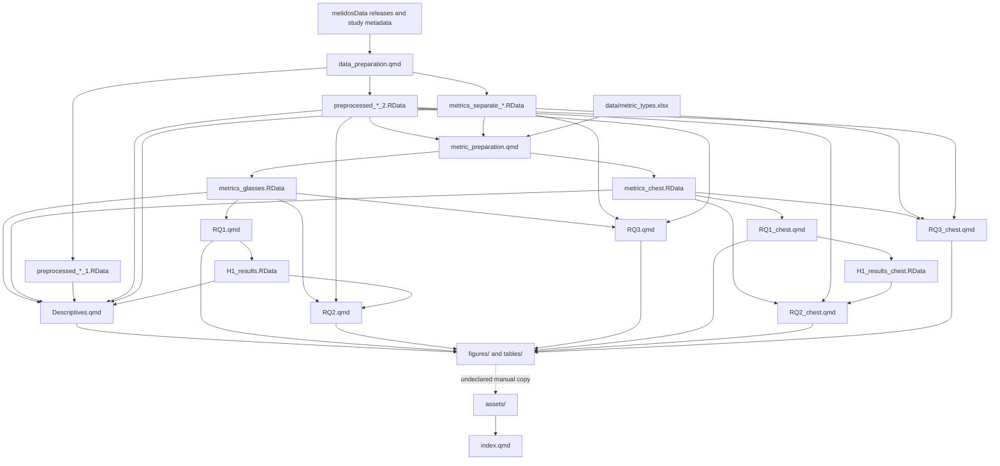

# Baseline render dependency graph

## Declared Quarto order

At commit `20ba43c27e69fd952ce8023770538f2aa843ef5e`,
`_quarto.yml` declares:

1. `data_preparation.qmd`
2. `metric_preparation.qmd`
3. `Descriptives.qmd`
4. `RQ1.qmd`
5. `RQ2.qmd`
6. `RQ3.qmd`
7. `RQ1_chest.qmd`
8. `RQ2_chest.qmd`
9. `RQ3_chest.qmd`
10. `index.qmd`

## Observed file dependencies

## Confirmed structural defects

### Invalid Descriptives-to-H1 ordering

`Descriptives.qmd:771` loads `data/H1_results.RData`; `RQ1.qmd:410`
produces it. Quarto nevertheless renders `Descriptives.qmd` before `RQ1.qmd`.
A clean build can only succeed if a stale H1 workspace already exists.

The minimum valid baseline ordering would put `RQ1.qmd` before
`Descriptives.qmd`. The planned canonical architecture should instead express
the dependency through explicit one-object artifacts and an artifact assembly
step.

### Frozen execution cannot establish provenance

The project-level execution setting is `freeze: auto`. There are 240 tracked
files under `_freeze/`, covering preparation, descriptives, ocular RQ, and
chest RQ documents. Quarto may therefore reuse results produced by a different
source, package, or data state. Mandatory final audit renders must set
`freeze: false` and begin without relying on `_freeze`.

### Undeclared manuscript assembly

`index.qmd` references 25 `assets/` resources. Analytical documents write
durable outputs to `figures/` and `tables/`, but the project declares no
deterministic copy, transformation, or source-data assembly step into
`assets/`. The manuscript can therefore display artifacts that do not
correspond to the current analytical output.

### Workspace-shaped artifacts

The baseline uses `.RData` files that may contain several objects and relies on
`load()` injecting them into the global environment. This obscures object
identity and permits accidental dependencies on pre-existing state. These
files are retained only as a hashed pre-repair record.

## Required replacement

The repaired graph must use explicit `.rds` and CSV producers, one artifact per
object, declared hypothesis-level inputs, deterministic figure/table assembly,
and a final manuscript render that consumes those produced artifacts directly.
