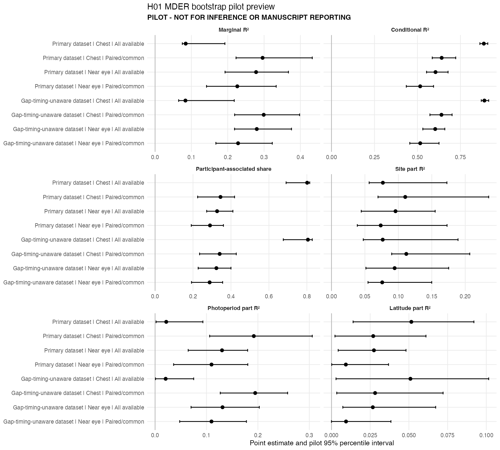

# H01 METRIC-010 bootstrap pilot review

Status: **PILOT - NOT FOR INFERENCE OR MANUSCRIPT REPORTING**  
Decision: **awaiting explicit author production approval**

## Execution summary

The pilot completed all 8 targets with 50 successful joint refits per target (400 used refits in total). There were 0 failed and 0 warning refits.

Observed target wall time summed to 16.5 seconds. Linear scaling projects the 1,000-refit production run at 0.09 hours, with a planning range of 0.07 to 0.11 hours using four refit workers per sequential target.

Completed-target checkpoints were written for all targets. The pilot created 26,676 bytes of compressed draw files; linearly projected production draws would occupy approximately 533,520 bytes. Peak memory was not instrumented per child process.

The current-input bridge passed for all eight MDER targets, and all 1169 canonical H01 artifacts checked before and after the pilot were byte-identical.

## Preview table

|Status                                            |Dataset                    |Placement |Sample        |Marginal R²          |Conditional R²       |Participant-associated share |Site part R²         |Photoperiod part R²  |Latitude part R²     |
|:-------------------------------------------------|:--------------------------|:---------|:-------------|:--------------------|:--------------------|:----------------------------|:--------------------|:--------------------|:--------------------|
|PILOT - NOT FOR INFERENCE OR MANUSCRIPT REPORTING |Primary dataset            |Chest     |All available |0.084 [0.075, 0.192] |0.886 [0.863, 0.909] |0.801 [0.690, 0.815]         |0.077 [0.056, 0.173] |0.022 [0.002, 0.093] |0.052 [0.014, 0.092] |
|PILOT - NOT FOR INFERENCE OR MANUSCRIPT REPORTING |Primary dataset            |Chest     |Paired/common |0.296 [0.223, 0.433] |0.641 [0.586, 0.722] |0.345 [0.224, 0.419]         |0.110 [0.070, 0.235] |0.192 [0.106, 0.306] |0.027 [0.002, 0.061] |
|PILOT - NOT FOR INFERENCE OR MANUSCRIPT REPORTING |Primary dataset            |Near eye  |All available |0.278 [0.193, 0.367] |0.605 [0.553, 0.678] |0.327 [0.272, 0.410]         |0.096 [0.045, 0.155] |0.130 [0.064, 0.180] |0.027 [0.004, 0.048] |
|PILOT - NOT FOR INFERENCE OR MANUSCRIPT REPORTING |Primary dataset            |Near eye  |Paired/common |0.226 [0.142, 0.333] |0.516 [0.435, 0.593] |0.289 [0.191, 0.360]         |0.074 [0.039, 0.173] |0.110 [0.036, 0.180] |0.009 [0.000, 0.037] |
|PILOT - NOT FOR INFERENCE OR MANUSCRIPT REPORTING |Gap-timing-unaware dataset |Chest     |All available |0.084 [0.065, 0.218] |0.889 [0.871, 0.914] |0.805 [0.676, 0.828]         |0.077 [0.048, 0.189] |0.021 [0.001, 0.075] |0.051 [0.003, 0.102] |
|PILOT - NOT FOR INFERENCE OR MANUSCRIPT REPORTING |Gap-timing-unaware dataset |Chest     |Paired/common |0.299 [0.219, 0.398] |0.639 [0.572, 0.701] |0.340 [0.235, 0.428]         |0.112 [0.090, 0.207] |0.195 [0.127, 0.258] |0.028 [0.003, 0.072] |
|PILOT - NOT FOR INFERENCE OR MANUSCRIPT REPORTING |Gap-timing-unaware dataset |Near eye  |All available |0.280 [0.219, 0.375] |0.603 [0.531, 0.659] |0.323 [0.227, 0.400]         |0.094 [0.051, 0.175] |0.131 [0.070, 0.203] |0.027 [0.007, 0.067] |
|PILOT - NOT FOR INFERENCE OR MANUSCRIPT REPORTING |Gap-timing-unaware dataset |Near eye  |Paired/common |0.228 [0.167, 0.323] |0.516 [0.455, 0.625] |0.288 [0.192, 0.356]         |0.076 [0.055, 0.150] |0.110 [0.048, 0.178] |0.009 [0.000, 0.038] |

Values are point R² summaries with pilot percentile intervals. They are not inferential results.

## Multiplicity preview

|Family                        |Metric                               |Raw p (rule: p < 0.050) |FDR-adjusted p (rule: q < 0.050) |FDR-supported |Point-baseline support decision |
|:-----------------------------|:------------------------------------|:-----------------------|:--------------------------------|:-------------|:-------------------------------|
|H01-F1-site                   |Time below 10 lx melEDI before sleep |**0.029**               |**0.049**                        |Supported     |Changed                         |
|H01-F1-site                   |MDER                                 |**&lt;0.001**           |**&lt;0.001**                    |Supported     |Changed                         |
|H01-F2-photoperiod            |MDER                                 |**&lt;0.001**           |**&lt;0.001**                    |Supported     |Unchanged                       |
|H01-F3-latitude               |MDER                                 |**0.005**               |**0.013**                        |Supported     |Changed                         |
|H01-F4-site-latitude-adequacy |MDER                                 |**0.003**               |**0.010**                        |Supported     |Changed                         |

This is the already accepted point-baseline preview. No adjusted p-value has been promoted into the accepted H01 package.

## Preview figure

The figure previews marginal and conditional R², the participant-associated share, and the separately reported site, photoperiod, and latitude part R² components. Term components can overlap and must not be summed.

## Production decision

No production bootstrap or accepted-report integration has been run. Explicit author approval is required before 1,000 successful joint refits are launched for each of the eight targets.
