## Study support and exposure definitions

### Supplementary Table S1. Descriptive sample flow

::: {#supp-table-s1 .supplementary-table .column-page-left tabindex="0" aria-label="Supplementary Table S1, descriptive sample flow"}



**Supplementary Table S1.** Participant, participant-day, and one-minute observation counts across the roster, sensor-specific completeness and all-zero screens, final descriptive datasets, and paired main subset. Each row names its denominator explicitly. An excluded participant-day is not necessarily an excluded participant.
:::

### Supplementary Table S2. Full near-eye metric dictionary and distributions

::: {#supp-table-s2 .supplementary-table .column-page-left tabindex="0" aria-label="Supplementary Table S2, near-eye metric dictionary and distributions"}



**Supplementary Table S2.** Definitions, exact support, median (interquartile range) summaries, and density displays for the 17 near-eye personal light-exposure metrics overall and by site. Values use three decimal places where applicable. Metrics are distinct summaries and should not be interpreted as interchangeable outcomes.
:::

### Supplementary Table S3. Descriptive recommendation-range fractions

::: {#supp-table-s3 .supplementary-table .column-page-left tabindex="0" aria-label="Supplementary Table S3, descriptive recommendation-range fractions"}



**Supplementary Table S3.** Fractions of valid near-eye minutes meeting each Brown et al. recommendation range, with explicit numerators and denominators. Daytime, Pre-sleep, and Sleep identify the recommendation windows. The Sleep summaries use near-eye illuminance recorded during sleep and describe the bedside sleep environment rather than verified ocular exposure. These pooled-minute summaries are descriptive and differ from the modelled recommendation-window-period estimates in main Table 2.
:::

### Supplementary Figure S1. Near-eye metric distributions

<figure id="fig-s1" class="display-figure">

<figcaption><strong>Supplementary Figure S1.</strong> Detailed near-eye metric distributions by country-coded study site.</figcaption>
</figure>

### Supplementary Figure S2. Worked metric derivation

<figure id="fig-s2" class="display-figure">
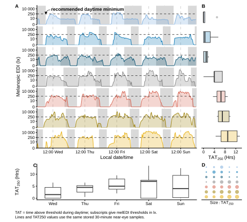
<figcaption><strong>Supplementary Figure S2.</strong> Examples linking 30-minute time series to the daily time-above-250-lx metric.</figcaption>
</figure>

### Supplementary Figure S3. Latitude and civil-photoperiod measurement range

<figure id="fig-s3" class="display-figure">
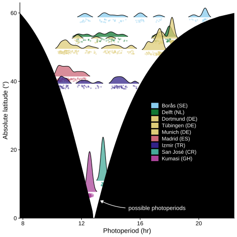
<figcaption><strong>Supplementary Figure S3.</strong> Observed civil photoperiod and theoretical bounds by absolute latitude.</figcaption>
</figure>

## Recommendation adherence

Daytime, Pre-sleep, and Sleep identify the Brown et al. recommendation windows.

### Supplementary Figure S4. Site-average recommendation adherence

<figure id="fig-s4" class="display-figure">
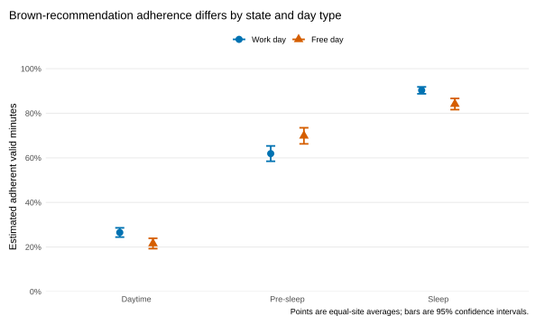
<figcaption><strong>Supplementary Figure S4.</strong> Recommendation adherence in the Daytime, Pre-sleep and Sleep recommendation windows on Work and Free days. Points are equal-site average percentages of valid minutes meeting the Brown et al. recommendation; bars are 95% confidence intervals. Daytime, Pre-sleep and Sleep identify the three Brown et al. recommendation windows. The Sleep estimate uses near-eye illuminance recorded during sleep and describes the bedside sleep environment rather than verified ocular exposure.</figcaption>
</figure>

### Supplementary Figure S5. Site-specific adherence and day-type differences

<figure id="fig-s5" class="display-figure">
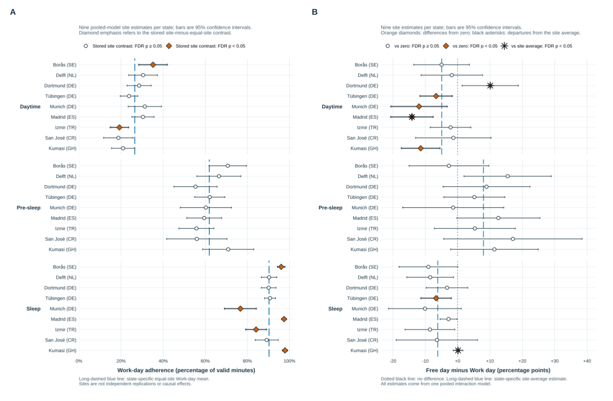
<figcaption><strong>Supplementary Figure S5.</strong> Site-specific recommendation adherence across Brown et al. recommendation windows. <strong>A</strong>, Work-day adherence, with diamonds identifying deviations from the window-specific site-average Work-day estimate that met its false-discovery-rate (FDR) criterion. <strong>B</strong>, Free-minus-Work differences, with diamonds identifying differences from zero and asterisks identifying departures from the window-specific site-average difference in a separate 27-comparison FDR family. Daytime, Pre-sleep and Sleep identify the Brown et al. recommendation windows. Points are estimates and bars are 95% confidence intervals. Sites are components of one pooled model, not independent replications or causal effects of location. The Sleep-window estimates use near-eye illuminance recorded during sleep and describe the bedside sleep environment rather than verified ocular exposure.</figcaption>
</figure>

### Supplementary Table S4. Exploratory cross-window recommendation-adherence associations

::: {#supp-table-s4 .supplementary-table .column-page-left tabindex="0" aria-label="Supplementary Table S4, cross-window recommendation-adherence associations"}



**Supplementary Table S4.** Exploratory within-participant and between-participant associations across Brown et al. recommendation windows. Results are percentage-point differences per 10 percentage points higher Daytime adherence. The four tests form one FDR family. The within-participant day-level claim is withheld because serial dependence remains unresolved. Between-participant results describe observed monitoring-period averages and do not establish rankings, stable traits, or causal effects.
:::

### Supplementary Figure S6. Anonymous participant recommendation-adherence profiles

<figure id="fig-s6" class="display-figure">
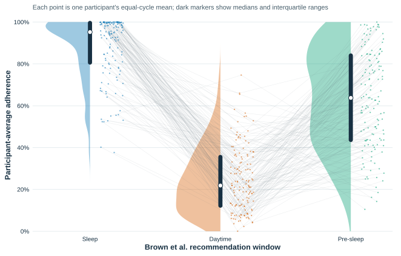
<figcaption><strong>Supplementary Figure S6.</strong> Participant-average recommendation adherence across the Brown et al. recommendation windows. Daytime, Pre-sleep, and Sleep are the window labels. Each colored point is one anonymous participant's equal-cycle mean within that window. Faint lines connect the same anonymous participant across the three window summaries; they are not time trajectories or ranks. Half-violin shapes show the window distributions, and dark bars with white points show interquartile ranges and medians. Because each window has its own Brown et al. threshold and direction, absolute percentages should be interpreted within window.</figcaption>
</figure>

## Daily architecture

### Supplementary Table S5. Near-eye fitted-curve dispersion and full-model R² allocation

::: {#supp-table-s5 .supplementary-table .column-page-left tabindex="0" aria-label="Supplementary Table S5, near-eye fitted-curve dispersion and full-model R squared allocation"}



**Supplementary Table S5.** Near-eye fitted-curve dispersion and Shapley allocation of full-model in-sample R². Fitted-curve variation is in squared log10(melanopic EDI + 0.1 lx) prediction units; dispersion and R²-share ratios are unitless. The allocation includes the shared local-clock curve in every component model as the baseline. Intervals are 95% hierarchical cluster-bootstrap percentile intervals from 2,000 replicates and are conditional on the fitted models. Dispersion and R² allocation describe different estimands and should not be added or interpreted causally.
:::

### Supplementary Table S6. Chest fitted-curve dispersion and full-model R² allocation

::: {#supp-table-s6 .supplementary-table .column-page-left tabindex="0" aria-label="Supplementary Table S6, chest fitted-curve dispersion and full-model R squared allocation"}



**Supplementary Table S6.** Complementary chest fitted-curve dispersion and Shapley allocation of full-model in-sample R². The quantities, bootstrap intervals and interpretation follow Supplementary Table S5; chest and near-eye measurements remain distinct sensor-position estimands.
:::

## Geographic and civil-photoperiod context

### Supplementary Figure S7. Geographic support and nonlinear photoperiod classifications

<figure id="fig-s7" class="display-figure">

A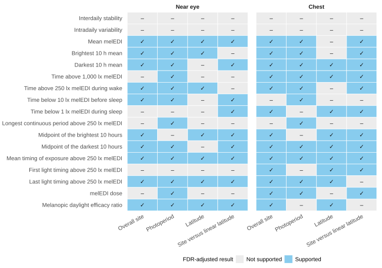

B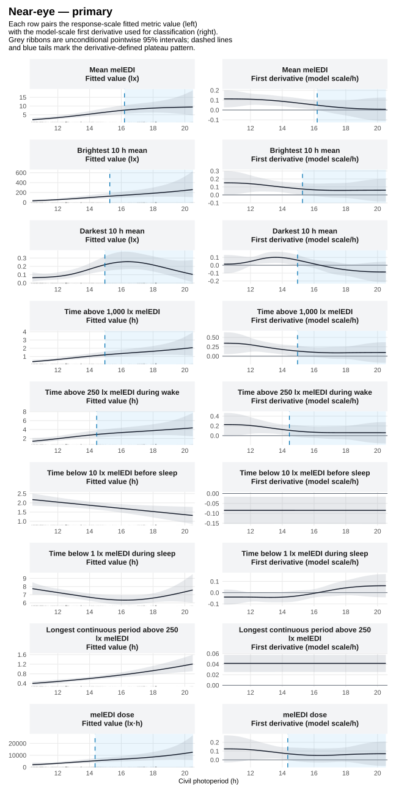

<figcaption><strong>Supplementary Figure S7.</strong> Geographic and civil-photoperiod associations across near-eye personal light-exposure metrics. <strong>A</strong>, Evidence retained after FDR adjustment for overall site, civil photoperiod, latitude, and site-versus-linear-latitude adequacy. <strong>B</strong>, Nonlinear civil-photoperiod associations and their fitted slopes. A qualifying transition denotes an increase followed by a sustained near-flat tail under the specified slope rule. These descriptive associations do not identify a mechanism, and no physiological or environmental ceiling was identified.</figcaption>
</figure>

### Supplementary Table S7. Geographic and photoperiod associations

::: {#supp-table-s7 .supplementary-table .column-page-left tabindex="0" aria-label="Supplementary Table S7, near-eye geographic and photoperiod associations"}



**Supplementary Table S7.** Overall-site, civil-photoperiod and absolute-latitude associations for the 17 near-eye personal light-exposure metrics. Each displayed *p* value is FDR-adjusted within its stated 17-test family. Site and latitude were evaluated in separate models because absolute latitude is fixed within and confounded with study site.
:::

### Supplementary Table S8. Nonlinear civil-photoperiod classifications

::: {#supp-table-s8 .supplementary-table .column-page-left tabindex="0" aria-label="Supplementary Table S8, near-eye nonlinear civil-photoperiod classifications"}



**Supplementary Table S8.** Derivative-based classifications for nine near-eye personal light-exposure metrics across the observed civil-photoperiod range. A qualifying transition required the preceding fitted-slope interval to be wholly above zero, the next interval to include zero and every later interval through the recorded maximum to remain zero-compatible. These classifications are descriptive and do not identify a physiological or environmental ceiling.
:::

## Immediate environments and routines

### Supplementary Figure S8. Light-source category and local-clock pattern of near-eye melanopic EDI

<figure id="fig-s8" class="display-figure">
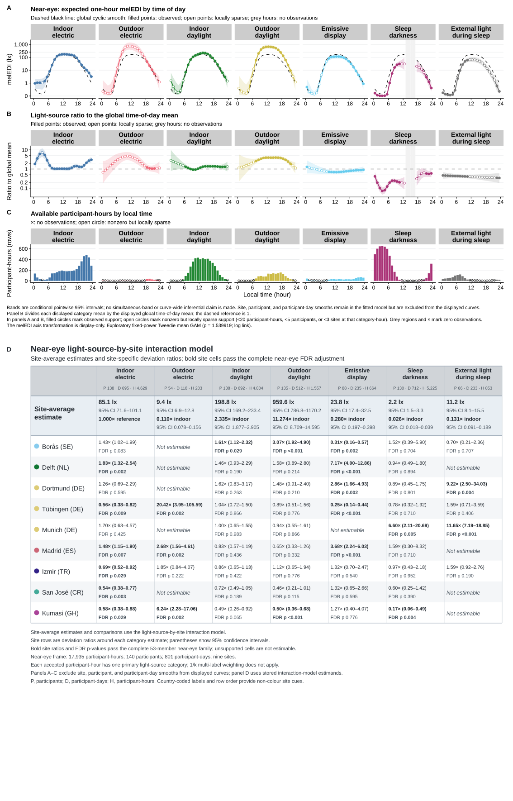
<figcaption><strong>Supplementary Figure S8.</strong> Near-eye light exposure by reported light source across time of day and study site. <strong>A–C</strong>, Exploratory time-of-day analysis. Panel A shows expected one-hour melanopic EDI with clock-specific 95% confidence intervals; the dashed line is the site-average local-clock smooth. Panel B shows each light-source curve relative to that smooth, with 1 as the reference. Panel C shows available participant-hours; open circles indicate locally sparse support and grey gaps indicate no observations. <strong>D</strong>, Site-average category estimates and site-specific deviation ratios from the light-source-by-site interaction model, with participant-cluster-robust 95% confidence intervals, FDR-adjusted <em>p</em> values, and exact support. The analysis includes 17,935 participant-hours from 140 participants, covering 801 participant-days and nine sites. Panels A–C and panel D answer different questions and are not numerically interchangeable. Estimates are observational. During reported sleep, measurements describe the bedside sleep environment.</figcaption>
</figure>

## Hourly routine analyses

### Supplementary Figure S9. Paired sensor-position hourly associations

<figure id="fig-s9" class="display-figure">
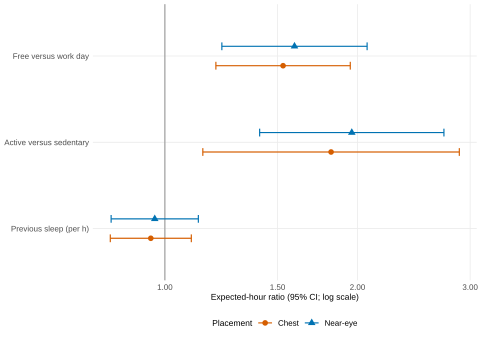
<figcaption><strong>Supplementary Figure S9.</strong> Near-eye and complementary chest associations estimated separately for the same participants and participant-days. The sets of supported participant-hours differ between sensor positions, so the display is not an observation-level identity comparison and does not test equivalence.</figcaption>
</figure>

### Supplementary Figure S10. Free-versus-Work hourly timing

<figure id="fig-s10" class="display-figure">
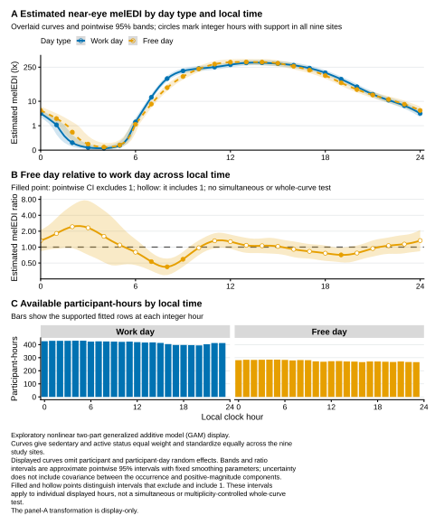
<figcaption><strong>Supplementary Figure S10.</strong> Exploratory Free-versus-Work hourly fitted exposure and response-scale ratio curves with 95% confidence intervals and participant-hour support.</figcaption>
</figure>

### Supplementary Figure S11. Active-versus-Sedentary hourly timing

<figure id="fig-s11" class="display-figure">
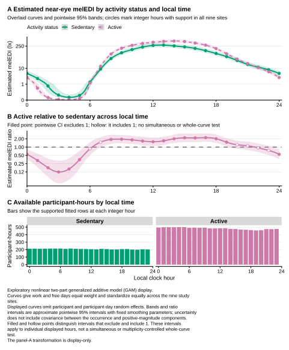
<figcaption><strong>Supplementary Figure S11.</strong> Exploratory Active-versus-Sedentary hourly fitted exposure and response-scale ratio curves with 95% confidence intervals and participant-hour support.</figcaption>
</figure>

### Supplementary Figure S12. Site-specific hourly routine associations

<figure id="fig-s12" class="display-figure">
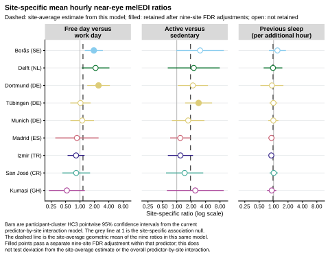
<figcaption><strong>Supplementary Figure S12.</strong> Site-specific estimates from the predictor-by-site interaction model. Filled and hollow points distinguish associations that did and did not meet the 0.050 criterion after a separate nine-site FDR adjustment within each predictor. The 95% confidence intervals are unadjusted; dashed lines show site-average estimates calculated with equal weight for each of the nine sites. Sites are components of one pooled model, not independent replications or causal effects of location.</figcaption>
</figure>

### Supplementary Table S9. Participant-hour routine associations

::: {#supp-table-s9 .supplementary-table .column-page-left tabindex="0" aria-label="Supplementary Table S9, participant-hour routine associations"}



**Supplementary Table S9.** Common-association estimates from the participant-hour analysis of Free versus Work day, Active versus Sedentary daily activity status and each additional hour of previous-night sleep duration. Ratios and participant-cluster-robust 95% confidence intervals come from the fixed-site model; the three *p* values form one FDR-adjusted family. Predictor-by-site differences are shown in Supplementary Figure S12.
:::

## Person-level findings

### Supplementary Table S10. Person-level evidence synthesis

::: {#supp-table-s10 .supplementary-table .column-page-left tabindex="0" aria-label="Supplementary Table S10, person-level evidence synthesis"}



**Supplementary Table S10.** Summary of person-level results in the near-eye analyses. Each row identifies the analysis-specific FDR-correction set or decision structure applied to that result. Results that did not meet the applicable FDR criterion are inconclusive rather than evidence of no association. Four light-behaviour sleep-environment cells were non-estimable. The two chronotype instruments were analysed separately. Biological sex and gender were recorded separately; gender was not analysed. The complete available-data curve difference was attenuated and not retained in the activity-complete near-eye analysis.
:::

### Supplementary Figure S13 and Table S11. Light-exposure behaviour and awareness

<figure id="fig-s13" class="display-figure">
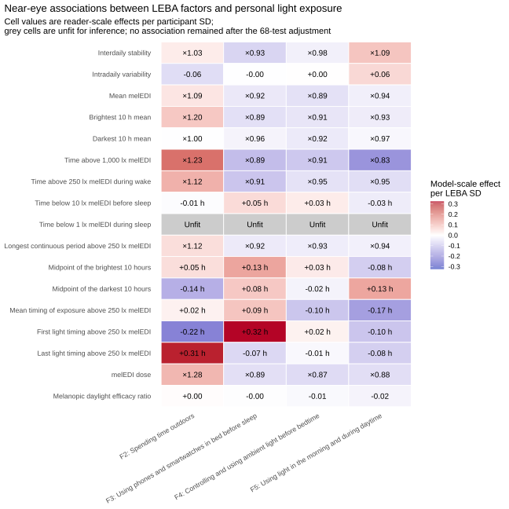
<figcaption><strong>Supplementary Figure S13.</strong> Near-eye associations per one participant-level standard deviation of each Light Exposure Behaviour Assessment factor. None of the 68 tests retained FDR-adjusted support. Four sleep-environment cells were not estimable and are labelled Unfit with estimates suppressed. Lack of adjusted support is inconclusive rather than proof of no association.</figcaption>
</figure>

::: {#supp-table-s11 .supplementary-table .column-page-left tabindex="0" aria-label="Supplementary Table S11, light-exposure behaviour and awareness"}




:::

### Supplementary Figure S14 and Table S12. Visual light sensitivity

<figure id="fig-s14" class="display-figure">
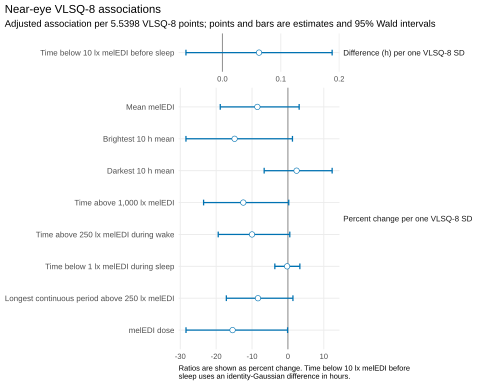
<figcaption><strong>Supplementary Figure S14.</strong> Near-eye site-average associations between the Visual Light Sensitivity Questionnaire-8 and nine personal light-exposure metrics. Associations compare scores separated by one participant-level standard deviation. Horizontal bars are 95% Wald confidence intervals. None of the nine associations retained FDR-adjusted support.</figcaption>
</figure>

::: {#supp-table-s12 .supplementary-table .column-page-left tabindex="0" aria-label="Supplementary Table S12, visual light sensitivity"}


:::

### Supplementary Figure S15 and Table S13. Chronotype and timing

<figure id="fig-s15" class="display-figure">

A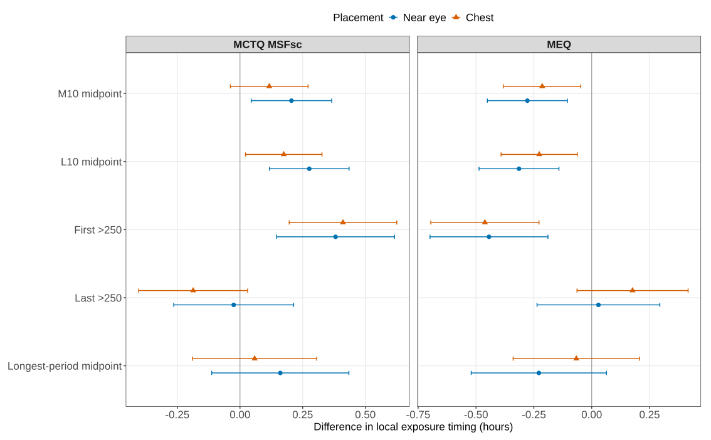

B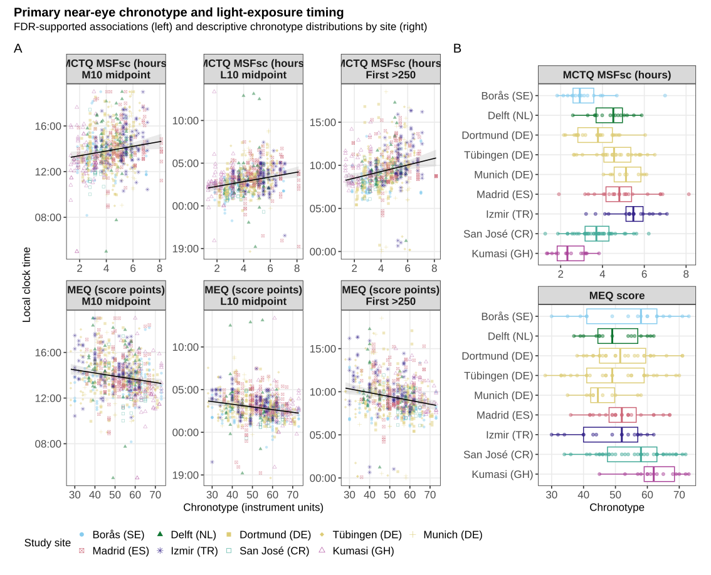

<figcaption><strong>Supplementary Figure S15.</strong> Chronotype and timing of personal light exposure. <strong>A</strong>, Study-site-adjusted associations of sleep-timing-based corrected midsleep on Free days and questionnaire-based morningness-eveningness with the analysed timing metrics. Points are estimates and bars are 95% confidence intervals; the two chronotype instruments remain separate. <strong>B</strong>, Observed participant-day timing values across chronotype and country-coded study sites for the samples used in the corresponding models. Each point represents one participant-day in a fitted sample. The observed panel is descriptive and does not replace the adjusted models or estimate independent site effects. Near-eye estimates provide ocular-exposure evidence; chest estimates, where shown, are complementary non-ocular evidence.</figcaption>
</figure>

::: {#supp-table-s13 .supplementary-table .column-page-left tabindex="0" aria-label="Supplementary Table S13, chronotype and timing"}


:::

### Supplementary Figure S16 and Table S14. Age and biological sex

<figure id="fig-s16" class="display-figure">
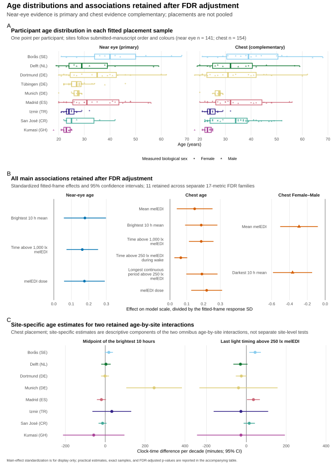
<figcaption><strong>Supplementary Figure S16.</strong> Participant age distributions, the 11 main associations retained after FDR adjustment, and descriptive site-specific estimates for two retained age-by-site interactions in the complementary chest analysis. The site-specific interaction estimates are descriptive model contrasts, not independent site tests. Biological sex, coded Female or Male, was analysed; gender was recorded separately and was not analysed.</figcaption>
</figure>

::: {#supp-table-s14 .supplementary-table .column-page-left tabindex="0" aria-label="Supplementary Table S14, age and biological sex"}


:::

### Supplementary Figure S17 and Table S15. Biological-sex-specific daily curves

<figure id="fig-s17" class="display-figure">
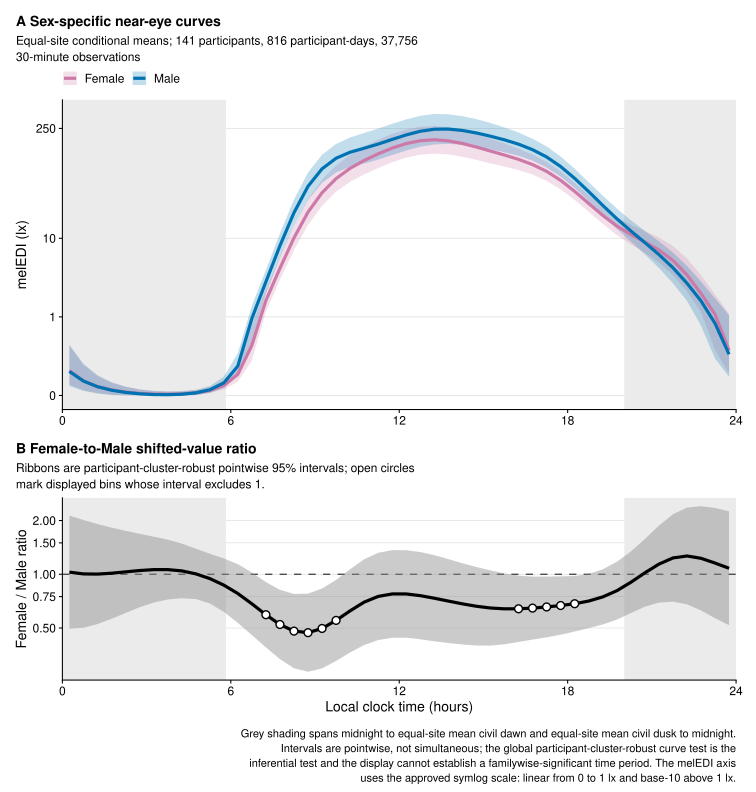
<figcaption><strong>Supplementary Figure S17.</strong> Near-eye biological-sex-specific fitted melanopic equivalent daylight illuminance curves and Female-to-Male shifted-value ratio. Ribbons and contrast intervals are participant-cluster-robust 95% confidence intervals at the displayed clock times. Grey shading gives site-average civil-night context with each site weighted equally and is not a model covariate. Biological sex, coded Female or Male, was analysed; gender was recorded separately and was not analysed.</figcaption>
</figure>

::: {#supp-table-s15 .supplementary-table .column-page-left tabindex="0" aria-label="Supplementary Table S15, biological-sex-specific daily curves and global tests"}


:::

## Measurement position, robustness, and reproducibility

Near-eye and complementary chest measurements remain separate sensor-position estimands. Common-sample analyses use the same participants and participant-days at both positions and fit the positions separately. They do not pool positions, test equivalence, or establish a universal correction. Detailed model checks, sensitivities, preregistration deviations, exact formulas, package versions, and source documentation are provided in the analysis reports and reproducibility package.
