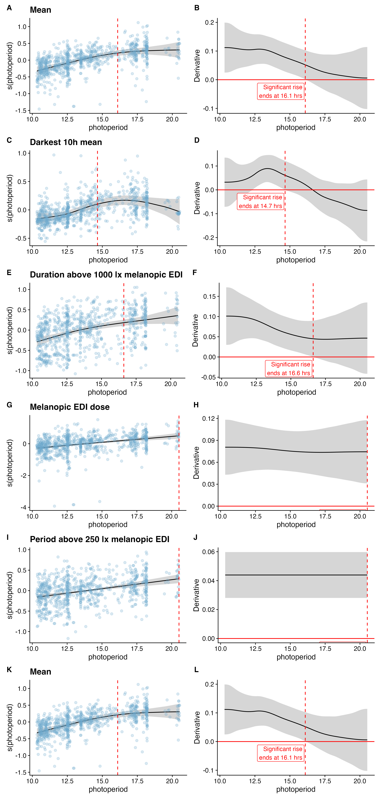

https://www.nature.com/nathumbehav/content
Main text – up to 5,000 words, excluding abstract, Methods, references and figure legends.
Abstract – up to 150 words, unreferenced. 
Display items – up to 8 items (figures and/or tables). 
Article should be divided as follows: 
Introduction (without heading) 
Results (concise, focused account of the findings)
Discussion
Methods. ​
Results and Methods should be divided by topical subheadings; the Discussion does not contain subheadings.

# Introduction {#sec-intro}

Human health and ocular light exposure are intricately linked through non-visual neural pathways from the eye to the autonomic nervous system. Because ocular light exposure is shaped not only by solar availability, but also by geographic location, culture, the built environment, and, ultimately, individual behaviour, it is considered a highly modifiable determinant of human health. However, our understanding of personal light exposure patterns under naturalistic conditions remains limited, including how much these patterns vary within and between populations and how they are shaped by individual, behavioural, and environmental factors. In this study, we present the first multi-country wearable and experience-sampling dataset of this fidelity and scope, and decompose personal light exposure into its contributing components.

Human behaviour and physiology are shaped by the 24-hour light–dark cycle. The evolutionary advantage of anticipating environmental changes and acting on them, rather than merely reacting to them, has led to the development of an endogenous circadian rhythm. In humans, as in many other mammals, the circadian system is coordinated by a central pacemaker, the suprachiasmatic nucleus (SCN), located in the hypothalamus. The SCN regulates many physiological processes, either directly or indirectly, by synchronising peripheral clocks throughout the body. Circadian effects include the regulation of hormone production, including melatonin and cortisol, sleep–wake timing, mood, cognition, and physical performance. In an entrained, that is, aligned, circadian system, internal processes provide an appropriate physiological substrate for responding to external demands during the day and internal restorative processes at night.

A key property of the SCN is its capacity for flexible alignment, allowing the endogenous rhythm to be adjusted by external stimuli known as zeitgebers. The strongest zeitgeber in humans is ocular light input. Intrinsically photosensitive retinal ganglion cells (ipRGCs) in the retina relay environmental light information to the SCN via the retinohypothalamic tract. Secondary downstream targets of ipRGC signalling include sleep–wake-regulatory brain regions and, as suggested by mouse models, potentially mood-regulatory circuits. This link between retinal light exposure and acute as well as long-term effects on human physiology has wide-reaching implications for health and wellbeing. Circadian misalignment is associated with increased risk of mental, metabolic, and cardiovascular disorders, as well as breast and prostate cancer.

Controlled laboratory studies over recent decades have characterised the novel photoreceptor class in the human retina and described its downstream physiological effects. In brief, light that excites ipRGCs acutely increases alertness, suppresses melatonin synthesis in the pineal gland, and shifts the phase of the circadian rhythm. These effects are collectively referred to as the non-visual effects of light.

Through the photopigment melanopsin, ipRGCs are maximally sensitive at approximately 490 nm, that is, at shorter wavelengths than those most strongly associated with daytime brightness perception, which peaks at approximately 555 nm. ipRGCs are also sparse, comprising approximately 1% of all retinal ganglion cells, although they are widely distributed across the retina. Their responses are relatively slow and temporally integrative, making them well suited as daylight detectors. Nevertheless, they can be stimulated by any light source with sufficient melanopic content.

The spectral sensitivity of ipRGCs has been standardised by the CIE in CIE S 026/E:2018. Within this framework, melanopic equivalent daylight illuminance, or melanopic EDI, is the primary metric for describing a corneal light stimulus to the non-visual system. Melanopic EDI has since been shown to describe non-visual responses in a dose-dependent manner better than individual photoreceptor-weighted quantities or photopic illuminance, that is, conventional daytime brightness perception.

On this basis, recommendations for healthy light exposure have been published that are based on activation of the non-visual system. These recommend a minimum of 250 lx melanopic EDI during waking hours to support circadian synchronisation and alertness, and a maximum of 10 lx melanopic EDI during the three hours before sleep to support the transition towards rest. The sleep environment should be as dark as possible, with an upper threshold of 1 lx melanopic EDI when light cannot be avoided.

While laboratory studies brought insights into the mechanisms, longterm effects of light exposure on human health require a deeper understanding of personal light exposure under naturalistic conditions. A few studies have made valuable attempts towards that goal, partially even before the underlying mechanisms were understood: Savides et al. (1986), with recordings conducted in San Diego (US) in 1984, measured forehead light exposure in 10 healthy young adults for one 24-hour period and found marked interindividual variation, with participants receiving on average only about 90 minutes per day above 2000 lx, suggesting that everyday bright-light exposure may be insufficient for robust circadian and seasonal synchronisation. Price et al. (2021) collected data in London (UK) and Dortmund (DE) during three separate weeks in three seasons in 2015, measuring 85 shift-working nurses continuously for 168 hours per season; light exposure varied strongly by season, shift type, and individual, with many profiles restricted or poorly aligned with the solar day, indicating that shift-worker light environments are heterogeneous and likely require context-specific interventions. Didikoglu et al. (2023), conducted as study in the UK in 2022, following 59 adults for approximately seven days and found that participants often received too little daytime melanopic EDI and too much evening or sleep-period light, while higher recent light exposure was associated with lower morning sleepiness and higher pre-bedtime exposure with longer sleep latency. Lok et al. (2023) analysed historical data collected between November 2009 and March 2012 in 877 community-dwelling older men, using at least five consecutive 24-hour actigraphy recordings, and found that lower daytime light exposure, especially less time above 1000 lx, was associated with greater sleep–wake fragmentation. Biller et al. (2025) measured 39 participants in Basel, Switzerland, and Kuala Lumpur, Malaysia, for 30 consecutive days in 2023 and found that Swiss participants experienced brighter days, more time in daylight-level exposure, later afternoon bright-light exposure, and longer dim-light periods before bed than Malaysian participants.

A number of real-world and large-scale cohort studies have shown that mechanistically derived assumptions about the long-term physiological impact of light exposure are visible as associations under naturalistic conditions. The largest evidence base comes from UK Biobank, where one week of wrist-worn Axivity light recordings has been linked to multiple health outcomes: brighter nights and darker days were associated with higher odds of psychiatric disorders and poorer mood in 86,772 adults; brighter nights, lower modelled circadian amplitude, and atypical circadian phase predicted incident type 2 diabetes in 84,790 adults; and brighter nights, darker days, lower circadian amplitude, and early or late circadian phase predicted higher all-cause and cardiometabolic mortality risk in 88,905 adults. Smaller cohort studies converge with these findings. In the HEIJO-KYO cohort, objectively measured ambient light exposure in 1110 older Japanese adults at baseline, with 766 followed longitudinally, showed that higher evening or night light and lower morning light were associated with subsequent increases in waist-to-height ratio and BMI. In 192 older adults studied at home for four days, higher evening light exposure measured by wrist actigraphy was associated with prolonged subsequent sleep-onset latency. In the Chicago Healthy Aging Study, 552 community-dwelling older adults with seven-day actigraphy showed higher prevalence of obesity, diabetes, and hypertension among those exposed to light at night. Finally, in 207 outpatients with bipolar disorder from the APPLE cohort, evening light exposure over seven nights was associated with lower sleep efficiency, longer sleep-onset latency, and more wake after sleep onset.  

Several shortcomings in the published literature currently limit our understanding of personal light exposure. First, studies conducted before the late 2010s commonly used photopic illuminance as the primary stimulus measure for the circadian system. As discussed above, photopic weighting is less suitable than the melanopic action spectrum for characterising light input to the non-visual system, which limits the predictive value of earlier studies for biologically effective light exposure. Second, many studies use wrist-worn sensors to estimate corneal light exposure. This approach has important limitations: the measurement planes of the eye and wrist are rarely aligned, occlusion by sleeves is common, and many wrist-worn devices are primarily designed for actigraphy rather than accurate spectral irradiance measurements, for example because of limited cosine response to incident light. Third, study protocols and analysis pipelines vary widely, making results difficult to compare across studies. This problem is amplified by the large number of personal light exposure metrics used to condense time-series recordings into daily or participant-level summaries. In many cases, the underlying time-series data are not published alongside these summary metrics, preventing direct comparison on a common analytical basis. Fourth, light exposure data often lack contextual information. Information such as participant activity, device wear status, and whether a given day was a workday or free day is essential for interpreting measured exposure patterns. Only by linking wearable recordings with auxiliary contextual information can personal light exposure patterns and their determinants be described robustly.

The MeLiDos project provides a metrological and methodological framework for translating laboratory knowledge on non-visual light responses into robust field measurements of personal light exposure, thereby addressing these shortcomings. Running from 2023 to 2026, the project addresses three linked needs: calibration and quality indices for wearable light loggers, interoperable software and data workflows, and the development of spatially resolved approaches to light dosimetry. Within this framework, the associated field study protocol implements a harmonised prospective, multicentre, cross-sectional design across Costa Rica, Germany, Ghana, the Netherlands, Spain, Sweden, and Turkey, targeting about 15 participants per site. Participants wore light loggers for seven days at three body locations, the near-corneal plane, chest, and wrist, while smartphone-based experience sampling and daily questionnaires captured sleep, alertness, mood, activity, work patterns, light-related behaviour, and contextual factors. By combining temporally resolved objective light measurements with repeated behavioural and environmental self-reports, the protocol is designed to quantify not only how much light people receive under everyday conditions, but also which factors shape healthy or suboptimal light exposure patterns.

This study is a core output of the MeLiDos project and investigates determinants of personal light exposure patterns across individual, behavioural, and environmental domains. Accordingly, the analyses are organised around three research questions, each comprising multiple hypotheses addressing different aspects of this overarching question:

- Do sites differ in objectively measured personal light exposure? If so, does an individual’s behaviour and micro-environment have a stronger effect than site?
- Is there a relationship between personal light exposure and participants’ behaviour and environment?
- Is personal light exposure related to participant characteristics?

Other studies within the MeLiDos project address the effects of device placement, that is, sensor wearing location, on measurement fidelity of the near-eye level, as well as the acute effects of personal light exposure on mood, alertness, and sleep. These studies are therefore referenced where relevant but are not part of the analyses presented below.

# Results {#sec-results}

## Descriptive results

@fig-overview shows a summary of the study and the collected data. The final dataset comprised 191 participants and 1,480 participant-days of measurement. Of these, 1,416 participant-days met the predefined completeness criterion of more than 80% valid light exposure data coverage. Near-corneal, or ocular, light exposure measurements were available for 811 participant-days, and chest-level measurements were available for 1,249 participant-days. Chest-level measurements were not available in the Tübingen cohort, whereas ocular measurements were available for only 6 of 39 participants in the Costa Rica cohort. @tbl-T1 provides descriptive statistics for data collection across study sites, and @tbl-T2 summarises all light exposure metrics. Unless otherwise specified, all references to lux refer to melanopic equivalent daylight illuminance, or melanopic EDI, rather than photopic illuminance.

{#fig-overview}

{#tbl-T1}

{#tbl-T2}

### Recommendations for healthy daytime light exposure are not reached on average

On average, participants did not meet the recommended minimum daytime exposure of 250 lx melanopic EDI during waking hours. This indicates that, despite substantial variation between sites, seasons, and individuals, typical real-world ocular light exposure remained below levels proposed to support circadian synchronisation and daytime alertness.

Across all observations, the recommendation of at least 250 lx melanopic EDI was met during 24% of wake time, ranging from 14% in Kumasi (GH) to 33% in Borås (SE). During the three hours before sleep, light exposure was below the recommended maximum of 10 lx melanopic EDI in 63% of observations, ranging from 56% in Izmir (TR) to 75% in Kumasi. During sleep, light exposure was below the recommended maximum of 1 lx melanopic EDI in 88% of observations, ranging from 72% in Munich (DE) to 95% in Kumasi (GH). Across the entire 24-hour day, recommendations were met for 52% of observations, ranging from 45% in Izmir to 58% in Borås (SE). As shown in @tbl-brown, adherence during wake time decreased with latitude, whereas pre-sleep and sleep adherence showed lowest values observed at mid-latitude sites.

{#tbl-brown}

Wake periods, excluding the three hours before sleep, accounted for 47% of observations, pre-sleep periods for 11%, and sleep periods for 33%. The remaining 9% of observations were missing, either because of missing light exposure measurements or unavailable sleep–wake timing information for a given day.

## Site-specific differences in covariates

Photoperiod differed significantly between sites (p < 0.001). Only Delft (NL) and San José (CR) did not differ significantly from the overall average. Compared with the average, Dortmund (DE), Borås (SE), and Munich (DE) had significantly longer photoperiods, by 2.5, 2.0, and 2.9 hours, respectively. In contrast, Madrid (ES), Izmir (TR), Kumasi (GH), and Tübingen (DE) had significantly shorter photoperiods, by −3.1, −1.2, −1.6, and −1.7 hours, respectively.

Light exposure-related behavior (LEBA) factors showed significant site differences for two factors: *F2: Spending time outdoors* and *F5: Using light in the morning and during daytime*. Of these, only San José (CR) for F2 and Dortmund (DE) for F5 differed significantly from the overall mean in post hoc tests, with both sites scoring approximately 2–3 points lower.

Primary lightsource reports are different between sites (p<0.001), as are activity diaries (p<0.001).
Day type was not significantly different between sites (p=0.277). Exercise was not significantly different between sites (∆AIC > -2). Sleep duration was not significantly different between sites (p=0.108).

## Research Question 1: Do sites differ in objectively measured personal light exposure? If so, does an individual’s behaviour and micro-environment have a stronger effect than site?

The following subsections summarise the key results for Hypotheses 1 and 2. Detailed results are reported in @supptbl-H1 and @supptbl-H1r2.

### Site differs significantly for level and timing-based metrics, but not for duration, dynamics, exposure history, or spectrum-based metrics

Level- and timing-based light exposure metrics showed significant site-specific differences after controlling for photoperiod (all p ≤ 0.04). For level-based metrics, Kumasi (Ghana) participants were consistently exposed to lower values during daytime (*brightest 10h mean*), nighttime (*darkest 10h mean*), and across the full day (*mean*), with estimated values ranging from 0.40 to 0.67 times the overall mean. In contrast, Izmir (Türkiye) showed higher nighttime light levels, by a factor of 1.48, and Tübingen (Germany) showed higher nighttime and overall light levels, by factors ranging from 1.34 to 1.47, respectively.

For timing-based metrics, first light timing above 250 lx melanopic EDI ($FLIT_{250}$) was the only metric without significant site-specific differences (p = 0.40). In Kumasi, light exposure timing was shifted earlier in the day, with site-specific deviations ranging from −00:57 to −01:40 HH:MM. Similarly, in San José (Costa Rica), mean and last timing above 250 lx melanopic EDI ($MLIT_{250}$ and $LLIT_{250}$) occurred substantially earlier, with deviations of −01:53 and −02:05, respectively. Madrid (Spain) and Izmir showed later $MLIT_{250}$ and $LLIT_{250}$ timing (Madrid: +00:53 and +01:23; Izmir: +00:53 and +00:54). Delft (the Netherlands) also showed a later $MLIT_{250}$, with a deviation of +00:32. Although the midpoint of the brightest 10 hours showed significant site specificity (p = 0.002), no individual site differed significantly from the overall mean; rather, the effect was driven by selected pairwise differences, which are not reported in detail here.

No significant site-specific differences were observed for duration-, dynamics-, exposure-history-, or spectrum-based metrics (all p ≥ 0.062).

### Site effects are not random

Site was supported as a random effect in only a subset of models in which it was supported as a fixed effect (5 of 7 models). Moreover, the random-effect specification was preferable to the fixed-effect specification in only two cases: overall and nighttime light levels. This suggests that, when study site contributes meaningfully to model fit, site effects are more often site-specific rather than well described as draws from a common random-effect distribution.

### Latitude explains daytime levels better than site specifics coefficients

For overall and daytime light levels, latitude provided a better fit than site based on ΔAIC. Both model comparisons controlled for photoperiod. For each 10-degree increase in latitude, overall daily light levels increased by a factor of 1.15, and daytime light levels increased by a factor of 1.24. While latitude was also significant for some timing-based metrics, site-specific metrics had better support based on ∆AIC in all cases. Latitude was not significant for duration, dynamic, exposure history, or spectrum-based metrics.

### Photoperiod is significant for duration, exposure history, level, and spectrum based metrics, but not for dynamics and timing-based metrics

Photoperiod was significant in most models (all p < 0.05), except for dynamics-based metrics, most timing-based metrics, specifically the midpoints of the brightest and darkest 10 hours and $FLIT_{250}$, and duration below 1 lx melanopic EDI during sleep.

For duration-based metrics, each additional hour of photoperiod increased time above 250 lx melanopic EDI during wake, the longest continuous period above 250 lx melanopic EDI, and time above 1000 lx melanopic EDI by factors ranging from 1.10 to 1.17. Conversely, time below 10 lx melanopic EDI before sleep decreased by a factor of 0.97 per additional hour of photoperiod.

For exposure-history-based metrics, each additional hour of photoperiod increased cumulative melanopic EDI dose by a factor of 1.19. For level-based metrics, each additional hour of photoperiod increased melanopic EDI during the brightest 10 hours by a factor of 1.25, during the darkest 10 hours by a factor of 1.09, and across the full day by a factor of 1.18.

For spectrum-based metrics, each additional hour of photoperiod increased the melanopic daylight efficacy ratio (MDER) by 0.02, indicating a shift towards shorter-wavelength light exposure with longer photoperiods. For timing-based metrics, both $MLIT_{250}$ and $LLIT_{250}$ occurred later in the day as photoperiod increased, with shifts of +00:07 and +00:20 HH:MM per additional hour of photoperiod, respectively.

### Site and photoperiod are relevant predictors, but not dominant drivers of personal light exposure

Across light exposure metrics, overall model fit varied substantially, with explained variance ranging from 25% to 62% (conditional $R^2$; mean: 40%). The highest explanatory power was observed for duration-, spectrum-, and level-based metrics, particularly duration above 250 lx melanopic EDI during wake, overall and nighttime light levels, and MDER (all $R^2$ > 50%). Fixed effects accounted for a comparatively modest share of variance, ranging from 2% to 24% (mean: 12%), indicating that environmental predictors such as site, photoperiod, and latitude contributed meaningfully to personal light exposure but were not its dominant drivers.

Instead, participant-level differences explained a large proportion of variance, ranging from 9% to 42% (mean: 28%), and often exceeded the contribution of fixed effects. Two exceptions were $MLIT_{250}$ and $LLIT_{250}$, for which participant-level differences explained only 9% and 17% of variance, respectively, whereas fixed effects explained 17% and 23%. When site effects were significant, they tended to explain more variance than photoperiod effects (mean: 10% vs. 7%). Latitude added only limited explanatory value beyond photoperiod (range: 2%–7%; mean: 5%). Residual variance remained high across most metrics, ranging from 38% to 75%, indicating substantial unexplained within-person or day-to-day variability in real-world light exposure.

### Sites deviate mostly in the morning and afternoon from one another

When decomposing daily patterns of 30-minute-binned melanopic EDI into contributions of time, photoperiod, site, participant, and participant-day, study sites showed distinct deviations from the overall daily exposure pattern (see @fig-H2). These deviations were observed mainly before and after solar noon. Compared with the overall average, participants in Borås (SE) showed approximately 2- to 5-fold higher light exposure during these windows. A similar pattern was observed in Dortmund (DE) and Munich (DE), although with smaller deviations of approximately 2- to 3-fold. In Borås (SE), the increase was most pronounced in the morning, whereas in the German sites it was more pronounced in the evening.

Madrid (ES) showed the inverse pattern, with approximately 5-fold lower exposure around dawn and approximately 2-fold lower exposure around dusk. In Izmir (TR), light exposure was approximately 2-fold lower around dawn but 3- to 4-fold higher in the evening. San José (CR) showed a tendency towards higher morning and lower afternoon exposure, although this pattern was not statistically significant, likely because few participants at this site wore glasses-mounted light sensors. Kumasi (GH) was the only site that differed significantly around noon, with approximately 3-fold lower exposure than the overall average. Exposure in Kumasi (GH) was also reduced in the morning by approximately 2- to 3-fold and remained lower during the afternoon and evening, with reductions ranging from approximately 3- to 10-fold.

{#fig-H2}

### Participant-specific exposure patterns matter more than site-specific patterns

The pattern decomposition revealed that participant-specific differences accounted for substantially more unique variance than measurement site. Specifically, participant-level contributions explained 11.18% of the smooth variance, compared with 4.87% explained by site, corresponding to an approximately 2.3-fold larger contribution. This pattern mirrors the metric-based analyses, in which participant-specific variance was, on average, approximately 2.8 times larger than the variance attributable to site.

## Research Question 2: Is there a relationship between personal light exposure and participants’ behaviour and environment?**

### Access to daylight matters

The primary light source was a strong predictor of personal light exposure (p < 0.001, $R^2$ = 0.69), with small but significant site-specific variation (site: p < 0.001, $R^2$ = 0.05, interaction with primary lightsource: p < 0.001, $R^2$ = 0.02). For indoor electric lighting, the reference exposure was approximately 75 lx melanopic EDI. Compared with this reference, exposure was higher in Borås (SE), Delft (NL), and Madrid (ES), by factors of 2.04, 2.16, and 1.48, respectively. In contrast, exposure under indoor electric lighting was lower in Tübingen (DE) and Kumasi (GH), by factors of 0.56 and 0.50, respectively. Full model results are shown in @supptbl-H3 and interaction effects are visualized in @suppfig-H3H4.

Access to daylight substantially increased personal light exposure. Indoor daylight was associated with a 2.31-fold higher exposure than indoor electric lighting, corresponding to approximately 172 lx melanopic EDI. Kumasi (GH) was the only site that deviated significantly from this pattern, with indoor daylight levels 0.40 times lower than at other sites. Outdoor daylight showed the largest increase, with exposure levels 9.47 times higher than indoor electric lighting, corresponding to approximately 707 lx melanopic EDI and exceeding the recommended daytime threshold of 250 lx melanopic EDI. Outdoor daylight exposure was even higher in Borås (SE) and Delft (NL), by factors of 3.06 and 1.95, respectively, whereas Kumasi (GH) and San José (CR) showed lower outdoor daylight levels, by factors of 0.42 and 0.52, respectively.

When emissive displays were reported as the primary light source, exposure was substantially lower than under indoor electric lighting, by a factor of 0.28, corresponding to approximately 21 lx melanopic EDI. Display-related exposure was lower still in Borås (SE), Tübingen (DE), and Munich (DE), by factors of 0.54, 0.15, and 0.08, respectively. Conversely, display-related exposure was higher in Delft (SE), Dortmund (DE), Madrid (ES), and Izmir (TR), by factors of 6.30, 3.42, 5.10, and 1.99, respectively.

Darkness during sleep corresponded to approximately 2% of indoor electric-light exposure, or about 1 lx melanopic EDI. Madrid (ES) and Kumasi (GH) showed significantly lower sleep-period light exposure than other sites, by factors of 0.54 and 0.14, respectively. In contrast, Munich (DE) showed 6.42-fold higher light exposure in the sleep environment than other sites.

@suppfig-H3 extends the pattern decomposition presented in H2 (see @fig-H2) by including activity context. This additional analysis illustrates when during the day specific activity categories occur and how activity-related deviations contribute to the observed daily light exposure patterns.

### Individual behavior and micro-environment strongly shapes personal light exposure

What a person does, and where that activity takes place, strongly affected personal light exposure (p < 0.001, $R^2$ = 0.58), with small but significant site-specific variation (site: p < 0.001, $R^2$ = 0.09; interaction with activity: p < 0.001, $R^2$ = 0.04). Being awake at home corresponded to an average personal light exposure of approximately 59 lx melanopic EDI. Compared with this average, Borås (SE), Delft (NL), and Dortmund (DE) showed higher values by factors of 1.77, 2.37, and 2.04, respectively. Tübingen (DE) and Kumasi (GH) showed lower values, by factors of 0.46 and 0.33, respectively. Full model results are shown in @tbl-H4 and interaction effects are visualized in @suppfig-H3H4.

{#tbl-H4}

Sleeping in bed corresponded to approximately 4% of exposure while being awake at home, or approximately 2 lx melanopic EDI. The difference from the sleep-environment estimate reported above is likely explained by the activity category also capturing periods in which participants were sleeping with light entering the sleep environment, rather than only periods classified as darkness during sleep. Delft (NL), Dortmund (DE), Munich (DE), and Izmir (TR) showed higher sleep-period exposures than the overall average, by factors of 1.63, 1.83, 7.42, and 2.12, respectively. Tübingen (DE), Madrid (ES), and Kumasi (GH) showed lower exposures, by factors of 0.43, 0.47, and 0.15, respectively.

Travelling by public transport or car was associated with a 4.90-fold increase in exposure compared with being awake at home, corresponding to approximately 291 lx melanopic EDI. Dortmund (DE) showed even higher values, by a factor of 2.05, whereas Tübingen (DE) showed lower values, by a factor of 0.35.

Working in the office or from home was associated with 3.25-fold higher exposure than being awake at home, corresponding to approximately 193 lx melanopic EDI. Borås (SE) and Delft (NL) showed higher work-related exposure, by factors of 1.79 and 1.81, respectively. Tübingen (DE) and Kumasi (GH) showed lower workplace exposure, by factors of 0.57 and 0.62, respectively.

Being outdoors, including free time, work, or travelling without cover, was associated with an 8.91-fold increase in exposure compared with being awake at home, corresponding to approximately 530 lx melanopic EDI. Borås (SE) and Delft (NL) again showed higher exposure levels, by factors of 3.32 and 2.24, respectively, whereas Tübingen (DE) showed considerably lower values, by a factor of 0.23.

@fig-H4 extends the pattern decomposition presented in H2 (see @fig-H2) by including activity context. This analysis illustrates when specific activity categories occur during the day and how activity-related deviations contribute to the observed daily light exposure patterns.

{#fig-H4}

### Light exposure metrics are weakly linked to factors of overall personal light exposure behavior

Out of 68 comparisons between 17 light exposure metrics and four factors of personal light exposure-related behaviour, assessed using the LEBA, only two correlations were significant. *F2: Spending time outdoors* was positively correlated with melanopic EDI dose (p = 0.013, r = 0.27) and duration above 1000 lx melanopic EDI (p = 0.032, r = 0.29). The full correlation matrix is shown in @suppfig-H5. Correlations were performed independently of site.

### Day type, exercise level, and prior sleep are weakly linked with personal light exposure

Daily assessments of day type, that is, workday versus free day, showed a significant but small association with personal light exposure (p < 0.001, $R^2$ = 0.01), driven primarily by an interaction with site. On workdays, average light exposure was 76 lx melanopic EDI and did not differ significantly by site (set with exercise as *none* and an average of 7.9 hours of sleep). On free days, however, light exposure was significantly higher in Borås (SE), Delft (NL), and Dortmund (DE), by factors of 2.23, 2.62, and 2.24, respectively. Conversely, free-day light exposure was significantly lower in San José (CR) and Kumasi (GH), by factors of 0.37 and 0.54, respectively. Exploratory analyses shown in @suppfig-H6 indicate that higher light exposure on workdays occurred mainly before noon, when exposure was up to five times higher than on free days, and to a lesser extent during the afternoon, when exposure was consistently approximately two times higher. In contrast, light exposure was lower after midnight on workdays, likely reflecting earlier bedtimes. An exploratory model comparing weekdays with weekends instead of workdays with free days showed similar but weaker patterns and substantially less model support, with an AIC approximately 33 points higher than that of the day-type model.

Daily exercise level also showed a significant but small association with personal light exposure (p < 0.001, $R^2$ = 0.05). On days without exercise, average light exposure was 76 lx melanopic EDI (set with daytype as *work day* and an average of 7.9 hours of sleep). Borås (SE) and Dortmund (DE) showed higher values, by factors of 2.14 and 2.08, respectively, whereas Kumasi (GH) showed substantially lower values, by a factor of 0.15. Light-exercise days were associated with a 1.85-fold increase in light exposure. For this exercise level, Borås (SE) and Delft (NL) showed significantly higher values, by factors of 2.38 and 3.07, respectively, whereas Kumasi (GH) showed lower values, by a factor of 0.45. Moderate-exercise days were associated with a 1.74-fold increase in light exposure. Delft (NL) showed significantly higher values, by a factor of 2.20, whereas San José (CR) showed lower values, by a factor of 0.23. Vigorous-exercise days were associated with an overall 1.50-fold increase in light exposure and showed no significant site-specific deviations.

Prior sleep duration had a significant but small association with daily light exposure (p < 0.001, $R^2$ = 0.02). Each additional hour of sleep was associated with a factor of 0.92 in average daily light exposure, corresponding to an 8% reduction. This association likely reflects reduced opportunity for light exposure due to shorter wake duration. Delft (NL) and Tübingen (DE) showed little evidence of this sleep-duration effect, with compensatory factors of 1.15 and 1.10, respectively. Munich (DE) showed a stronger sleep-duration effect, with an additional factor of 0.88. A summary of model results for day type, exercise, and prior sleep duration is shown in @supptbl-H6.

### Photoperiod has a ceiling effect for level-based metrics

A ceiling effect of photoperiod was observed for selected light exposure metrics. For level-based metrics, increases in exposure were no longer significant beyond approximately 14.7 to 16.4 hours of photoperiod. A comparable ceiling effect was observed for duration above 1000 lx melanopic EDI, with the effect plateauing at approximately 16.6 hours of photoperiod. In contrast, the longest continuous period above 250 lx melanopic EDI and cumulative melanopic EDI dose showed no evidence of a ceiling effect within the observed photoperiod range. @suppfig-H7 shows the nonlinear relationships between photoperiod and the selected exposure metrics.

## Research Question 3: Is personal light exposure related to participant characteristics?

### Light exposure metrics are not significantly associated with persona light sensitivity

Duration-, exposure-history-, and level-based metrics of personal light exposure were not significantly associated with self-reported visual light sensitivity, assessed using the VLSQ-8 (all p > 0.9). A summary of the results is shown in @supptbl-H8.

**H9:** *Timing-based metrics of personal light exposure are significantly associated with chronotype.*

**H10:** *Personal light exposure metrics depend on age and sex*

**H11:** *Personal light exposure patterns depend on sex*

# Discussion {#sec-discussion}

# Methods {#sec-methods}

The current study was preregistered with AsPredicted (#273407). Deviations from the preregistration are documented in @sec-preregdev.

## Research questions and hypotheses

We assessed the following research questions and hypotheses, as specified in the preregistration and @sec-preregdev:

**Research Question 1: Do sites differ in objectively measured personal light exposure? If so, does an individual’s behaviour and micro-environment have a stronger effect than site?**

**H1:** *There is a significant difference in personal light-exposure metrics across sites, even after accounting for latitude and photoperiod.*

**H2:** *The variance of personal light exposure patterns (30-minute-binned geometric mean of melanopic EDI) by participants within sites is greater than the variance between sites.*

**Research Question 2: Is there a relationship between personal light exposure and participants’ behaviour and environment?**

**H3:** *There is a significant relationship between hourly self-reported light exposure categories and hourly geometric mean of melanopic EDI.*

**H4:** *There is a significant relationship between hourly self-reported activities and hourly geometric mean of melanopic EDI.*

**H5:** *There is a significant relationship between LEBA-factors and pre-selected personal light exposure metrics.*

**H6:** *There is a significant relationship between day type, daily exercise, sleep, and the hourly geometric mean of light exposure.*

**H7:** *There is a ceiling effect of photoperiod on level-, duration-, and exposure-history-based metrics.*

**Research Question 3: Is personal light exposure related to participant characteristics?**

**H8:** *Duration, exposure-history, and level-based metrics of personal light exposure are significantly associated with personal light sensitivity (VLSQ-8)*

**H9:** *Timing-based metrics of personal light exposure are significantly associated with chronotype.*

**H10:** *Personal light exposure metrics depend on age and sex*

**H11:** *Personal light exposure patterns depend on sex*

## Study design

This publication reports analyses from the MeLiDos field study, which is a multinational observational study examining associations between real-world ocular light exposure and personal and behavioral characteristics across diverse geographic and sociocultural contexts. The MeLiDos consortium collected multimodal longitudinal data using harmonised assessment protocols across participating study sites. The present analyses focused on the decomposition of melanopic light exposure under naturalistic conditions into individual, behavioural, and environmental contributing factors. The study design is described in detail in the protocol paper by Guidolin et al. and will be summarized in the following sections. 

Participants completed an 8-day ambulatory monitoring protocol comprising continuous personal light exposure assessment, repeated ecological momentary assessments, and daily diary measures under free-living conditions. The protocol started with an in-person visit to the local research centre, during which participants provided written informed consent, received detailed study instructions, and were equipped with wearable light-monitoring devices. Participants returned to the research centre after the monitoring period for device return and completion of end-of-study assessments. At most sites, monitoring began on a Monday and ended the following Monday; in Dortmund, data collection was conducted from Tuesday to the following Tuesday. Continuous recordings were collected over seven consecutive days between the two visits. When participants were unable to attend the scheduled return visit, they were instructed to continue the protocol until formal study termination and device retrieval.

Participants were recruited across nine study sites in seven countries (sorted by latitude): Borås, Sweden; Delft, the Netherlands; Dortmund, Tübingen, and Munich, Germany; Madrid, Spain; Izmir, Türkiye; San José, Costa Rica; and Kumasi, Ghana. These sites covered a broad range of latitudes, photoperiods, climates, built environments, and sociocultural contexts. The choice of sites was an opportunity sample determined by the location of project partners and partners that joined the consortium (Türkiye, Costa Rica, and Ghana).  Recruitment and questionnaire administration were conducted in the native language of each study site, except in Tübingen and Kumasi, where study procedures were conducted in English. Self-report instruments were translated, culturally adapted, and harmonised using the TRAPD framework (Translation, Review, Adjudication, Pretesting, and Documentation), involving at least two independent translators per language version.

Data collection was conducted between August 2023 and October 2025, depending on local logistics and seasonal scheduling. All participants provided written informed consent before participation. Ethical approval for the overarching study protocol was obtained from the Ethics Committee of the Technical University of Munich (2023-115-S-KK), with local implementation procedures harmonised across participating centres. Additional ethical approvals were obtained from the respective institutional research ethics committees at participating study sites.

## Inclusion and exclusion criteria

Eligible participants were adults aged 18 years or older who were engaged in full-time employment or part-time employment exceeding 80% workload. Participants were recruited through local advertisements and institutional mailing lists.

Exclusion criteria included diagnosed psychiatric disorders, diagnosed sleep disorders, regular tobacco use, regular recreational drug use, shift work within the preceding two months, and use of medication known to affect photosensitivity. Further exclusion criteria were visual impairments incompatible with the wearable light-monitoring devices and residence outside the predefined local study region during the recording period.

A minimum target sample size of 15 participants per study site was defined based on prior power analyses for real-world light exposure studies. This target was intended to provide sufficient statistical power for planned light exposure metrics while accounting for expected dropout and incomplete recordings of up to one third. All study sites reached this target except Munich; however, the available sample from Munich remained within the dropout-adjusted range considered sufficient for most calculated light exposure measures.

## Data collection procedures

At the registration visit, participants received detailed instructions for the ambulatory monitoring protocol, completed baseline questionnaires, and were fitted with wearable light-monitoring devices. Depending on device availability and local research capacity, multiple participants could be assessed concurrently within the same measurement week at a given study site.

Participants were instructed to wear the light-monitoring devices continuously during waking hours. During sleep, devices were placed facing upward on a bedside surface near head level to capture nocturnal ambient light exposure in the sleep environment. Participants also documented device removals using a dedicated wear log implemented in the mobile assessment platform. During waking non-wear periods, they were instructed to place the devices in a provided opaque black bag to minimise light contamination.

Throughout the monitoring period, participants completed repeated smartphone-based ecological momentary assessments. Momentary sleepiness and mood were assessed four times daily at scheduled time points: 11:00, 14:00, 17:00, and 20:00. Participants additionally completed morning sleep diaries after awakening and evening questionnaires assessing daily wellbeing and physical activity. Baseline and end-of-study questionnaires assessed demographic characteristics, chronotype, habitual light exposure behaviours, sleep environment characteristics, and self-reported visual light sensitivity. All participant-reported data were collected via the MyCap smartphone application integrated with REDCap servers, except for the paper-based evening diaries assessing hourly light exposure and activity contexts. These paper-based diaries were photographed and uploaded daily by participants.

## Wearable light logger

Light exposure was recorded using spectrally sensitive ActLumus devices, Condor Instruments, São Paulo, Brazil. Devices recorded continuously at 10-second intervals. Multispectral measurements across eight visible-band channels were processed internally by the device to derive photopic and α-opic quantities, including melanopic equivalent daylight illuminance, or melanopic EDI. The devices were factory calibrated to an operating range between 1 and 10^5 lx (precision 10% at 1k lx).

Participants wore a near-corneal light logger mounted centrally on non-prescription spectacle frames and a chest-level pendant-mounted logger. Depending on site specific limitations for participant-recruitment and device-availability, only one position was assessed. Specifically, some participants were hesitant to wear the glasses-mounted logger for a week, which hindered some sites to reach the target number of participants, while the chest-position was more acceptable. The near-corneal configuration was designed to approximate retinal light exposure during daily activities and was therefore treated as the primary measurement configuration in the present analyses. The chest-mounted configuration provided an ambulatory estimate of personal environmental light exposure and was used in supplementary robustness analyses.

Participants also wore an ActLumus device configured as a wrist-mounted monitor during the MeLiDos protocol. Wrist-derived light exposure data were not included in the present analyses because the wrist position provides a limited approximation of ocular light exposure and is more susceptible to measurement bias during sleep and periods of occlusion.

## Surveys

Daily sleep parameters were assessed each morning using the core Consensus Sleep Diary. Participants reported bedtime, time attempting to sleep, sleep onset latency, nocturnal awakenings, wake after sleep onset, final awakening time, and subjective sleep quality. Subjective sleep quality was rated on a five-point Likert-type scale ranging from “very poor” to “very good”.

Hourly light exposure and activity contexts were assessed using evening questionnaires. Light exposure context was assessed with a modified version of the Harvard Light Exposure Assessment (mH-LEA). For each hour of the day, participants reported the primary light source to which they were exposed, defined as the main light source in their environment. They could choose from the following categories:

- Electric light source indoors (e.g.: lamps, such as LEDs)
- Electric light source outdoors (e.g.: street lights)
- Daylight indoors (through windows)
- Daylight outdoors (including being in the shade)
- Emissive displays (e.g.: smartphone, laptop etc.)
- Darkness (outdoors and/or indoors)
- Light entering from outside during sleep (e.g., daylight, streetlights)

If participants perceived a substantial combination of light sources within the same hour, they could additionally report a secondary light source using the same set of categories.

Activity context was assessed in parallel. For each hour of the day, participants reported the activity they had primarily performed during that hour. They could choose from the following categories:

- Sleeping in bed
- Awake at home
- On the road with public transport/car
- On the road with bike/on foot
- Working in the office/from home
- Working outdoors (including lunch break outdoors)
- Free time outdoors (e.g. garden/park etc.)
- Other: please specify (e.g. sport)

Momentary sleepiness was assessed four times daily using the Karolinska Sleepiness Scale, a single-item measure of current alertness and sleepiness. Ratings were provided on a 10-point Likert-type scale ranging from 1, “extremely alert”, to 10, “extremely sleepy”.

Momentary mood was assessed concurrently with sleepiness using a modified version of the MoodZoom questionnaire. Participants rated their current affective state across six dimensions: anxious, elated, sad, angry, irritable, and energetic. Responses were recorded using seven-point Likert-type scales, with higher scores indicating stronger endorsement of the respective affective state.

Daily wellbeing was assessed each evening using the WHO-5 Wellbeing Index. Item scores were summed and normalised to a maximum score of 100, with higher scores indicating better subjective wellbeing. Evening diary measures additionally included self-reported physical activity, from which a binary indicator of daily exercise participation was derived.

Logs to record non-wear periods, timespans outside the 60 km radius around the site, and experiences with the light loggers were available to participants at all times through the smartphone application of the study.

Baseline questionnaires assessed age, biological sex, gender, employment status, and chronotype. Chronotype was assessed using the Munich Chronotype Questionnaire and the Morningness–Eveningness Questionnaire. The Munich Chronotype Questionnaire was used to derive corrected midsleep on free days, representing an estimate of biological timing adjusted for accumulated sleep debt on workdays. The Morningness–Eveningness Questionnaire quantified circadian preference, with higher scores indicating greater morning preference.

End-of-study questionnaires assessed subjective visual light sensitivity, sleep environment characteristics, and habitual light exposure behaviours. Visual light sensitivity was assessed using the Visual Light Sensitivity Questionnaire-8. Sleep environment characteristics were assessed using the Assessment of Sleep Environment questionnaire. Habitual light exposure behaviours were assessed using the Light Exposure Behaviour Assessment. Four LEBA factor scores were used: spending time outdoors, use of phones and smart devices in bed before sleep, controlling and using ambient light before bedtime, and use of light during the morning and daytime. The LEBA factor relating to filtered or tinted glasses was not administered because participants wore study-specific spectacle frames without optical filters during monitoring.

## Measured variables

The primary light exposure quantity was melanopic EDI, expressed in lux. The primary source of light exposure data was the near-corneal device, because it most closely approximates ocular light exposure. Chest-level light exposure data were used for supplementary robustness analyses.

Habitual light exposure was characterised using participant-level and participant-day-level metrics. Participant-level dynamics-based metrics included interdaily stability, reflecting day-to-day regularity of light exposure timing, and intradaily variability, reflecting fragmentation and temporal variability of daily light exposure patterns.

Participant-day-level metrics were grouped into level-based, duration-based, timing-based, exposure-history-based, and spectrum-based measures. Level-based metrics included the geometric mean melanopic EDI across the day, the geometric mean melanopic EDI during the 10 brightest hours of the day, and the geometric mean melanopic EDI during the 10 darkest hours of the day. Duration-based metrics included time above 1000 lx melanopic EDI, time above 250 lx melanopic EDI during wake periods, time below 10 lx melanopic EDI during the three hours before attempted sleep, time below 1 lx melanopic EDI during sleep periods, and the longest continuous period above 250 lx melanopic EDI. Timing-based metrics included first light timing above 250 lx melanopic EDI, last light timing above 250 lx melanopic EDI, and mean timing of exposure above 250 lx melanopic EDI. Exposure-history-based metrics included cumulative daily melanopic EDI dose. Spectrum-based metrics included melanopic daylight efficacy ratio, defined as the ratio between melanopic and photopic illuminance at a given moment.

Sleep-related outcome variables included sleep onset latency, wake after sleep onset, number of awakenings, final wake time, attempted sleep timing, sleep duration, and subjective sleep quality. For sleep-environment-related analyses, sleep windows were defined based on the time participants reported attempting to sleep, rather than estimated sleep onset after adding sleep onset latency. This definition better represents the behavioural interval during which participants intended to sleep and is particularly relevant for analyses of pre-sleep and sleep-environment light exposure.

Light exposure and activity context variables include the primary lightsource, and the given activity.

Momentary outcomes included sleepiness and the six mood dimensions assessed with the modified MoodZoom questionnaire. Daily outcomes included WHO-5 wellbeing scores and binary daily exercise participation.

Environmental and behavioural covariates included study site, latitude, photoperiod duration, day type (work or free day), exercise participation, chronotype, habitual light exposure behaviours, and subjective visual light sensitivity. Daily photoperiod duration was calculated as the interval between dawn and dusk.

## Transformation of variables and preprocessing steps

Light exposure preprocessing and metric derivation were performed in R using the LightLogR package. Raw unaggregated light exposure recordings from near-corneal and chest-mounted devices were first trimmed according to participant-specific study start and end times. Irregular timestamps, prolonged recording gaps, and physiologically implausible values exceeding 120000 lx were visually inspected and removed or recoded as missing values.

Non-wear periods were identified from participant wear logs. Only non-wear periods that did not overlap with reported sleep windows were set to missing. Sleep-period recordings were retained because devices were placed beside the participant during sleep to quantify the sleep environment. The cleaned unaggregated dataset was retained for the calculation of recent light exposure metrics linked to ecological momentary assessments.

For habitual light exposure analyses, additional completeness criteria were applied. Hours with less than 50% valid data availability were excluded. Participant-days with less than 80% valid light exposure data after hourly filtering were removed from analysis. The resulting dataset was used to derive participant-level and participant-day-level light exposure metrics.

For analyses involving wake, pre-sleep, and sleep intervals, sleep diary data were merged with light exposure data at the participant-day level. Wake periods, the three-hour pre-sleep interval, and sleep periods were defined using diary-derived attempted sleep timing and final wake time. This operationalisation was used to align light exposure metrics with behaviourally meaningful sleep windows.

Because level-, duration-, and dose-related light exposure metrics were strongly right-skewed, these variables were log10-transformed before statistical analysis. When a metric contained zero values, an offset of 0.1 was added before transformation. Sleep and wake timing variables were circularly linearised before modelling. Day type was recoded as free day, the reference category, or workday. Biological sex was recoded with female as the reference category and male as the comparison category. Employment status was recoded as not full-time employed, the reference category, or full-time employed. Subjective sleep quality, sleepiness, mood, and wellbeing ratings were treated as pseudo-continuous variables in statistical analyses.

Due to the low number of observations for certain light-source and activity contexts within individual sites, some categories were combined or excluded before analysis. For primary light source, categories were excluded if they contained fewer than 0.1% of all observations within a site, corresponding to approximately 20 observations, and fewer than 1% of observations across all sites, corresponding to approximately 200 observations.

For activity context, *Working outdoors (including lunch break outdoors)*, *Free time outdoors (e.g., garden/park etc.)*, and *On the road by bike/on foot* were combined into a single *Outdoors* category, because the individual categories occurred infrequently or were absent at some sites.

## Statistical analysis

All statistical analyses were performed in R version 4.5.0. Analyses used the *tidyverse* package (v2.0.0) for data processing and visualisation, *lme4* (v2.0-1), *glmmTMB* (v.1.1.14) and related mixed-modelling packages for linear and generalized linear mixed-effects models, *mgcv* (v1.9-4), *gratia* (v0.11.2), and *itsadug* (v2.5) for generalized additive mixed models (HGAM), and *LightLogR* (v0.10.2) for light exposure preprocessing, visualisation, and metric derivation. All MeLiDos data were imported using the *melidosData* (v1.0.6) package. The *performance* (0.16.0) package was used for model diagnostics and mixed-effect $R^2$ calculations, and *emmeans* (v2.0.3) to calculate marginal effects. For H5, a correlation matrix of Spearman-rank correlations was constructed using the *stats* (v4.5.0) package.

Unless otherwise specified, hypothesis tests were two-tailed. Statistical significance was evaluated using a hypothesis-wide type I error threshold of α = 0.05. Where multiple related tests were performed within a hypothesis, false discovery rate correction according to the Benjamini–Hochberg procedure was applied, and adjusted p-values are reported. Model assumptions were evaluated using visual and quantitative model diagnostics. These included inspection of residual distributions, residuals plotted against fitted values, and method-specific diagnostics to assess homoscedasticity, linearity, approximate normality, mean-zero residual structure, distributional fit, and influential deviations. Where diagnostics indicated violations of model assumptions, model specifications were adjusted where possible.

For analyses using linear mixed-effects models (LMM) and generalized linear mixed-effects models (GLMM), full models were specified based on the preregistered hypotheses (H1, H3, H4, H6, H8, H9, H10) and adjusted for relevant demographic, behavioural, environmental, and sleep-related covariates where appropriate. Model selection was performed using backward and forward stepwise comparison of nested models. Nested models were compared using likelihood-ratio tests, with test statistics evaluated against a χ² distribution. If a model showed convergence problems, singularity, or unstable parameter estimates, the random-effects structure was simplified first by reducing random slopes. If instability persisted, higher-order interaction terms were reduced while retaining the main effects required for hypothesis testing. Depending on the distributional characteristics of each exposure metric and the corresponding model diagnostics, models were fitted using either a Gaussian or Tweedie error distribution. Where appropriate, metrics were modelled either on the original scale or after logarithmic transformation. A metric-specific overview of preprocessing transformations, distributional assumptions, and modelling engines, either *lmer* or *glmmTMB*, is provided in the supplementary analysis documentation for Research Question 1, Hypothesis 1.

Generalized additive mixed models (HGAM) were constructed following the approach described by Pedersen and colleagues (H2, H7, H11). These models included smooth functions of time of day to describe daily patterns of personal light exposure. For factor-specific temporal patterns, smooth terms were specified to estimate deviations from the overall temporal profile where appropriate (e.g., site, or participant). Model selection for GAMs and HGAMs was based on Akaike’s Information Criterion. A difference in AIC of at least 2 was interpreted as sufficient evidence favouring the model with the lower AIC, including when the lower-AIC model had greater complexity. Temporal autocorrelation was assessed during model diagnostics. First-order autocorrelation of residuals was significant and ranged between 0.4 and 0.8, depending on the model and underlying dataset. This was handled by an AR1 correction after which no significant autocorrelation remained. For GAM-based analyses, differences in smooth relationships were evaluated using difference smooths for comparisons between factor levels and derivative smooths for changes within a smooth over time. This approach allowed inference on both between-group differences in temporal exposure profiles and within-profile periods of significant increase or decrease. HGAMs were fitted using a Gaussian error distribution, with melanopic EDI transformed before modelling. Following the recommendations by Zauner et al., values were offset by +0.1 before logarithmic transformation.

Linear models, LMM, GLMM, and HGAM were used for exploratory analyses.

## Deviation from the preregistration {#sec-preregdev}

This section summarizes deviations from the preregistration (https://aspredicted.org/te3zw2.pdf)



# References
<!-- the pattern below controls the placement of the references -->
:::{#refs}
:::

# Supplements

## Tables

{#supptbl-H1}

{#supptbl-H1r2}

{#supptbl-H3}

{#supptbl-H6}

{#supptbl-H8}

## Figures

{#suppfig-H3H4}

{#suppfig-H3}

{#suppfig-H5}

{#suppfig-H6}

{#suppfig-H7}