# Introduction {#sec-intro}

Human behaviour and physiology are organised around the 24-hour light–dark cycle [@blume2019; @aschoff1965; @krauchi1994; @wirz-justice2022], yet the light that reaches the human eye in everyday life remains surprisingly poorly characterised [@spitschan2026]. Ocular light exposure is not determined by daylight availability alone. It emerges from the interaction between geography, season, architecture, social schedules, work demands, technology use, and individual behaviour [@biller2024]. These factors make personal light exposure both biologically relevant and, in principle, modifiable [@spitschan2026a]. However, most evidence on naturalistic light exposure has come from single sites, specific occupational groups, wrist-worn sensors, or pairwise comparisons between locations [@biller2025; @windred2024; @burns2023; @didikoglu2023; @lok2023; @lok2024; @price2021; @esaki2020; @obayashi2016; @kim2022]. As a result, we know relatively little about whether everyday ocular light exposure follows shared structures across populations, where it diverges between contexts, and how much of this variation is attributable to sites, behaviours, environments, or individuals.

This gap matters because light exposure is increasingly discussed as a candidate target for behavioural and environmental interventions [@biller2024; @spitschan2026a]. Recommendations for daytime and evening light exposure [@brown2022] are now framed in biologically meaningful quantities such as melanopic equivalent daylight illuminance [@cies02; @brown2020], reflecting retinal input to the non-visual system. Yet before such recommendations can be translated into public health guidance, workplace design, urban planning, or personalised behavioural advice, we need to understand the patterns that people actually experience [@spitschan2026]. The central question is therefore not only whether light exposure affects sleep, alertness, mood, or circadian timing, but why people differ so strongly in their exposure, whether these differences are structured across countries and micro-environments, and which aspects of daily life might be amenable to change.

Existing field studies have provided important evidence that personal light exposure varies substantially across individuals [@biller2025] and is associated with health-relevant outcomes. Large cohort studies, particularly those using wrist-worn light sensors, suggest that brighter days, darker nights, and stronger day–night contrast are related to sleep, mental health, metabolic outcomes, and mortality risk [@windred2024; @burns2023; @lok2024; @windred2024a; @obayashi2016]. Smaller studies using more targeted protocols have further shown that season, shift work, ageing, and evening light exposure can shape daily light profiles [@price2021; @kim2022; @lok2023; @didikoglu2023; @esaki2020]. However, this literature remains difficult to synthesise. Many studies rely on photopic illuminance rather than melanopic metrics, use measurement locations that only approximate the light reaching the eye, apply heterogeneous protocols and summary measures, and rarely publish the underlying time-series data in a form that enables re-analysis. Moreover, contextual information about activity, work status, location, and behaviour is often limited, making it difficult to interpret why exposure patterns arise [@zauner2026; @spitschan2026].

Here, we address these limitations using a harmonised, multi-country field study from the MeLiDos project [@guidolin2024; @spitschan2024]. Participants in Costa Rica, Germany, Ghana, the Netherlands, Spain, Sweden, and Turkey wore calibrated light loggers for one week while completing smartphone-based experience sampling and daily questionnaires. Critically, light was measured not only at conventional body locations, such as the wrist and chest, but also near the corneal plane, providing an ocular-level estimate of the stimulus most relevant to non-visual photoreception. The study combines temporally resolved melanopic light exposure with repeated contextual reports on sleep, mood, alertness, activity, work patterns, location, and light-related behaviour. The resulting dataset, which is published alongside the study [@zauner2026a] (https://github.com/MeLiDosProject), offers an unusually detailed basis for comparing personal light exposure across a diverse set of everyday environments.

Rather than testing the effect of light exposure on a single outcome, this study asks how personal ocular light exposure is patterned. Specifically, we examine whether exposure profiles differ across sites, how much variation is explained by site compared with individual behaviour and micro-environment, and whether participant characteristics are associated with systematic differences in exposure. This design provides a first glimpse of structural similarities and differences in ocular light exposure across multiple international contexts. By moving beyond isolated sites and pairwise contrasts, the study identifies where exposure patterns appear robust, where they are context-specific, and where behavioural or environmental factors may offer plausible points of intervention.

In doing so, we position personal light exposure as a behavioural and environmental phenotype: measurable at the level of the individual, shaped by social and physical context, and potentially modifiable through changes in daily routines, built environments, and lighting practices. This perspective complements mechanistic and laboratory work on the non-visual effects of light by asking how the relevant stimulus is distributed in real life. Understanding these distributions is a necessary step towards designing interventions that are not only biologically informed, but also behaviourally realistic and culturally transferable.

# Results {#sec-results}

## The MeLiDos dataset is unique in scope and fidelity

@fig-overview summarises the study and collected data. The final dataset comprised 191 participants and 1,480 participant-days. Of these, 1,416 participant-days met the predefined completeness criterion of \>80% valid light-exposure data coverage. Near-corneal, or ocular, measurements were available for 811 participant-days, and chest-level measurements for 1,249 participant-days. Chest-level measurements were unavailable in the Tübingen cohort, whereas ocular measurements were available for only 6 of 39 participants in the Costa Rica cohort. @tbl-T1 provides site-level descriptive statistics, and @tbl-T2 summarises all light-exposure metrics. Unless otherwise specified, lux refers to melanopic equivalent daylight illuminance, or melanopic EDI, not photopic illuminance.

{#fig-overview}

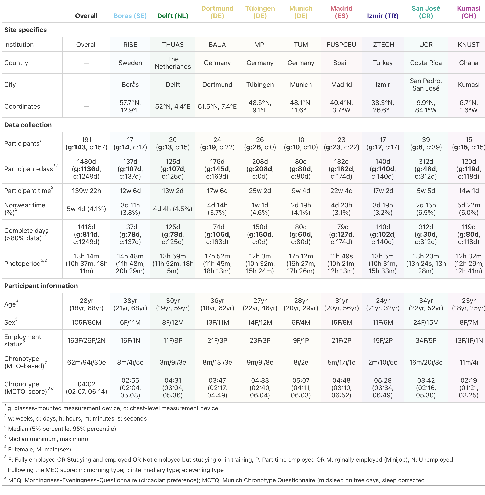{#tbl-T1}

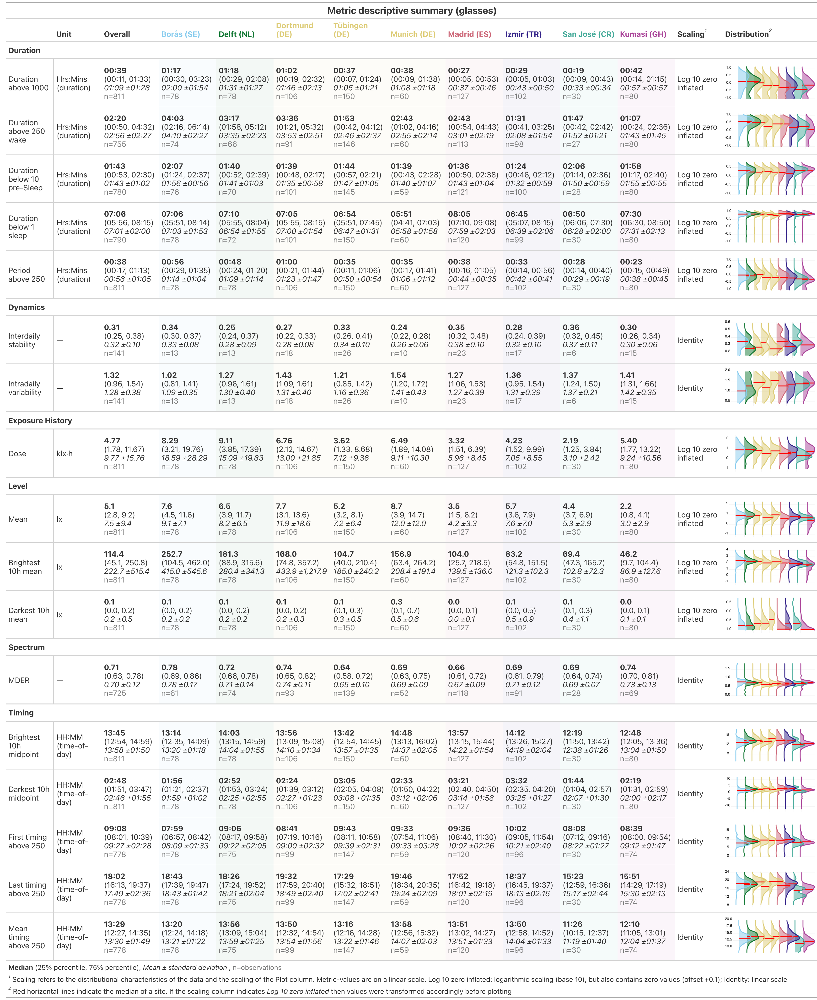{#tbl-T2}

## Daytime recommendations were not reached on average

Participants did not, on average, meet the recommended minimum daytime exposure of 250 lx melanopic EDI during waking hours [@brown2022], indicating that typical real-world ocular light exposure remained below levels proposed to support circadian synchronisation and daytime alertness.

Across all observations, the 250 lx daytime recommendation was met during 24% of wake time, ranging from 14% in Kumasi (GH) to 33% in Borås (SE). During the three hours before sleep, exposure was below the recommended maximum of 10 lx melanopic EDI in 63% of observations, ranging from 56% in Izmir (TR) to 75% in Kumasi. During sleep, exposure was below the recommended maximum of 1 lx melanopic EDI in 88% of observations, ranging from 72% in Munich (DE) to 95% in Kumasi. Across the full 24-hour day, recommendations were met for 52% of observations, ranging from 45% in Izmir to 58% in Borås. As shown in @tbl-brown, wake-time adherence decreased with latitude, whereas pre-sleep and sleep adherence were lowest at mid-latitude sites.

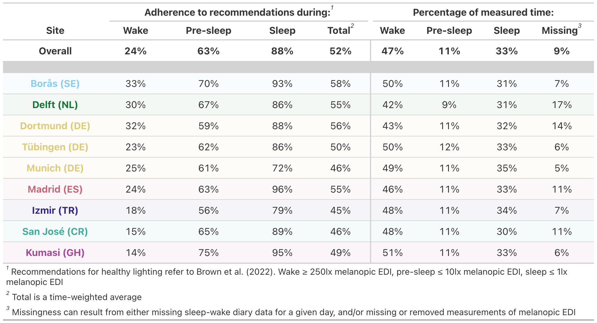{#tbl-brown}

Wake periods, excluding the three hours before sleep, accounted for 47% of observations, pre-sleep periods for 11%, and sleep periods for 33%. The remaining 9% were missing because of incomplete light-exposure or sleep–wake timing data.

## Sites differed in environment, behaviour, chronotype, and age

Photoperiod differed significantly between sites (p \< 0.001). Only Delft (NL) and San José (CR) did not differ from the overall average. Dortmund (DE), Borås (SE), and Munich (DE) had longer photoperiods by 2.5, 2.0, and 2.9 h, respectively, whereas Madrid (ES), Izmir (TR), Kumasi (GH), and Tübingen (DE) had shorter photoperiods by −3.1, −1.2, −1.6, and −1.7 h.

Light exposure-related behaviour, assessed with the LEBA, differed by site for *F2: Spending time outdoors* and *F5: Using light in the morning and during daytime*. In post hoc tests, only San José (CR) for F2 and Dortmund (DE) for F5 differed from the overall mean, both scoring approximately 2–3 points lower.

Primary light-source reports differed between sites (p \< 0.001), as did activity diaries (p \< 0.001). Proportion tables of light source and activity by site are provided in the supplementary analysis scripts. Day type (p = 0.277), exercise (∆AIC \> −2), and sleep duration (p = 0.108) did not differ significantly between sites.

Chronotype, operationalised as sleep-corrected midsleep on free days, differed significantly between sites after controlling for photoperiod (p \< 0.001). Borås (SE), Dortmund (DE), San José (CR), and Kumasi (GH) showed earlier chronotypes than the overall average, with midsleep advanced by −0.5, −0.2, −0.7, and −1.9 h. Delft (NL), Tübingen (DE), Munich (DE), Madrid (ES), and Izmir (TR) showed later chronotypes, with midsleep delayed by 0.3, 0.2, 1.3, 0.4, and 1.0 h. Photoperiod also had a significant effect (p \< 0.001): each 1 h increase was associated with a 0.11 h, or approximately 6.6 min, advance in midsleep.

Age differed significantly between sites (p \< 0.001). Participants in Borås (SE) and Dortmund (DE) were older than the overall average by 9.4 and 4.7 years, whereas those in Izmir (TR) and Kumasi (GH) were younger by −6.3 and −8.0 years. Sex did not differ significantly between sites (p = 0.54).

## Research Question 1: Sites differ, but individual patterns dominate

### Sites differed in exposure level and timing

After controlling for photoperiod, level- and timing-based metrics showed significant site-specific differences (all p ≤ 0.04). For level-based metrics, Kumasi (GH) showed consistently lower daytime (*brightest 10h mean*), nighttime (*darkest 10h mean*), and full-day (*mean*) exposure, with estimates 0.40–0.67 times the overall mean. Izmir (TR) showed higher nighttime light levels by a factor of 1.48, and Tübingen (DE) showed higher nighttime and overall levels by factors of 1.34–1.47 (see @supptbl-H1).

For timing-based metrics, first light timing above 250 lx melanopic EDI ($FLIT_{250}$) was the only metric without significant site-specific differences (p = 0.40). In Kumasi, exposure timing was shifted earlier by −00:57 to −01:40 HH:MM. In San José (CR), mean and last timing above 250 lx melanopic EDI ($MLIT_{250}$ and $LLIT_{250}$) occurred earlier by −01:53 and −02:05. Madrid (ES) and Izmir showed later $MLIT_{250}$ and $LLIT_{250}$ timing (Madrid: +00:53 and +01:23; Izmir: +00:53 and +00:54), and Delft (NL) showed later $MLIT_{250}$ timing (+00:32). Although the midpoint of the brightest 10 hours showed significant site specificity (p = 0.002), no individual site differed from the overall mean; the effect was driven by selected pairwise differences not reported here.

Duration-, dynamics-, exposure-history-, and spectrum-based metrics showed no significant site-specific differences (all p ≥ 0.062).

### Site effects were usually specific

Site was supported as a random effect in only 5 of 7 models in which it was otherwise supported as a fixed effect (see @supptbl-H1). The random-effect specification was preferable to the fixed-effect specification only for overall and nighttime light levels, suggesting that meaningful site effects were usually site-specific rather than well described as draws from a common random-effect distribution.

### Latitude explained daytime levels better than site

For overall and daytime light levels, latitude provided a better fit than site based on ΔAIC, with both comparisons controlling for photoperiod. Each 10-degree increase in latitude was associated with 1.15-fold higher overall daily light levels and 1.24-fold higher daytime light levels. Latitude was also significant for some timing-based metrics, but site-specific models had better support based on ∆AIC in all timing cases. Latitude was not significant for duration-, dynamics-, exposure-history-, or spectrum-based metrics. (see @supptbl-H1)

### Photoperiod predicted several metric classes

Photoperiod was significant in most models (all p \< 0.05), except for dynamics-based metrics, most timing-based metrics, specifically the midpoints of the brightest and darkest 10 hours and $FLIT_{250}$, and duration below 1 lx melanopic EDI during sleep (see @supptbl-H1).

For duration-based metrics, each additional hour of photoperiod increased time above 250 lx melanopic EDI during wake, the longest continuous period above 250 lx melanopic EDI, and time above 1000 lx melanopic EDI by factors of 1.10–1.17. Conversely, time below 10 lx melanopic EDI before sleep decreased by a factor of 0.97 per additional photoperiod-hour.

For exposure-history-based metrics, each additional hour of photoperiod increased cumulative melanopic EDI dose by a factor of 1.19. For level-based metrics, it increased exposure during the brightest 10 hours by a factor of 1.25, during the darkest 10 hours by 1.09, and across the full day by 1.18. For spectrum-based metrics, it increased the melanopic daylight efficacy ratio (MDER) by 0.02, indicating a shift towards shorter-wavelength exposure. For timing-based metrics, $MLIT_{250}$ and $LLIT_{250}$ occurred later with longer photoperiods, shifting by +00:07 and +00:20 HH:MM per additional hour.

### Site and photoperiod were not dominant drivers

Across light-exposure metrics, conditional $R^2$ ranged from 25% to 62% with a mean of 40% (see @supptbl-H1r2). Explanatory power was highest for duration-, spectrum-, and level-based metrics, particularly duration above 250 lx melanopic EDI during wake, overall and nighttime light levels, and MDER (all $R^2$ \> 50%). Fixed effects explained 2%–24% of variance (mean: 12%), indicating that site, photoperiod, and latitude contributed meaningfully but were not dominant drivers.

Participant-level differences explained 9%–42% of variance (mean: 28%) and often exceeded the contribution of fixed effects. Exceptions were $MLIT_{250}$ and $LLIT_{250}$, for which participant-level differences explained 9% and 17% of variance, while fixed effects explained 17% and 23%. When significant, site effects explained more variance than photoperiod effects on average (10% vs. 7%). Latitude added limited explanatory value beyond photoperiod (2%–7%; mean: 5%). Residual variance remained high across metrics (38%–75%), indicating substantial unexplained within-person or day-to-day variability.

### Sites diverged mainly around morning and afternoon

Decomposing daily patterns of 30-minute-binned melanopic EDI into contributions of time, photoperiod, site, participant, and participant-day showed that sites deviated from the overall daily pattern mainly before and after solar noon (see @fig-H2). Compared with the average, Borås (SE) showed approximately 2- to 5-fold higher exposure during these windows. Dortmund (DE) and Munich (DE) showed similar but smaller deviations of approximately 2- to 3-fold. In Borås, the increase was strongest in the morning, whereas in the German sites it was more pronounced in the evening.

Madrid (ES) showed the inverse pattern, with approximately 5-fold lower exposure around dawn and approximately 2-fold lower exposure around dusk. Izmir (TR) showed approximately 2-fold lower exposure around dawn but 3- to 4-fold higher exposure in the evening. San José (CR) tended towards higher morning and lower afternoon exposure, although this was not significant, likely because few participants wore glasses-mounted sensors. Kumasi (GH) was the only site differing significantly around noon, with approximately 3-fold lower exposure than average. Exposure in Kumasi was also reduced by approximately 2- to 3-fold in the morning and by approximately 3- to 10-fold during the afternoon and evening.

{#fig-H2}

### Participant patterns outweighed site patterns

Pattern decomposition showed that participant-specific differences explained substantially more unique variance than site. Participant-level contributions explained 11.18% of smooth variance, compared with 4.87% for site, corresponding to an approximately 2.3-fold larger contribution. This mirrors the metric-based analyses, in which participant-specific variance was, on average, approximately 2.8 times larger than site-attributable variance.

## Research Question 2: Behaviour and micro-environment shape exposure

### Daylight access matters

Primary light source strongly predicted personal light exposure (p \< 0.001, $R^2$ = 0.69), with small but significant site variation (site: p \< 0.001, $R^2$ = 0.05; interaction with primary light source: p \< 0.001, $R^2$ = 0.02). For indoor electric lighting, the reference exposure was approximately 75 lx melanopic EDI. Relative to this, exposure was higher in Borås (SE), Delft (NL), and Madrid (ES), by factors of 2.04, 2.16, and 1.48, and lower in Tübingen (DE) and Kumasi (GH), by factors of 0.56 and 0.50. Full model results are shown in @supptbl-H3, and interaction effects in @suppfig-H3H4.

Indoor daylight was associated with 2.31-fold higher exposure than indoor electric lighting, corresponding to approximately 172 lx melanopic EDI. Kumasi (GH) was the only site deviating significantly, with indoor daylight levels 0.40 times lower than elsewhere. Outdoor daylight showed the largest increase, with exposure 9.47 times higher than indoor electric lighting, corresponding to approximately 707 lx melanopic EDI and exceeding the 250 lx daytime recommendation. Outdoor daylight exposure was higher in Borås (SE) and Delft (NL), by factors of 3.06 and 1.95, and lower in Kumasi (GH) and San José (CR), by factors of 0.42 and 0.52.

When emissive displays were reported as the primary light source, exposure was 0.28 times that under indoor electric lighting, corresponding to approximately 21 lx melanopic EDI. Display-related exposure was lower in Borås (SE), Tübingen (DE), and Munich (DE), by factors of 0.54, 0.15, and 0.08, and higher in Delft (SE), Dortmund (DE), Madrid (ES), and Izmir (TR), by factors of 6.30, 3.42, 5.10, and 1.99.

Darkness during sleep corresponded to approximately 2% of indoor electric-light exposure, reaching below 1 lx melanopic EDI. Madrid (ES) and Kumasi (GH) showed lower sleep-period exposure than other sites, by factors of 0.54 and 0.14, whereas Munich (DE) showed 6.42-fold higher exposure in the sleep environment.

@suppfig-H3 extends the H2 pattern decomposition (see @fig-H2) by including the primary light source context, illustrating when lightsource categories occur, how lightsource-related deviations contribute to daily exposure patterns.

### Activity and micro-environment strongly shaped exposure

Activity and micro-environment strongly affected personal light exposure (p \< 0.001, $R^2$ = 0.58), with small but significant site-specific variation (site: p \< 0.001, $R^2$ = 0.09; interaction with activity: p \< 0.001, $R^2$ = 0.04). Being awake at home corresponded to approximately 59 lx melanopic EDI. Relative to this, Borås (SE), Delft (NL), and Dortmund (DE) showed higher values by factors of 1.77, 2.37, and 2.04, whereas Tübingen (DE) and Kumasi (GH) showed lower values by factors of 0.46 and 0.33. Full model results are shown in @tbl-H4 and interaction effects in @suppfig-H3H4.

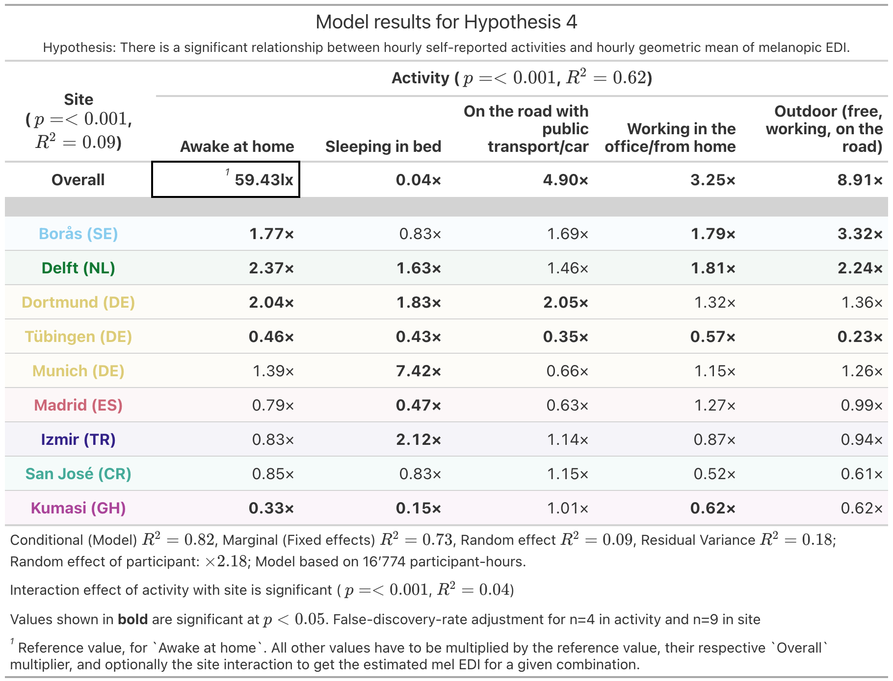{#tbl-H4}

Being in bed corresponded to approximately 4% of exposure while awake at home, or approximately 2 lx melanopic EDI. This differs from the sleep-environment estimate above, likely because the activity category also captured periods with light entering the sleep environment, rather than only periods classified as darkness during sleep. Delft (NL), Dortmund (DE), Munich (DE), and Izmir (TR) showed higher sleep-period exposures than average, by factors of 1.63, 1.83, 7.42, and 2.12, whereas Tübingen (DE), Madrid (ES), and Kumasi (GH) showed lower exposures, by factors of 0.43, 0.47, and 0.15.

Travelling by public transport or car was associated with 4.90-fold higher exposure than being awake at home, corresponding to approximately 291 lx melanopic EDI. Dortmund (DE) showed even higher values, by a factor of 2.05, whereas Tübingen (DE) showed lower values, by a factor of 0.35.

Working in the office or from home was associated with 3.25-fold higher exposure than being awake at home, corresponding to approximately 193 lx melanopic EDI. Borås (SE) and Delft (NL) showed higher work-related exposure, by factors of 1.79 and 1.81, whereas Tübingen (DE) and Kumasi (GH) showed lower workplace exposure, by factors of 0.57 and 0.62.

Being outdoors, including free time, work, or travelling without cover, was associated with 8.91-fold higher exposure than being awake at home, corresponding to approximately 530 lx melanopic EDI. Borås (SE) and Delft (NL) again showed higher levels, by factors of 3.32 and 2.24, whereas Tübingen (DE) showed substantially lower values, by a factor of 0.23.

@fig-H4 extends the previous pattern decomposition (see @fig-H2) by including activity context, showing when activity categories occur and how activity-related deviations contribute to observed daily patterns.

{#fig-H4}

### LEBA factors were weakly related to exposure

Of 68 comparisons between 17 light-exposure metrics and four LEBA factors, only two correlations were significant. *F2: Spending time outdoors* was positively correlated with melanopic EDI dose (p = 0.013, r = 0.27) and duration above 1000 lx melanopic EDI (p = 0.032, r = 0.29). The full correlation matrix is shown in @suppfig-H5. Correlations were performed independently of site.

### Day type, exercise, and sleep showed small associations

Day type, defined as workday versus free day, showed a significant but small association with personal light exposure (p \< 0.001, $R^2$ = 0.01), driven mainly by an interaction with site. On workdays, average exposure was 76 lx melanopic EDI and did not differ significantly by site, with exercise set to none and sleep duration to the average of 7.9 h. On free days, exposure was higher in Borås (SE), Delft (NL), and Dortmund (DE), by factors of 2.23, 2.62, and 2.24, and lower in San José (CR) and Kumasi (GH), by factors of 0.37 and 0.54. Exploratory analyses in @suppfig-H6 indicate that higher workday exposure occurred mainly before noon, when exposure was up to five times higher than on free days, and to a lesser extent in the afternoon, when exposure was consistently approximately two times higher. Exposure was lower after midnight on workdays, likely reflecting earlier bedtimes. An exploratory weekday–weekend model showed similar but weaker patterns and substantially less support, with an AIC approximately 33 points higher than the day-type model.

Daily exercise level also showed a significant but small association with exposure (p \< 0.001, $R^2$ = 0.05). On days without exercise, average exposure was 76 lx melanopic EDI, with day type set to work day and sleep to 7.9 h. Borås (SE) and Dortmund (DE) showed higher values, by factors of 2.14 and 2.08, whereas Kumasi (GH) showed lower values, by a factor of 0.15. Light-exercise days were associated with a 1.85-fold increase in exposure; Borås (SE) and Delft (NL) showed higher values, by factors of 2.38 and 3.07, and Kumasi (GH) lower values, by a factor of 0.45. Moderate-exercise days were associated with a 1.74-fold increase; Delft (NL) was higher by a factor of 2.20, and San José (CR) lower by a factor of 0.23. Vigorous-exercise days were associated with a 1.50-fold increase and no significant site-specific deviations.

Prior sleep duration had a significant but small association with daily exposure (p \< 0.001, $R^2$ = 0.02). Each additional hour of sleep was associated with a factor of 0.92 in average daily exposure, corresponding to an 8% reduction, likely reflecting reduced opportunity for light exposure through shorter wake duration. Delft (NL) and Tübingen (DE) showed little evidence of this effect, with compensatory factors of 1.15 and 1.10, whereas Munich (DE) showed a stronger effect, with an additional factor of 0.88.

Model results for day type, exercise, and prior sleep are shown in @supptbl-H6. All associations remained significant after controlling for activity context (all p ≤ 0.001), indicating that factors beyond recorded activity and micro-environment contributed to exposure.

### Photoperiod showed ceiling effects

Photoperiod showed ceiling effects for selected metrics. For level-based metrics, exposure no longer increased significantly beyond approximately 14.7–16.4 h of photoperiod. A comparable ceiling occurred for duration above 1000 lx melanopic EDI, plateauing at approximately 16.6 h. In contrast, the longest continuous period above 250 lx melanopic EDI and cumulative melanopic EDI dose showed no ceiling within the observed photoperiod range. @suppfig-H7 shows these nonlinear relationships.

## Research Question 3: Participant characteristics showed limited associations

### Light sensitivity was not associated with exposure

Duration-, exposure-history-, and level-based metrics were not significantly associated with self-reported visual light sensitivity, assessed using the VLSQ-8 (all p \> 0.9). Results are summarised in @supptbl-H8.

### Chronotype shifted exposure timing

Chronotype predicted timing-based exposure metrics. For each 1 h later $MSF_{sc}$, participants experienced the midpoint of the brightest 10 hours 0.31 h later, the midpoint of the darkest 10 hours 0.40 h later, mean timing above 250 lx melanopic EDI 0.32 h later, and first timing above 250 lx melanopic EDI 0.44 h later (all p \< 0.001). Last timing above 250 lx melanopic EDI was not significantly associated with chronotype (p = 0.12). Effect sizes were modest, with marginal $R^2$ values of 0.05–0.08. Model results are shown in @supptbl-H9 and @suppfig-H9.

### Sex and age showed weak effects

Across all 17 metrics, none were significantly associated with sex (all p ≥ 0.7). Only one metric was significantly associated with age, with all other age associations non-significant (all p ≥ 0.2). No significant age-by-site interactions were observed (all p ≥ 0.3).

Duration above 1000 lx melanopic EDI was significantly associated with age (p = 0.017), although the effect was modest ($R^2$ = 0.07). Each additional year of age was associated with a 0.024 h, or 1.44 min, increase in daily duration above 1000 lx melanopic EDI. Given an average duration of 39 min across sites, this corresponds to approximately 3%–4% per year. Model results are shown in @supptbl-H10 and @suppfig-H10.

### Females showed behaviourally driven lower morning exposure

Males and females showed broadly similar daily exposure patterns. However, females had significantly lower melanopic EDI exposure between 08:00 and 10:00, by approximately a factor of 2 (see @suppfig-H11). This difference appeared behaviourally driven: after controlling for activity context, sex no longer added significant explanatory value.

## Chest-level analysis were broadly consistent with eye-level findings

Chest-level analyses were broadly consistent with the ocular-level findings, while providing additional evidence for the Costa Rica cohort owing to its larger sample size at this wearing location. In the chest-level data, Costa Rica showed up to five-fold higher morning light exposure than the other sites and approximately two-fold lower exposure around dusk. Duration above 1000 lx melanopic EDI was 1.40 times higher, and duration above 250 lx melanopic EDI was 1.28 times higher than the average across sites. Contextual light-source analyses further indicated lower exposure under indoor electric lighting (0.69×), higher exposure under indoor daylight (1.59×), amongst others. The larger number of chest-level observations makes it expected that more Costa Rica-specific effects reached significance in this analysis. Overall, the only substantive discrepancy between wearing locations concerned daylight exposure in Costa Rica: outdoor daylight was lower in the ocular analysis (0.42×) but not significantly reduced in the chest analysis, where the estimate instead trended higher (1.18×), and indoor daylight trended slightly lower in the ocular analysis but was higher in the chest analysis (1.59×). Apart from this difference, results across the 11 hypotheses were remarkably stable despite differences in sample size and sensor placement, supporting the robustness of the main findings.

# Discussion {#sec-discussion}

This study provides a first multi-country view of how personal ocular light exposure is structured across everyday environments. Using harmonised wearable measurements, near-corneal light logging, repeated contextual reports, and a published time-resolved dataset[@zauner2026a; @agbeshie2025; @akuffo2025; @baezamoyano2025; @broszio2025; @didikoglu2025; @guidolin2025; @sancho-salas2026; @hilden2025; @nilssontengelin2026; @aerts2025], we show that real-world light exposure varies substantially across sites, but that site-level differences are only part of the picture. Across metrics and daily exposure patterns, participant-specific variation and activity context accounted for a larger share of variability than site alone. Thus, personal light exposure appears to be best understood not simply as a property of geography or daylight availability, but as a behavioural and environmental phenotype shaped jointly by photoperiod, latitude, local context, and individual routines.

A central finding is that participants did not, on average, reach recommended daytime melanopic light exposure during waking hours [@brown2022]. This extends previous field studies reporting limited daytime light exposure and elevated evening or night exposure in everyday settings, including work by Savides et al. [@savides1986], Didikoglu et al. [@didikoglu2023], Lok et al. [@lok2023], Price et al. [@price2021], and Biller et al. [@biller2025]. In line with these studies, our data suggest that insufficient daytime light exposure is common even in free-living conditions across diverse sites. At the same time, our results move beyond earlier single-site or pairwise comparisons by showing that adherence patterns differ systematically across sites and daily phases: daytime adherence broadly decreased with latitude, whereas pre-sleep and sleep adherence were lowest at mid-latitude sites. This illustrates why multi-site data are essential. The relevant exposure problem is not uniform across contexts; daytime, evening, and sleep-period exposure may each be shaped by different combinations of outdoor availability, indoor environments, schedules, and behaviour.

The study also clarifies the role of geography. Photoperiod predicted several classes of light-exposure metrics, including duration-, exposure-history-, level-, and spectrum-based measures, and latitude explained daytime levels better than site-specific coefficients. Yet neither photoperiod nor latitude dominated the data structure. Indeed, one of the more striking findings was that light exposure tended to increase with latitude, although lower-latitude and tropical sites have greater year-round sunlight availability. This apparent paradox is consistent with the distinction between ambient availability and personal exposure: in brighter, hotter, or higher-UV environments, individuals may actively avoid direct sunlight, seek shade, remain indoors, or organise activities around thermal comfort and sun protection. Such behavioural filtering has been described in research on personal UV exposure, shade use, outdoor thermal comfort, and sun-protective behaviour, where exposure is often shaped less by ambient radiation than by time outdoors, shade availability, heat avoidance, and cultural norms (see [@diffey2008; @middel2016; @huang2015], with a focus on children @raymond-lezman2023). However, the site in Costa Rica did show higher daylight exposure values for chest-level data, which consisted of a much larger sample size for the site compared to the default glasses-level analysis. Site effects were also present mainly for level- and timing-based metrics and were often better represented as site-specific deviations than as random effects. Daily pattern decomposition showed that sites diverged mainly in the morning and afternoon, with higher morning exposure in Borås, later exposure in Izmir, and lower exposure across much of the day in Kumasi. Geography therefore provides an important scaffold, but local social and built environments determine how daylight availability is translated into ocular exposure.

The strongest behavioural signal came from immediate activity context and micro-environment. Access to daylight, especially outdoor daylight, produced the largest increases in melanopic exposure and was the only lighting context that clearly exceeded the recommended daytime threshold on average. Indoor daylight also substantially increased exposure relative to electric lighting. Further time-of-day decomposition, however, shows a weak separation of self-reported indoor electric and daylight conditions at a given hour (see @suppfig-H3). Display-dominated contexts were generally associated with markedly lower exposure. Similarly, being outdoors, travelling, and working were associated with higher exposure than being awake at home, although the magnitude of these associations differed by site. These results support the idea that interventions should not be framed only as individual-level advice to “get more light”, but should consider where people spend time, when daylight is accessible, and how indoor environments mediate ocular exposure. They also help explain why broad self-report measures of light-related behaviour showed only weak correlations with objective exposure: actual exposure depends on timing, location, and the physical characteristics of behaviour, not merely on general behavioural tendencies.

Participant-level differences were a major source of variation. Across metric-based models, participant-specific variance often exceeded fixed effects, and in the pattern decomposition it explained more than twice as much unique smooth variance as site. Chronotype was specifically related to timing-based exposure metrics, with later chronotypes showing later bright and dark exposure timing. This aligns with circadian theory and prior evidence that light exposure and sleep timing are behaviourally coupled [@biller2025; @roenneberg2019; @roenneberg2015; @tortello2023; @bonatto2024; @dacostalopes2024]. By contrast, visual light sensitivity, sex, and age showed limited associations with summary exposure metrics. The observed lower morning exposure among females appeared to be behaviourally mediated, and the only age association—longer duration above 1000 lx melanopic EDI with increasing age—was modest. Together, these findings indicate that personal light exposure is not well captured by demographic categories alone. More informative predictors are likely to involve time use, mobility, occupation, housing, daylight access, and culturally patterned routines.

A major strength of this study is the ocular-level measurement approach. Many large cohort studies, including UK Biobank analyses linking wrist-worn light exposure to psychiatric, metabolic, sleep, and mortality outcomes, have provided important evidence that naturalistic light exposure is health-relevant [@windred2024; @burns2023; @lok2024; @windred2024a; @obayashi2016]. However, wrist-worn sensors only approximate the stimulus reaching the eye and can be affected by body posture, sleeve occlusion, and device-specific limitations [@devries2025; @devries2026; @devries2026a; @gibaldi2024]. By measuring near the corneal plane, this study targets the biologically relevant input more directly and provides a stronger basis for interpreting melanopic exposure in relation to non-visual photoreception. Additional strengths are the harmonised multi-country design [@guidolin2024], the combination of objective time-series data with experience sampling and daily questionnaires, and publication of the dataset(s) [@zauner2026a; @agbeshie2025; @akuffo2025; @baezamoyano2025; @broszio2025; @didikoglu2025; @guidolin2025; @sancho-salas2026; @hilden2025; @nilssontengelin2026; @aerts2025], which supports transparent re-analysis and comparison with future studies.

Several limitations should be considered. First, although this dataset is unusually broad for ocular light-dosimetry research, site-level sample sizes remain modest. Future studies could increase both participants and participant-days to stabilise site estimates, improve power for interactions, and support more granular subgroup analyses. Second, the study population consisted of healthy working-age adults, limiting generalisability to children, adolescents, older adults, clinical populations, shift workers, unemployed or retired individuals, and people with restricted mobility or atypical living conditions. Third, the sampled latitude-by-photoperiod space remains sparse (see @fig-phot). More sites, seasons, and photoperiod conditions are needed to disentangle latitude, climate, seasonality, culture, and built environment. Fourth, activity and primary lightsource reports were intentionally broad and collected daily at an retrospective hourly scale. This enabled cross-site harmonisation but limited fine-grained analyses, for example distinguishing different activities within the same space, different types of work environments, or specific behaviours during home, office, or transport periods. Fifth, very low sensor readings, for example during nighttime, should be interpreted cautiously. Although the light logger is rated down to 1 lx, single-digit values should be understood as indicating exposure within that approximate range rather than as precise measurements.

{#fig-phot width="60%"}

In summary, everyday ocular light exposure is structured, measurable, and strongly shaped by behaviour and micro-environment, but not reducible to site, latitude, or photoperiod alone. By combining near-eye melanopic measurements with contextual data across multiple countries, this study provides a first view of shared and site-specific exposure patterns. This pattern-based understanding is a necessary step towards interventions that are biologically grounded, context-sensitive, and feasible in daily life.

# Methods {#sec-methods}

The current study was preregistered with AsPredicted (#273407) [@zauner2026melidos_preregistration]. Deviations from the preregistration are documented in @sec-preregdev.

## Research questions and hypotheses

We assessed the following research questions and hypotheses, as specified in the preregistration [@zauner2026melidos_preregistration] and @sec-preregdev:

**Research Question 1: Do sites differ in objectively measured personal light exposure? If so, does an individual’s behaviour and micro-environment have a stronger effect than site?**

**H1:** *There is a significant difference in personal light-exposure metrics across sites, even after accounting for latitude and photoperiod.*

**H2:** *The variance of personal light exposure patterns (30-minute-binned geometric mean of melanopic EDI) by participants within sites is greater than the variance between sites.*

**Research Question 2: Is there a relationship between personal light exposure and participants’ behaviour and environment?**

**H3:** *There is a significant relationship between hourly self-reported light exposure categories and hourly geometric mean of melanopic EDI.*

**H4:** *There is a significant relationship between hourly self-reported activities and hourly geometric mean of melanopic EDI.*

**H5:** *There is a significant relationship between LEBA-factors and pre-selected personal light exposure metrics.*

**H6:** *There is a significant relationship between day type, daily exercise, sleep, and the hourly geometric mean of light exposure.*

**H7:** *There is a ceiling effect of photoperiod on level-, duration-, and exposure-history-based metrics.*

**Research Question 3: Is personal light exposure related to participant characteristics?**

**H8:** *Duration, exposure-history, and level-based metrics of personal light exposure are significantly associated with personal light sensitivity (VLSQ-8)*

**H9:** *Timing-based metrics of personal light exposure are significantly associated with chronotype.*

**H10:** *Personal light exposure metrics depend on age and sex*

**H11:** *Personal light exposure patterns depend on sex*

## Study design

This publication reports analyses from the MeLiDos field study, which is a multinational observational study examining associations between real-world ocular light exposure and personal and behavioral characteristics across diverse geographic and sociocultural contexts [@spitschan2024]. The MeLiDos consortium collected multimodal longitudinal data using harmonised assessment protocols across participating study sites. The present analyses focused on the decomposition of melanopic light exposure under naturalistic conditions into individual, behavioural, and environmental contributing factors. The study design is described in detail in the protocol paper by Guidolin et al. [@guidolin2024] and will be summarized in the following sections.

Participants completed an 8-day ambulatory monitoring protocol comprising continuous personal light exposure assessment, repeated ecological momentary assessments, and daily diary measures under free-living conditions. The protocol started with an in-person visit to the local research centre, during which participants provided written informed consent, received detailed study instructions, and were equipped with wearable light-monitoring devices. Participants returned to the research centre after the monitoring period for device return and completion of end-of-study assessments. At most sites, monitoring began on a Monday and ended the following Monday; in Dortmund, data collection was conducted from Tuesday to the following Tuesday. Continuous recordings were collected over seven consecutive days between the two visits. When participants were unable to attend the scheduled return visit, they were instructed to continue the protocol until formal study termination and device retrieval.

Participants were recruited across nine study sites in seven countries (sorted by latitude): Borås, Sweden [@nilssontengelin2026; @tengelin2025]; Delft, the Netherlands [@aerts2025]; Dortmund [@broszio2025], Tübingen [@guidolin2025], and Munich [@hilden2025], Germany; Madrid, Spain [@baezamoyano2025]; Izmir, Türkiye [@didikoglu2025]; San José, Costa Rica [@sancho-salas2026]; and Kumasi, Ghana [@akuffo2025; @agbeshie2025]. These sites covered a broad range of latitudes, photoperiods, climates, built environments, and sociocultural contexts. The choice of sites was an opportunity sample determined by the location of project partners and partners that joined the consortium (Türkiye, Costa Rica, and Ghana). Recruitment and questionnaire administration were conducted in the native language of each study site, except in Tübingen and Kumasi, where study procedures were conducted in English. Self-report instruments were translated, culturally adapted, and harmonised using the TRAPD framework (Translation, Review, Adjudication, Pretesting, and Documentation), involving at least two independent translators per language version [@walde2023].

Data collection was conducted between August 2023 and October 2025, depending on local logistics and seasonal scheduling. All participants provided written informed consent before participation. Ethical approval for the overarching study protocol was obtained from the Ethics Committee of the Technical University of Munich (2023-115-S-KK), with local implementation procedures harmonised across participating centres. Additional ethical approvals were obtained from the respective institutional research ethics committees at participating study sites.

## Inclusion and exclusion criteria

Eligible participants were adults between 18 and 65 years who were engaged in full-time employment or part-time employment exceeding 80% workload. Participants were recruited through local advertisements and institutional mailing lists.

Exclusion criteria included diagnosed psychiatric disorders, diagnosed sleep disorders, regular tobacco use, regular recreational drug use, shift work within the preceding two months, and use of medication known to affect photosensitivity. Further exclusion criteria were visual impairments incompatible with the wearable light-monitoring devices and residence outside the predefined local study region during the recording period.

A minimum target sample size of 15 participants per study site was defined based on prior power analyses for real-world light exposure studies [@zauner2024]. This target was intended to provide sufficient statistical power for planned light exposure metrics while accounting for expected dropout and incomplete recordings of up to one third.

## Data collection procedures

At the registration visit, participants received detailed instructions for the ambulatory monitoring protocol, completed baseline questionnaires, and were fitted with wearable light-monitoring devices. Depending on device availability and local research capacity, multiple participants could be assessed concurrently within the same measurement week at a given study site.

Participants were instructed to wear the light-monitoring devices continuously during waking hours. During sleep, devices were placed facing upward on a bedside surface near head level to capture nocturnal ambient light exposure in the sleep environment. Participants also documented device removals using a dedicated wear log implemented in the mobile assessment platform [@zauner2026]. During waking non-wear periods, they were instructed to place the devices in a provided opaque black bag to minimise light contamination [@zauner2026; @guidolin2026].

Throughout the monitoring period, participants completed repeated smartphone-based ecological momentary assessments. Momentary sleepiness [@kaida2006] and mood [@tsanas2016] were assessed four times daily at scheduled time points: 11:00, 14:00, 17:00, and 20:00. Participants additionally completed morning sleep diaries after awakening [@Carney2012] and evening questionnaires assessing daily wellbeing [@sischka2020] and physical activity [@zauner2026], as well as hourly light exposure [@Bajaj2011] and activity [@zauner2026]. Baseline and end-of-study questionnaires assessed demographic characteristics, chronotype [@kantermann2015], habitual light exposure behaviours [@siraji2023], sleep environment characteristics [@grandner2022], and self-reported visual light sensitivity [@verriotto2017]. All participant-reported data were collected via the MyCap [@harris2022] smartphone application integrated with REDCap [@patridge2018] servers, except for the paper-based evening diaries assessing hourly light exposure and activity contexts. These paper-based diaries were photographed and uploaded daily by participants.

## Wearable light logger

Light exposure was recorded using spectrally sensitive ActLumus devices, Condor Instruments, São Paulo, Brazil [@ishihara2025; @vanduijnhoven2025]. Devices recorded continuously at 10-second intervals. Multispectral measurements across eight visible-band channels were processed internally by the device to derive photopic and α-opic quantities, including melanopic equivalent daylight illuminance, or melanopic EDI. The devices were factory calibrated to an operating range between 1 and 10\^5 lx (precision 10% at 1k lx).

Participants wore a near-corneal light logger mounted centrally on non-prescription spectacle frames and a chest-level pendant-mounted logger. Depending on site specific limitations for participant-recruitment and device-availability, only one position was assessed (see @sec-preregdev. Specifically, some participants were hesitant to wear the glasses-mounted logger for a week, which hindered some sites to reach the target number of participants, while the chest-position was more acceptable [@zauner2025]. The near-corneal configuration was designed to approximate retinal light exposure during daily activities and was therefore treated as the primary measurement configuration in the present analyses. The chest-mounted configuration provided an ambulatory estimate of personal environmental light exposure and was used in supplementary robustness analyses.

Participants also wore an ActLumus device configured as a wrist-mounted monitor during the MeLiDos protocol. Wrist-derived light exposure data were not included in the present analyses because the wrist position provides a limited approximation of ocular light exposure [@devries2025; @devries2026; @devries2026a; @gibaldi2024].

## Surveys

Daily sleep parameters were assessed each morning using the core Consensus Sleep Diary [@Carney2012]. Participants reported bedtime, time attempting to sleep, sleep onset latency, nocturnal awakenings, wake after sleep onset, final awakening time, and subjective sleep quality. Subjective sleep quality was rated on a five-point Likert-type scale ranging from “very poor” to “very good”.

Hourly light exposure and activity contexts were assessed using evening questionnaires. Light exposure context was assessed with a modified version of the Harvard Light Exposure Assessment (mH-LEA) [@Bajaj2011]. For each hour of the day, participants reported the primary light source to which they were exposed, defined as the main light source in their environment. They could choose from the following categories:

- Electric light source indoors
- Electric light source outdoors
- Daylight indoors
- Daylight outdoors (including shade)
- Emissive display light
- Darkness during sleep
- Light entering from outside during sleep

If participants perceived a substantial combination of light sources within the same hour, they could additionally report a secondary light source using the same set of categories.

Activity context was assessed in parallel [@zauner2026]. For each hour of the day, participants reported the activity they had primarily performed during that hour. They could choose from the following categories:

- Sleeping in bed
- Awake at home
- On the road with public transport/car
- On the road with bike/on foot
- Working in the office/from home
- Working outdoors (including lunch break outdoors)
- Free time outdoors (e.g. garden/park etc.)
- Other: please specify (e.g. sport)

Momentary sleepiness was assessed four times daily using the Karolinska Sleepiness Scale [@kaida2006], a single-item measure of current alertness and sleepiness. Ratings were provided on a 10-point Likert-type scale ranging from 1, “extremely alert”, to 10, “extremely sleepy”.

Momentary mood was assessed concurrently with sleepiness using a modified version of the MoodZoom questionnaire [@tsanas2016]. Participants rated their current affective state across six dimensions: anxious, elated, sad, angry, irritable, and energetic. Responses were recorded using seven-point Likert-type scales, with higher scores indicating stronger endorsement of the respective affective state.

Daily wellbeing was assessed each evening using a modified WHO-5 Wellbeing Index [@sischka2020]. Question four was reframed to indicate last nights sleep, instead of referring to multiple days. Item scores were summed and normalised to a maximum score of 100, with higher scores indicating better subjective wellbeing. Evening diary measures additionally included self-reported physical activity, from which a binary indicator of daily exercise participation was derived.

Logs to record non-wear periods, timespans outside the 60 km radius around the site, and experiences with the light loggers were available to participants at all times through the smartphone application of the study. [@zauner2026; @guidolin2026]

Baseline questionnaires assessed age, biological sex, gender, employment status, and chronotype. Chronotype was assessed using the Munich Chronotype Questionnaire [@roenneberg2007] and the Morningness–Eveningness Questionnaire [@horne1976]. The Munich Chronotype Questionnaire was used to derive corrected midsleep on free days, representing an estimate of biological timing adjusted for accumulated sleep debt on workdays. The Morningness–Eveningness Questionnaire quantified circadian preference, with higher scores indicating greater morning preference.

End-of-study questionnaires assessed subjective visual light sensitivity, sleep environment characteristics, and habitual light exposure behaviours. Visual light sensitivity was assessed using the Visual Light Sensitivity Questionnaire-8 [@verriotto2017]. Sleep environment characteristics were assessed using the Assessment of Sleep Environment questionnaire [@grandner2022]. Habitual light exposure behaviours were assessed using the Light Exposure Behaviour Assessment[@siraji2023]. Four LEBA factor scores were used: spending time outdoors, use of phones and smart devices in bed before sleep, controlling and using ambient light before bedtime, and use of light during the morning and daytime. The LEBA factor relating to filtered or tinted glasses was not administered because participants wore study-specific spectacle frames without optical filters during monitoring.

## Primary and co-variates

The primary light exposure quantity was melanopic EDI, expressed in lux [@cies02]. The primary source of light exposure data was the near-corneal device, because it most closely approximates ocular light exposure. Chest-level light exposure data were used for supplementary robustness analyses.

Habitual light exposure was characterised using participant-level and participant-day-level metrics. Participant-level dynamics-based metrics included interdaily stability, reflecting day-to-day regularity of light exposure timing, and intradaily variability, reflecting fragmentation and temporal variability of daily light exposure patterns. [@hartmeyer2023; @hartmeyer2022]

Participant-day-level metrics were grouped into level-based, duration-based, timing-based, exposure-history-based, and spectrum-based measures. Level-based metrics included the geometric mean melanopic EDI across the day, the geometric mean melanopic EDI during the 10 brightest hours of the day, and the geometric mean melanopic EDI during the 10 darkest hours of the day. Duration-based metrics included time above 1000 lx melanopic EDI, time above 250 lx melanopic EDI during wake periods, time below 10 lx melanopic EDI during the three hours before attempted sleep, time below 1 lx melanopic EDI during sleep periods, and the longest continuous period above 250 lx melanopic EDI. Timing-based metrics included first light timing above 250 lx melanopic EDI, last light timing above 250 lx melanopic EDI, and mean timing of exposure above 250 lx melanopic EDI. Exposure-history-based metrics included cumulative daily melanopic EDI dose. Spectrum-based metrics included melanopic daylight efficacy ratio, defined as the ratio between melanopic and photopic illuminance at a given moment. [@hartmeyer2023; @hartmeyer2022]

For sleep-related analyses, sleep windows were defined based on the time participants reported attempting to sleep, rather than estimated sleep onset after adding sleep onset latency. This definition better represents the behavioural interval during which participants intended to sleep and is particularly relevant for analyses of pre-sleep and sleep-environment light exposure.

Self-reported light exposure and activity context variables include the primary lightsource, and the given activity, in an hourly resolution.

Environmental and behavioural covariates included study site, latitude, photoperiod duration, day type (work or free day), exercise level, chronotype, habitual light exposure behaviours, and subjective visual light sensitivity. Daily photoperiod duration was calculated as the interval between dawn and dusk, i.e., sun elevation above -6°.

## Transformation of variables and preprocessing steps

Light exposure preprocessing and metric derivation were performed in R statistical software [@base] using the LightLogR package [@LightLogR]. Raw unaggregated light exposure recordings from near-corneal and chest-mounted devices were first trimmed according to participant-specific study start and end times. Irregular timestamps, prolonged recording gaps, and physiologically implausible values exceeding 120000 lx were visually inspected and removed or recoded as missing values.

Non-wear periods were identified from participant wear logs [@guidolin2026]. Only non-wear periods that did not overlap with reported sleep windows were set to missing. Sleep-period recordings were retained because devices were placed beside the participant during sleep to quantify the sleep environment.

For habitual light exposure analyses, additional completeness criteria were applied. Hours with less than 50% valid data availability were excluded. Participant-days with less than 80% valid light exposure data after hourly filtering were removed from analysis. The resulting dataset was used to derive participant-level and participant-day-level light exposure metrics.

For analyses involving wake, pre-sleep, and sleep intervals, sleep diary data were merged with light exposure data at the participant-day level. Wake periods, the three-hour pre-sleep interval, and sleep periods were defined using diary-derived attempted sleep timing and final wake time. This operationalisation was used to align light exposure metrics with behaviourally meaningful sleep windows.

Because level-, duration-, and dose-related light exposure metrics were strongly right-skewed, these variables were log10-transformed before statistical analysis. When a metric contained zero values, an offset of 0.1 was added before transformation [@zauner2025a]. Timing variables were circularly linearised before modelling when they crossed midnight.

Due to the low number of observations for certain light-source and activity contexts within individual sites, some categories were combined or excluded before analysis. For primary light source, categories were excluded if they contained fewer than 0.1% of all observations within a site, corresponding to approximately 20 observations, and fewer than 1% of observations across all sites, corresponding to approximately 200 observations.

For primary lightsource, *Electric light source outdoors*, and *Light entering from outside during sleep* fell below those thresholds.

For activity context, *Working outdoors (including lunch break outdoors)*, *Free time outdoors (e.g., garden/park etc.)*, and *On the road by bike/on foot* were combined into a single *Outdoors* category, because the individual categories occurred infrequently or were absent at some sites.

## Statistical analysis

All statistical analyses were performed in R version 4.5.0 @base. Analyses used the *tidyverse* package (v2.0.0) [@tidyverse] for data processing and visualisation, *lme4* (v2.0-1) [@lme4], *glmmTMB* (v.1.1.14) [@glmmTMB] and related mixed-modelling packages for linear and generalized linear mixed-effects models, *mgcv* (v1.9-4) [@mgcv], *gratia* (v0.11.2) [@gratia], and *itsadug* (v2.5) [@itsadug] for generalized additive mixed models (HGAM), and *LightLogR* (v0.10.2) [@LightLogR] for light exposure preprocessing, visualisation, and metric derivation. All MeLiDos data were imported using the *melidosData* (v1.0.6) [@melidosData] package. The *performance* (0.16.0) [@performance] package was used for model diagnostics and mixed-effect $R^2$ calculations, and *emmeans* (v2.0.3) [@emmeans] to calculate marginal effects. For H5, a correlation matrix of Spearman-rank correlations was constructed using the *stats* (v4.5.0) [@stats] package.

Unless otherwise specified, hypothesis tests were two-tailed. Statistical significance was evaluated using a hypothesis-wide type I error threshold of α = 0.05. Where multiple related tests were performed within a hypothesis, false discovery rate correction according to the Benjamini–Hochberg procedure was applied, and adjusted p-values are reported [@benjamini1995]. Model assumptions were evaluated using visual and quantitative model diagnostics. These included inspection of residual distributions, residuals plotted against fitted values, and method-specific diagnostics to assess homoscedasticity, linearity, approximate normality, mean-zero residual structure, distributional fit, and influential deviations. Where diagnostics indicated violations of model assumptions, model specifications were adjusted where possible.

For analyses using linear mixed-effects models (LMM) and generalized linear mixed-effects models (GLMM) @lme4, full models were specified based on the preregistered hypotheses (H1, H3, H4, H6, H8, H9, H10) [@zauner2026melidos_preregistration] and adjusted for relevant demographic, behavioural, environmental, and sleep-related covariates where appropriate. Model selection was performed using backward and forward stepwise comparison of nested models. Nested models were compared using likelihood-ratio tests, with test statistics evaluated against a χ² distribution. If a model showed convergence problems, singularity, or unstable parameter estimates, the random-effects structure was simplified first by reducing random slopes. If instability persisted, higher-order interaction terms were reduced while retaining the main effects required for hypothesis testing. Depending on the distributional characteristics of each exposure metric and the corresponding model diagnostics, models were fitted using either a Gaussian or Tweedie error distribution. Where appropriate, metrics were modelled either on the original scale or after logarithmic transformation. A metric-specific overview of preprocessing transformations, the chosen error distribution family, and modelling engines, either *lmer* or *glmmTMB*, is provided in the supplementary analysis documentation for [Research Question 1, Hypothesis 1](RQ1.qmd).

Generalized additive mixed models (HGAM) [@zauner2022; @hastie1986; @hastie1995] were constructed following the approach described by Pedersen and colleagues [@pedersen2019] (H2, H7, H11). These models included smooth functions of time of day to describe daily patterns of personal light exposure. For factor-specific temporal patterns, smooth terms were specified to estimate deviations from the overall temporal profile where appropriate (e.g., site, or participant). Model selection for GAMs and HGAMs was based on Akaike’s Information Criterion [@pedersen2019; @bozdogan1987]. A difference in AIC of at least 2 was interpreted as sufficient evidence favouring the model with the lower AIC, including when the lower-AIC model had greater complexity. Temporal autocorrelation was assessed as part of model diagnostics. First-order autocorrelation of residuals was significant and ranged between 0.4 and 0.8, depending on the model and underlying dataset. This was handled by an AR1 correction after which no significant autocorrelation remained. For GAM-based analyses, differences in smooth relationships were evaluated using difference smooths for comparisons between factor levels and derivative smooths for changes within a smooth over time. This approach allowed inference on both between-group differences in temporal exposure profiles and within-profile periods of significant increase or decrease. HGAMs were fitted using a Gaussian error distribution, with melanopic EDI transformed before modelling. Following the recommendations by Zauner et al. [@zauner2025a], values were offset by +0.1 before logarithmic transformation.

Linear models, LMM, GLMM, and HGAM were used for exploratory analyses.

## Deviation from the preregistration and protocol {#sec-preregdev}

This section summarizes deviations from the preregistration (https://aspredicted.org/te3zw2.pdf)



# Statements

## Acknowledgements

To all authors: please add people that supported this work and their contribution. Please only do so after getting written consent from them to be named here (e.g., through email).

## Funding statement

The project MeLiDos (22NRM05 MeLiDos) has received funding from the European Partnership on Metrology, co-financed from the European Union’s Horizon Europe Research and Innovation Programme and by the Participating States. Views and opinions expressed are however those of the author(s) only and do not necessarily reflect those of the European Union or EURAMET. Neither the European Union nor the granting authority can be held responsible for them.

## Statement of Author contributions

Conceptualization: JZ, \[Author initials\]

Methodology: JZ, \[Author initials\]

Study design: JZ, \[Author initials\]

Data collection: \[Author initials\]

Participant recruitment: \[Author initials\]

Project administration: JZ, \[Author initials\]

Data curation: JZ, \[Author initials\]

Software: JZ, \[Author initials\]

Formal analysis: JZ, \[Author initials\]

Visualization: JZ, \[Author initials\]

Validation: JZ, \[Author initials\]

Resources: JZ, \[Author initials\]

Funding acquisition: \[Author initials\]

Supervision: JZ, \[Author initials\]

Writing – original draft: JZ

Writing – review and editing: All authors

All authors reviewed and approved the final manuscript.

## Statement of AI use

During manuscript preparation, generative artificial intelligence tools (ChatGPT 5.5) were used to support language editing, structural refinement, and condensation of text. AI assistance was used to improve clarity, coherence, concision, and journal fit, but **not** to generate, analyse, or interpret primary data. All AI-assisted text was critically reviewed, edited, and approved by the authors, who take full responsibility for the content, accuracy, integrity, and conclusions of the manuscript.

During data analysis, AI assistance was used to bugfix code sections, support figure and table styling, and resolve modelling convergence and singularity issues. Further, participant comments in their native language were translated in English with AI-assistance. All translations were reviewed and approved or corrected by the respective site authors. AI assistance was **not** used to develop the analysis strategy, write analysis scripts, or interpret results.

## Statement of competing interests

M.S. declares the following potential conflicts of interest in the past five years (2021–2025): academic roles as Member of the Board of Directors of the Society of Light, Rhythms, and Circadian Health (SLRCH), Chair of Joint Technical Committee 20 (JTC20) of the International Commission on Illumination (CIE), Member of the Daylight Academy, and Chair of the Research Data Alliance Working Group Optical Radiation and Visual Experience Data; remunerated roles as Speaker of the Steering Committee of the Daylight Academy, ad-hoc reviewer for the Health and Digital Executive Agency of the European Commission, ad-hoc reviewer for the Swedish Research Council, Associate Editor for LEUKOS, examiner for the University of Manchester, Flinders University, and the University of Southern Norway, and consultant for LyS Technologies and RoX Health; research funding and support from the Max Planck Society, Max Planck Foundation, Max Planck Innovation, Technical University of Munich, Wellcome Trust, National Research Foundation Singapore, European Partnership on Metrology, VELUX Foundation, Bayerisch-Tschechische Hochschulagentur (BTHA), BayFrance/Bayerisch-Französisches Hochschulzentrum, BayFOR/Bayerische Forschungsallianz, and Reality Labs Research; honoraria for talks from ISGlobal, the Research Foundation of the City University of New York, and the Stadt Ebersberg, Museum Wald und Umwelt; travel reimbursements from the Daimler und Benz Stiftung; and being named on European Patent Application EP23159999.4A, “System and method for corneal-plane physiologically-relevant light logging with an application to personalized light interventions related to health and well-being.” M.S. declares that the disclosed roles and relationships had no influence on the work presented herein. The funders had no role in study design, data collection and analysis, the decision to publish, or preparation of the manuscript.

J.Z. declares the following potential conflicts of interest in the past five years (2021–2025): academic roles as Member of Joint Technical Committee 20 (JTC20) of the International Commission on Illumination (CIE), Member of the Research Data Alliance Working Group Optical Radiation and Visual Experience Data, and Speaker of group 2, melanopic effects of light, of the Technical Scientific Committee (TWA) of the German Society of Lighting Technology and Design (LiTG); remunerated roles as examiner for the Swiss Lighting Society; teacher for LiTG, the University of Applied Sciences Munich, and the Technical University of Applied Sciences Rosenheim; associated partner at 3lpi lighting design + engineering, Munich; tool and 3D-model designer for Zumtobel Lighting GmbH; and course designer for the University of Applied Sciences Munich and Virtual University Bavaria; honoraria for talks from LiTG, Lamilux/Heinrich Strunz GmbH, Robert-Bosch Hospital Stuttgart, Ergotopia GmbH, the German statutory accident insurance institution for the administrative sector (VBG), BRIXEN CULTUR, KITEO GmbH & Co. KG, and the University of Applied Sciences Augsburg; travel reimbursements from the Daimler und Benz Stiftung; and, together with 3lpi, holding a design patent for a non-visually optimized luminaire, No. 008194021–0001 through -0006, at the European Union Intellectual Property Office.

# References

<!-- the pattern below controls the placement of the references -->

::: {#refs}
:::

# Supplements

## Tables

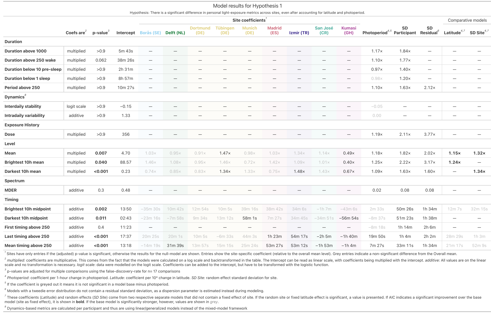{#supptbl-H1}

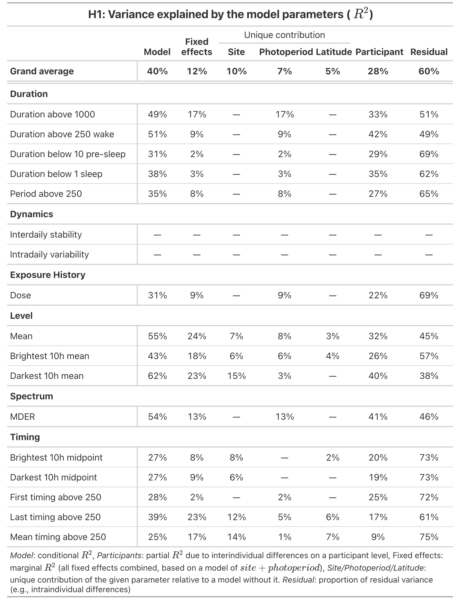{#supptbl-H1r2 width="60%"}

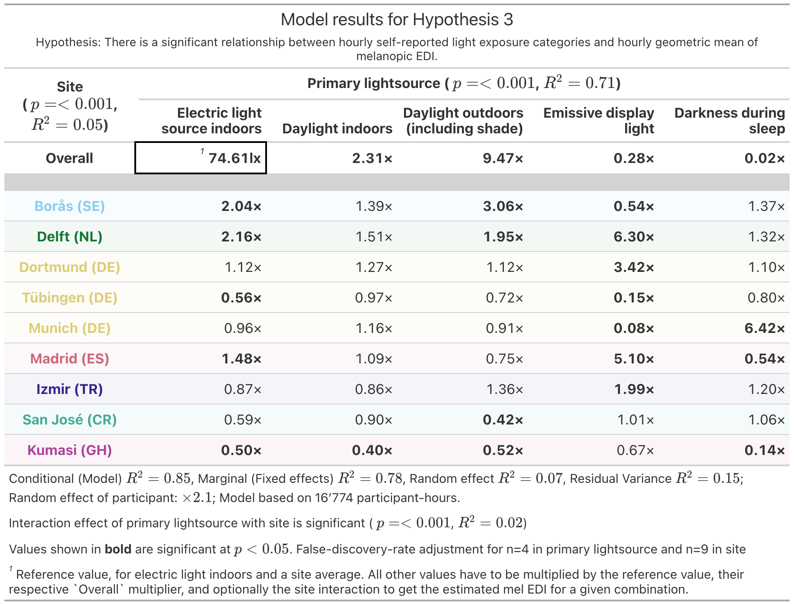{#supptbl-H3}

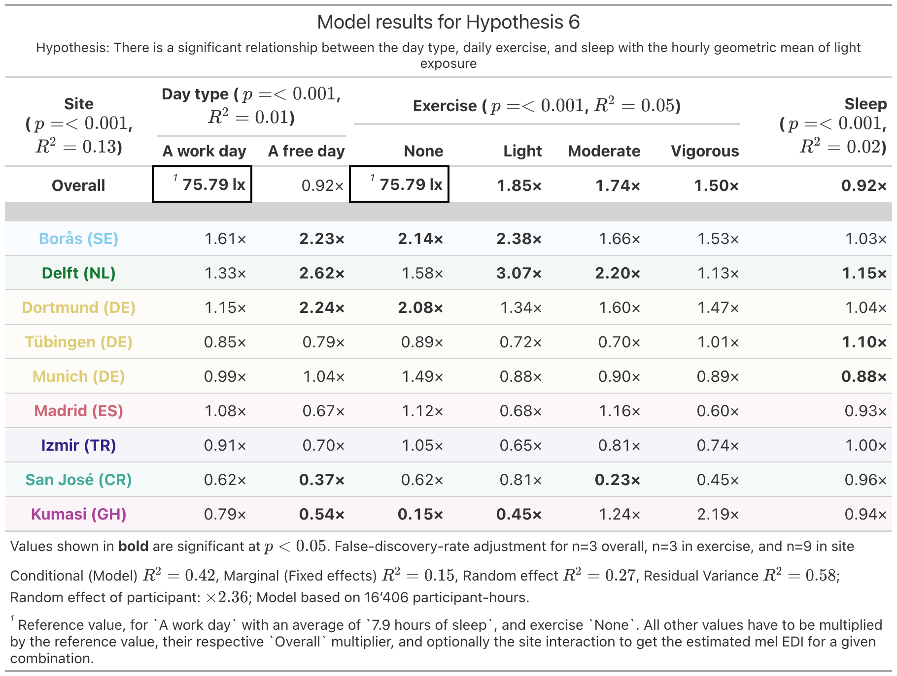{#supptbl-H6}

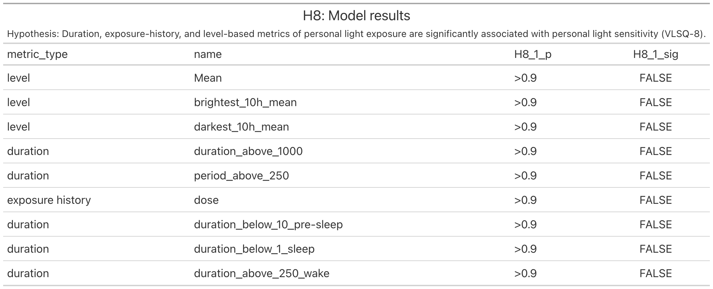{#supptbl-H8}

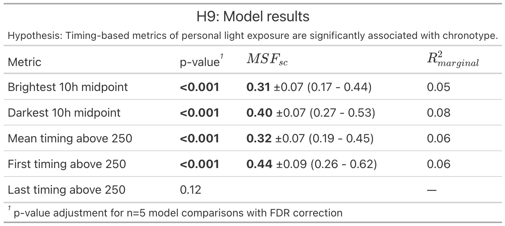{#supptbl-H9 width="60%"}

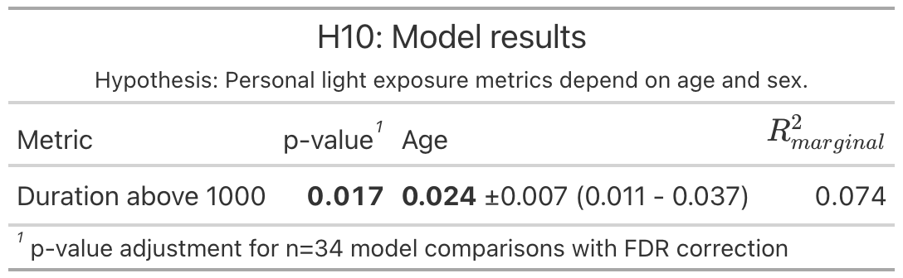{#supptbl-H10 width="50%"}

## Figures

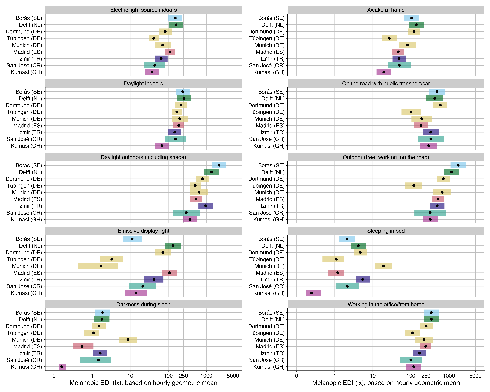{#suppfig-H3H4}

{#suppfig-H3}

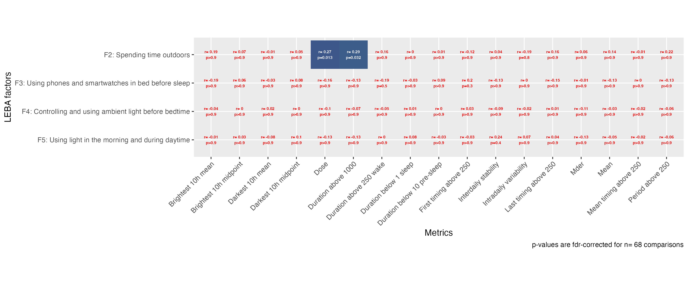{#suppfig-H5}

{#suppfig-H6 width="60%"}

{#suppfig-H7}

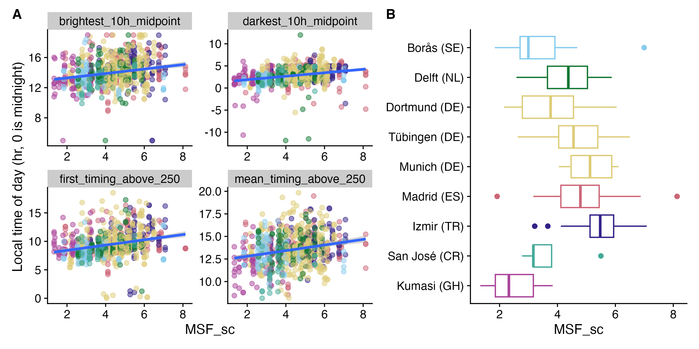{#suppfig-H9}

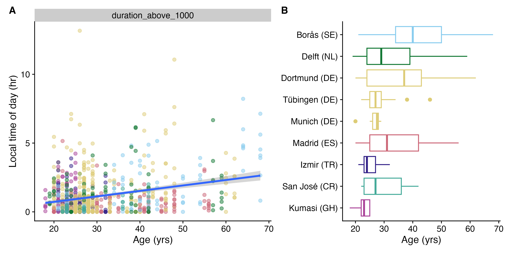{#suppfig-H10}

{#suppfig-H11 width="60%"}
